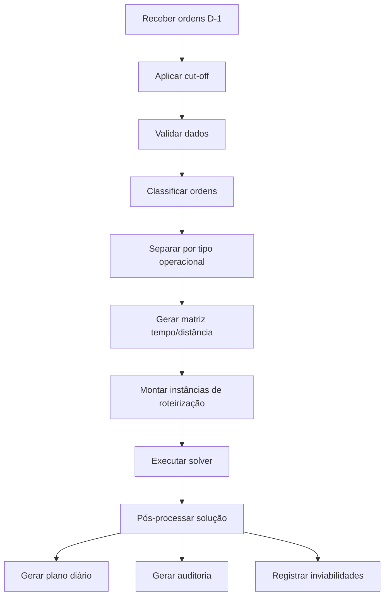
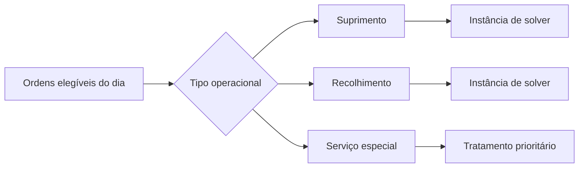
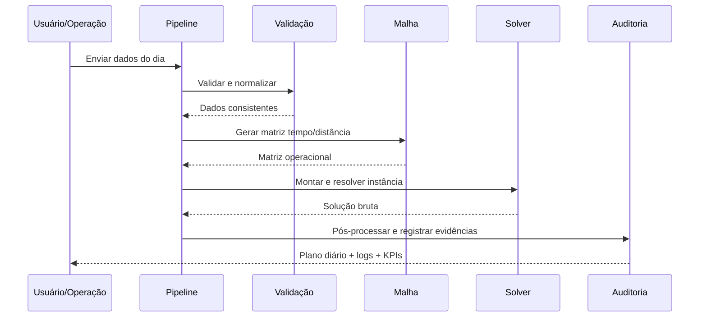

# Sistema de Roteirização para Transporte de Numerário

MVP de planejamento diário de rotas para transporte de numerário, com foco em **suprimento**, **recolhimento** e **serviços especiais**, usando **PyVRP** como motor de otimização.

## Visão geral

Este projeto busca responder, para cada dia operacional:

> Quais ordens cada viatura deve executar, em que sequência e em qual horário, para minimizar o custo total da operação sem violar prazos, capacidades, limites de risco e regras operacionais?

O sistema foi desenhado para refletir a realidade operacional do transporte de numerário, incluindo:

- janelas de atendimento;
- jornada máxima da guarnição;
- capacidade financeira e volumétrica;
- teto segurado por rota;
- priorização por SLA;
- isolamento entre operações de suprimento e recolhimento;
- geração de plano diário com trilha de auditoria.

---

## Objetivos do MVP

O MVP cobre o **planejamento diário** da operação, com geração de um plano viável e economicamente eficiente.

### Incluído no MVP

- planejamento de rotas saindo e retornando à base;
- roteirização de ordens de **suprimento**;
- roteirização de ordens de **recolhimento**;
- tratamento priorizado de **serviços especiais**;
- uso de matriz de tempo e distância;
- controle de capacidade volumétrica e financeira;
- controle de limite segurado por rota;
- registro de inviabilidades e justificativas;
- tratamento de cancelamentos com impacto operacional e financeiro.

### Fora do MVP

- reotimização com viatura em campo;
- redistribuição dinâmica durante a execução;
- múltiplas viagens por viatura no mesmo turno;
- balanceamento entre múltiplas bases;
- trânsito em tempo real;
- integração plena com torre de controle.

---

## Premissas de negócio

### 1. Circuito fechado
Toda rota parte e retorna à mesma base no MVP.

### 2. Isolamento de estado físico
No MVP, **suprimento e recolhimento não se misturam na mesma viagem operacional**.

- uma rota de suprimento não executa recolhimento;
- uma rota de recolhimento não executa suprimento;
- a troca de estado operacional exige retorno à base.

### 3. Planejamento diário com cut-off
As ordens elegíveis para o dia operacional são congeladas em um **cut-off no D-1**.

### 4. Multi-cliente por setor
Uma mesma viatura pode atender múltiplos pontos em sequência dentro de um setor geográfico, desde que a rota permaneça viável em:

- tempo;
- custo;
- capacidade;
- risco;
- limite segurado.

### 5. Limite segurado
No caso de recolhimento, o valor acumulado embarcado não pode ultrapassar o teto coberto pela apólice da operação.

---

## Arquitetura proposta

A arquitetura foi desenhada para manter o domínio desacoplado do solver e da infraestrutura externa.

```mermaid
flowchart LR
    A[Dados de entrada] --> B[Validação e normalização]
    B --> C[Classificação operacional]
    C --> D[Montagem da instância de domínio]
    D --> E[Adapter de otimização]
    E --> F[PyVRP]
    F --> G[Pós-processamento]
    G --> H[Plano operacional diário]
    G --> I[Logs de inviabilidade]
    G --> J[KPIs e auditoria]
````

### Camadas

* **domain**
  Regras de negócio e entidades centrais do problema.

* **application**
  Casos de uso e orquestração do fluxo de planejamento.

* **infrastructure**
  Leitura de arquivos, integração com APIs, persistência, geração de matriz e adaptadores externos.

* **optimization**
  Contrato do solver e implementação do adaptador PyVRP.

* **orchestration**
  Pipeline executável, idempotência, rastreabilidade e auditoria.

---

## Estrutura sugerida do repositório

```text
roteirizacao-numerario-mvp/
├─ README.md
├─ docs/
│  ├─ contexto.md
│  ├─ arquitetura.md
│  ├─ regras-de-negocio.md
│  └─ roadmap.md
├─ src/
│  └─ roteirizacao/
│     ├─ domain/
│     │  ├─ entities/
│     │  ├─ value_objects/
│     │  ├─ services/
│     │  └─ contracts/
│     ├─ application/
│     │  ├─ use_cases/
│     │  ├─ dto/
│     │  └─ services/
│     ├─ infrastructure/
│     │  ├─ io/
│     │  ├─ matrix/
│     │  ├─ repositories/
│     │  └─ logging/
│     ├─ optimization/
│     │  ├─ solver_adapter.py
│     │  ├─ pyvrp_adapter.py
│     │  └─ model_builders/
│     └─ orchestration/
│        ├─ pipeline.py
│        └─ run_context.py
├─ tests/
│  ├─ unit/
│  ├─ integration/
│  ├─ contract/
│  └─ acceptance/
├─ data/
│  ├─ raw/
│  ├─ processed/
│  └─ samples/
├─ notebooks/
├─ pyproject.toml
├─ .gitignore
└─ .env.example
```

---

## Fluxo operacional do planejamento



---

## Entidades principais do domínio

### Base operacional

Representa a origem e o retorno das viaturas.

Campos típicos:

* `id_base`
* `nome`
* `coordenadas`
* `horario_operacao`

### Ponto atendido

Representa o local físico de atendimento.

Campos típicos:

* `id_ponto`
* `tipo_ponto`
* `coordenadas`
* `inicio_janela`
* `fim_janela`
* `tempo_servico`

### Ordem de atendimento

Representa a demanda a ser roteirizada.

Campos mínimos:

* `id_ordem`
* `data_operacao`
* `tipo_servico`
* `classe_planejamento`
* `id_ponto`
* `valor_estimado`
* `volume_estimado`
* `inicio_janela`
* `fim_janela`
* `tempo_servico`
* `criticidade`
* `penalidade_nao_atendimento`
* `penalidade_atraso`
* `status_cancelamento`
* `janela_cancelamento`
* `taxa_improdutiva`

### Viatura

Representa o recurso operacional da rota.

Campos típicos:

* `id_viatura`
* `tipo`
* `base_origem`
* `turno`
* `custo_fixo`
* `custo_variavel`
* `limite_financeiro`
* `limite_volumetrico`

---

## Regras de negócio e restrições

## Restrições rígidas

O plano é inviável quando viola qualquer uma das regras abaixo:

1. atendimento dentro da janela permitida;
2. jornada máxima da guarnição;
3. limite financeiro da viatura;
4. limite volumétrico da viatura;
5. teto segurado da rota;
6. isolamento entre suprimento e recolhimento;
7. compatibilidade entre viatura, ponto e serviço;
8. circuito fechado com retorno à base.

## Restrições penalizáveis

Podem ser tratadas como custo elevado, conforme política operacional:

* não atendimento de ordem padrão;
* atraso moderado em ordem não crítica;
* uso de viatura adicional;
* cancelamento tardio;
* parada improdutiva.

---

## Função objetivo

A solução deve buscar minimizar o custo total da operação, considerando:

* custo fixo de uso da viatura;
* custo variável de deslocamento;
* penalidades por atraso;
* penalidades por não atendimento;
* impacto de cancelamentos;
* improdutividade operacional.

Em versões futuras, o modelo poderá incorporar mecanismos explícitos para reduzir previsibilidade operacional de horários e trajetos.

---

## Separação por classe operacional

No MVP, a modelagem deve considerar pelo menos estas classes:



Essa separação simplifica a modelagem, reduz ambiguidade operacional e melhora a aderência às regras do negócio.

---

## Integração com PyVRP

O **PyVRP** será usado como motor de otimização do MVP.

Princípios da integração:

* o domínio não deve depender diretamente do PyVRP;
* a montagem do modelo do solver deve ocorrer em uma camada adaptadora;
* a solução do solver deve ser traduzida de volta para objetos e eventos do domínio;
* a troca futura de solver deve exigir mudança mínima fora da camada de adaptação.

### Contrato esperado do adaptador

```python
class SolverAdapter:
    def solve(self, instancia):
        ...
```

Implementação prevista:

```python
class PyVRPAdapter(SolverAdapter):
    def solve(self, instancia):
        ...
```

Referência oficial:

* PyVRP: [https://pyvrp.org/](https://pyvrp.org/)

---

## Pipeline de execução



---

## Rastreabilidade e auditoria

Cada execução do pipeline deve ser auditável.

Sugestões de rastreabilidade:

* `id_execucao`
* `data_referencia`
* `hash_cenario`
* versão das entradas
* versão do modelo
* versão do solver
* lista de ordens atendidas
* lista de ordens não atendidas
* justificativas de inviabilidade
* métricas agregadas da solução

---

## Estratégia de testes

O projeto deve evoluir com cobertura de testes desde o início.

### Tipos de teste

* **unit**: regras puras de domínio;
* **contract**: interfaces entre camadas;
* **integration**: integração com matriz, arquivos e solver;
* **acceptance**: cenários operacionais completos.

### Exemplos de cenários importantes

* rota de suprimento válida com múltiplos pontos;
* rota de recolhimento respeitando teto segurado;
* ordem fora da janela de atendimento;
* cancelamento antes e depois do cut-off;
* incompatibilidade entre viatura e serviço;
* excesso de capacidade volumétrica;
* excesso de capacidade financeira.

---

## Roadmap inicial

### Fase 1 — Fundamentos

* definir contratos de dados;
* modelar entidades centrais;
* estruturar repositório e convenções;
* criar suíte inicial de testes.

### Fase 2 — Pipeline base

* ingestão;
* validação;
* normalização;
* classificação operacional.

### Fase 3 — Modelagem de otimização

* geração de matriz;
* montagem da instância;
* implementação do `SolverAdapter`;
* implementação do `PyVRPAdapter`.

### Fase 4 — Saída operacional

* plano diário;
* KPIs;
* logs de inviabilidade;
* trilha de auditoria.

---

## Convenções de desenvolvimento

### Branches

Sugestão simples:

* `main`: estável
* `feat/*`: novas funcionalidades
* `fix/*`: correções
* `docs/*`: documentação
* `test/*`: testes

### Commits

Sugestão de padrão:

* `feat: adiciona entidade Ordem`
* `fix: corrige cálculo de capacidade financeira`
* `test: adiciona cenários de janela de atendimento`
* `docs: documenta fluxo do pipeline`

---

## Próximos passos

1. consolidar os contratos de entrada;
2. criar as entidades de domínio;
3. modelar os casos de uso principais;
4. implementar o adaptador PyVRP;
5. gerar o primeiro cenário de ponta a ponta com dados sintéticos.

---

## Status do projeto

🚧 Em estruturação do MVP.
