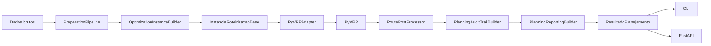

# Sistema de Roteirizacao para Transporte de Numerario

Backend de planejamento diario de rotas para transporte de numerario, com foco em **suprimento**, **recolhimento** e tratamento prioritario de ordens especiais, usando **PyVRP** como motor de otimizacao.

Hoje o repositorio ja contem:

- contratos de dominio e validacao;
- pipeline `bruto -> validado -> classificado`;
- montagem de `InstanciaRoteirizacaoBase` solver-agnostic;
- adaptador para PyVRP;
- pos-processamento, auditoria e KPIs;
- geracao e persistencia de snapshots logísticos;
- orquestracao idempotente do planejamento diario;
- CLI operacional;
- API FastAPI para consumo por frontend externo.

## O que o sistema resolve

Para cada dia operacional, a aplicacao responde:

> Quais ordens cada viatura deve executar, em que sequencia e em qual horario, minimizando o custo total da operacao sem violar janelas, capacidades, teto segurado e regras operacionais?

O modelo contempla, no estado atual do projeto:

- janelas de atendimento;
- jornada/turno da viatura;
- capacidade financeira e volumetrica;
- teto segurado para recolhimento;
- segregacao entre suprimento e recolhimento;
- penalidades por nao atendimento e atraso;
- cancelamentos e parada improdutiva;
- trilha de auditoria e explicabilidade;
- reprocessamento seguro do mesmo cenario.

## Status atual

O projeto nao esta mais apenas em estruturacao. O nucleo executavel e o backend HTTP ja estao implementados.

Entregas principais ja concluidas:

- Etapa 1: especificacao formal dos contratos em [`docs/etapa-1/`](docs/etapa-1/)
- Etapa 2: ingestao, validacao e classificacao
- Etapa 3: instancia solver-agnostic
- Etapa 4: adaptador PyVRP
- Etapa 5: resultado de planejamento
- Etapas 6 a 8: malha, snapshots e materializacao versionada
- Etapa 9: CLI operacional
- Etapas 10 a 12: pos-processamento, auditoria e reporting
- Etapa 13: orquestracao idempotente
- Camada HTTP: FastAPI sobre o orquestrador

## Arquitetura implementada



Principios mantidos:

- o dominio nao depende diretamente de PyVRP;
- a linguagem do negocio e separada do solver;
- a execucao diaria e idempotente por `hash_cenario`;
- a saida final preserva auditoria, KPIs e contexto de execucao.

## Estrutura real do repositorio

```text
.
├─ README.md
├─ docs/
│  ├─ api.md
│  ├─ contexto.md
│  └─ etapa-1/
├─ data/
│  ├─ fake_smoke/
│  ├─ logistics_snapshots/
│  └─ logistics_sources/
├─ scripts/
│  └─ roteirizacao_cli.py
├─ src/
│  └─ roteirizacao/
│     ├─ api/
│     ├─ application/
│     ├─ domain/
│     ├─ optimization/
│     └─ cli.py
├─ tests/
│  └─ contract/
├─ pyproject.toml
└─ .python-version
```

## Requisitos de ambiente

- `pyenv` com Python `3.13.7`
- ambiente virtual `.venv`
- `PyVRP` instalado para executar o planejamento completo

Versoes usadas no ambiente de desenvolvimento atual:

- Python `3.13.7`
- PyVRP `0.13.3`
- FastAPI `0.135.1`
- Uvicorn `0.42.0`

## Setup local

```bash
pyenv local 3.13.7
pyenv exec python -m venv .venv
.venv/bin/pip install -e .
.venv/bin/pip install '.[dev]'
.venv/bin/pip install pyvrp==0.13.3
```

Se quiser apenas validar que o ambiente foi criado corretamente:

```bash
.venv/bin/python --version
.venv/bin/python -c "import pyvrp, fastapi, uvicorn"
```

## Como rodar os testes

```bash
.venv/bin/python -m compileall src tests
.venv/bin/python -m unittest discover -s tests -p 'test_*.py' -v
```

A suite atual cobre contratos do pipeline, adaptador do solver, snapshots, orquestracao e API HTTP.

## Smoke test com dataset fake

O repositorio ja inclui um dataset minimo em [`data/fake_smoke/`](data/fake_smoke/).

Execucao pela CLI:

```bash
.venv/bin/python scripts/roteirizacao_cli.py run-planning \
  --dataset-dir data/fake_smoke \
  --materialize-snapshot \
  --max-iterations 50 \
  --seed 1
```

Esse comando produz:

- resultado consolidado em `data/fake_smoke/outputs/resultado-planejamento.json`;
- estado idempotente em `data/fake_smoke/outputs/executions/`;
- reaproveitamento automatico do mesmo cenario em reexecucoes identicas.

## CLI operacional

Entry point do projeto:

```bash
roteirizacao --help
```

Ou diretamente:

```bash
.venv/bin/python scripts/roteirizacao_cli.py --help
```

Comandos disponiveis:

- `materialize-snapshot`: materializa um snapshot logístico bruto para o formato versionado do projeto
- `run-planning`: executa o planejamento diario a partir de um dataset local

Exemplo para materializar snapshot:

```bash
.venv/bin/python scripts/roteirizacao_cli.py materialize-snapshot \
  --date 2026-03-22 \
  --source-dir data/logistics_sources \
  --snapshot-dir data/logistics_snapshots
```

## API FastAPI

A API foi criada para expor o motor como backend para um frontend futuro em outro repositorio.

Subir localmente com recarga:

```bash
.venv/bin/python -m uvicorn roteirizacao.api.main:create_app --factory --reload
```

Ou via entry point instalado:

```bash
roteirizacao-api
```

A documentacao interativa fica disponivel em:

- `http://127.0.0.1:8000/docs`
- `http://127.0.0.1:8000/redoc`

### Endpoints principais

- `GET /health`
- `POST /api/v1/snapshots/materialize`
- `POST /api/v1/planning/run-dataset`
- `POST /api/v1/planning/run`

O endpoint `run-dataset` reutiliza um dataset existente em disco.

O endpoint `run` aceita payload inline, materializa internamente os arquivos em `data/api_runs/` e executa o mesmo orquestrador idempotente usado pela CLI.

Exemplo rapido de chamada HTTP com dataset existente:

```bash
curl -X POST http://127.0.0.1:8000/api/v1/planning/run-dataset \
  -H 'Content-Type: application/json' \
  -d '{
    "dataset_dir": "data/fake_smoke",
    "materialize_snapshot": true,
    "max_iterations": 50,
    "seed": 1
  }'
```

Detalhes adicionais da camada HTTP estao em [`docs/api.md`](docs/api.md).

## Idempotencia e rastreabilidade

A orquestracao principal usa um `hash_cenario` estavel a partir das entradas relevantes do planejamento.

Isso garante:

- mesma entrada relevante -> mesmo identificador de cenario;
- reexecucao segura do mesmo cenario;
- retry apos falha tecnica sem duplicar artefatos;
- recuperacao do contexto logico anterior.

Artefatos por cenario incluem:

- `cenario.json`
- `estado.json`
- `resultado-planejamento.json`
- `resultado-planejamento.pkl`
- `manifest.json`

## Dados e snapshots

Convencoes relevantes do repositorio:

- [`data/logistics_sources/README.md`](data/logistics_sources/README.md): formato esperado da fonte bruta de malha
- [`data/logistics_snapshots/README.md`](data/logistics_snapshots/README.md): formato materializado e versionado do snapshot
- [`data/fake_smoke/README.md`](data/fake_smoke/README.md): dataset minimo para smoke de ponta a ponta

## Modulos principais

### `src/roteirizacao/domain/`

Contem enums, entidades, eventos, contratos solver-agnostic, contratos de resultado e utilitarios de serializacao.

### `src/roteirizacao/application/`

Contem os casos de uso do sistema:

- `preparation.py`
- `instance_builder.py`
- `planning.py`
- `post_processing.py`
- `audit.py`
- `reporting.py`
- `snapshot_materializer.py`
- `orchestration.py`

### `src/roteirizacao/optimization/`

Contem a fronteira com o solver e o adaptador do PyVRP.

### `src/roteirizacao/api/`

Contem a camada FastAPI, schemas HTTP e service wrapper sobre o orquestrador.

## Limitacoes atuais

Ainda nao fazem parte do escopo implementado:

- autenticacao/autorizacao da API;
- banco de dados para execucoes;
- fila assíncrona para jobs longos;
- reotimizacao com viatura em campo;
- observabilidade externa e metrics server;
- integracao nativa com fontes externas reais alem do modelo de snapshot/dataset local.

## Documentacao complementar

- [`docs/contexto.md`](docs/contexto.md)
- [`docs/api.md`](docs/api.md)
- [`docs/etapa-1/`](docs/etapa-1/)

## Proximos passos recomendados

- autenticar a API e versionar contratos HTTP;
- transformar execucoes longas em jobs assíncronos;
- persistir resultados em banco em vez de apenas filesystem;
- adicionar integracoes reais de entrada e de malha;
- criar o frontend consumidor em repositorio separado.
