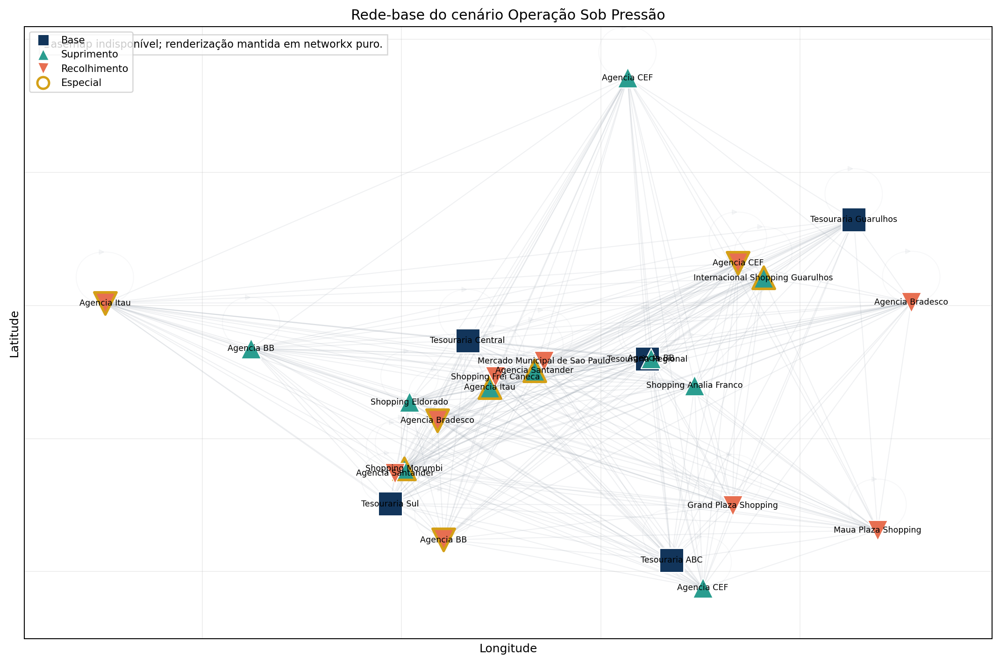
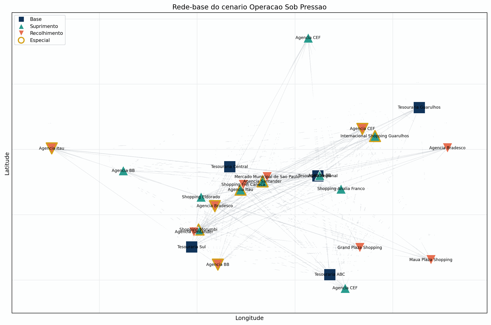

# 1. Introdução e Contexto

## O problema

Uma transportadora de valores precisa decidir, no início do dia, quais viaturas sairão de cada base, quais pontos serão atendidos e em que ordem. Essa decisão precisa equilibrar:

- janelas de tempo;
- capacidade volumétrica;
- limite financeiro segurado;
- custo de deslocamento;
- cobertura de atendimento.

## Dois fluxos operacionais

O projeto trata dois tipos de operação:

- **suprimento**: a carga sai da base e é descarregada ao longo da rota;
- **recolhimento**: a carga é acumulada ao longo da rota e aproxima a viatura do limite segurado.

Essa diferença muda a leitura de capacidade e impede que a solução seja vista como um simples problema de menor caminho.

## Cenário da apresentação

O fio condutor desta apresentação é o cenário **operação sob pressão**. Ele é mais adequado para discussão porque expõe conflito real entre tempo, frota, risco e cobertura.

- mais ordens e maior dispersão geográfica;
- maior pressão de capacidade e risco;
- resultado operacional mais rico para interpretar.

## Pergunta central

A pergunta da disciplina não é “qual é o menor caminho?”, mas sim:

> como construir rotas viáveis, seguras e economicamente eficientes em uma rede com restrições?

[⬅️ Anterior](./01-introducao-e-contexto.md) | [Próxima ➡️](./02-elementos-da-rede-grafica.md)
