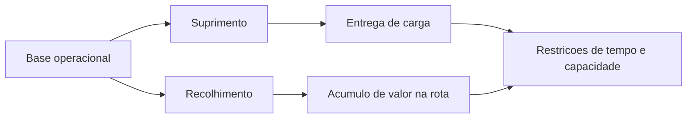

# 1. Introducao e Contexto

## A cena inicial: o problema comeca antes da primeira rota

Imagine o inicio do dia operacional.

Uma viatura blindada sai da base com um plano que precisa funcionar no mundo real: horarios apertados, clientes espalhados pela cidade, risco financeiro acumulado e custo elevado de qualquer decisao ruim.

> Uma rota ruim nao significa apenas mais quilometros. Pode significar atraso em agencia, excesso de carga, uso ineficiente da frota e aumento de risco operacional.

## O que uma transportadora de valores realmente movimenta?

Quando pensamos em transporte de numerario, nao estamos falando apenas de dinheiro em especie. A operacao pode envolver:

- numerario para suprimento de agencias e caixas;
- recolhimento de valores de clientes e pontos atendidos;
- malotes e envelopes lacrados;
- documentos operacionais vinculados ao atendimento;
- cargas com restricoes de volume, seguranca e tempo.

Isso faz com que a viatura seja, ao mesmo tempo:

- um veiculo de transporte;
- um recurso operacional escasso;
- um elemento central de uma rede de servicos.

## Por que esse problema e mais dificil do que parece?

Em uma aula introdutoria, pode parecer que o objetivo seria apenas ligar pontos no mapa. Mas o problema real e muito mais rico.

Cada decisao precisa conciliar:

- janelas de tempo em agencias, clientes e bases;
- frota heterogenea, com capacidades diferentes;
- limite financeiro e limite fisico de carga;
- custo de ativar mais viaturas;
- necessidade de sair e retornar a uma base;
- restricoes de compatibilidade entre servico, ponto e veiculo.

## Dois tipos de operacao, duas leituras logisticas

Na pratica, o problema possui dois grandes fluxos:

- **suprimento**: a carga sai da base e vai sendo entregue;
- **recolhimento**: a carga vai sendo acumulada ao longo da rota.

Essa diferenca e importante porque altera o comportamento da capacidade da viatura:

- no suprimento, a rota tende a descarregar;
- no recolhimento, a rota tende a carregar;
- no recolhimento, o valor embarcado pode aproximar a rota do limite segurado.

## A pergunta central da disciplina

Do ponto de vista de Analise de Redes de Transporte, a pergunta nao e:

> Qual e o menor caminho?

A pergunta correta e:

> Como montar rotas viaveis, seguras e economicamente eficientes em uma rede com restricoes?

## Como isso aparece em Pesquisa Operacional?

Esse problema pode ser lido como uma variacao do Vehicle Routing Problem, ou VRP, com varios elementos adicionais:

- janelas de tempo;
- capacidade em mais de uma dimensao;
- frota heterogenea;
- clientes opcionais com alto custo de nao atendimento.

Ou seja, a aplicacao real da transportadora de valores e um excelente estudo de caso porque conecta:

- rede fisica;
- decisao combinatoria;
- custo operacional;
- restricoes logisticas.

## O fio da apresentacao

Nas proximas paginas, a historia sera a seguinte:

1. o mundo real sera traduzido para um grafo;
2. o grafo sera transformado em um modelo de roteirizacao;
3. a funcao objetivo mostrara o que significa uma "boa" solucao;
4. uma heuristica moderna buscara rotas viaveis;
5. por fim, veremos como interpretar os resultados.

> 🎥 *[Inserir video curto da viatura em operacao ou saindo da base aqui]*

> 🎥 *[Inserir video ou GIF curto mostrando itens sendo preparados para embarque aqui]*

[⬅️ Anterior](./01-introducao-e-contexto.md) | [Próxima ➡️](./02-elementos-da-rede-grafica.md)
