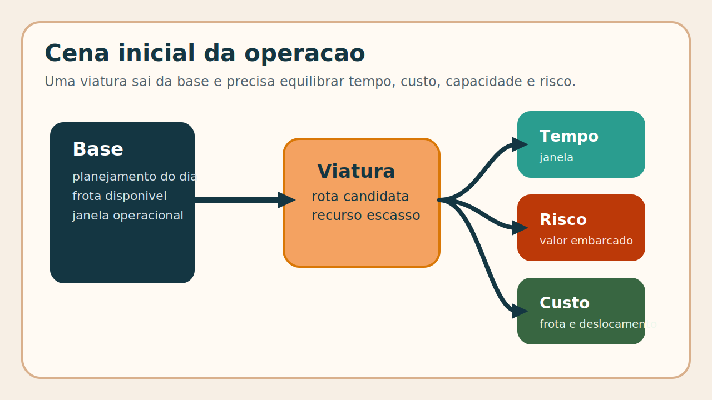
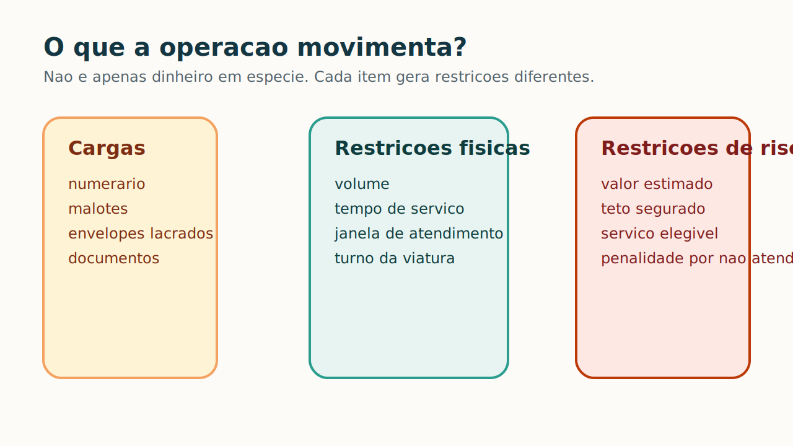
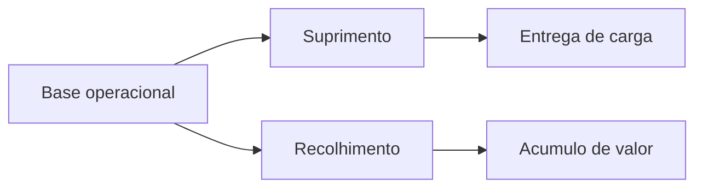

# 1. Introducao e Contexto

## O problema

Uma transportadora de valores precisa decidir, no inicio do dia, quais viaturas sairão de cada base, quais pontos serão atendidos e em que ordem. Essa decisão precisa equilibrar:

- janela de tempo;
- capacidade volumétrica;
- limite financeiro segurado;
- custo de deslocamento;
- cobertura de atendimento.

## Dois fluxos operacionais

O projeto trata dois tipos de operação:

- **suprimento**: a carga sai da base e é descarregada ao longo da rota;
- **recolhimento**: a carga é acumulada ao longo da rota e aproxima a viatura do limite segurado.

Essa diferença muda a leitura de capacidade e impede que a solução seja vista como um simples "menor caminho".

## Cenario da apresentacao

Nesta versao final, o fio condutor visual e o cenario **operacao_sob_pressao**. Ele e mais adequado para apresentacao porque expõe conflito real entre tempo, custo, frota e cobertura.

- mais ordens e mais dispersao geografica;
- maior pressao de capacidade e risco;
- resultado operacional mais rico para discutir.

## Pergunta central

A pergunta da disciplina nao e "qual o menor caminho?", mas sim:

> como construir rotas viaveis, seguras e economicamente eficientes em uma rede com restricoes?

## Roteiro da fala

Para caber em 7 a 10 minutos, a narrativa fica assim:

1. o problema operacional;
2. a rede e seus elementos;
3. a modelagem e a funcao objetivo;
4. a solucao computacional;
5. os resultados operacionais e o benchmark.

[⬅️ Anterior](./01-introducao-e-contexto.md) | [Próxima ➡️](./02-elementos-da-rede-grafica.md)
