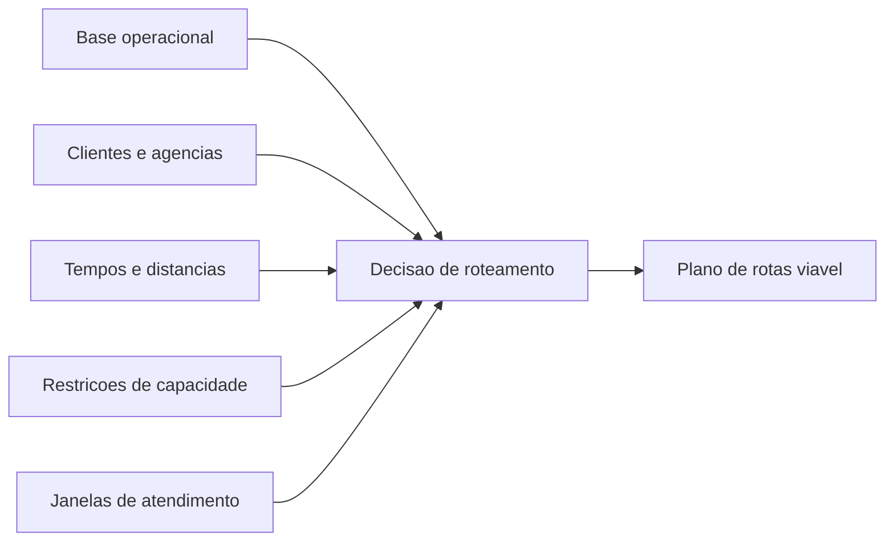

# 1. Introducao e Contexto

## Logistica de uma transportadora de valores

A operacao de transporte de numerario envolve o deslocamento planejado de viaturas entre uma base operacional e um conjunto de pontos de atendimento, como agencias bancarias, clientes corporativos, terminais e outros locais com demanda financeira.

Diferentemente de uma distribuicao urbana simples, aqui o roteamento precisa considerar simultaneamente:

- risco financeiro acumulado ao longo da rota;
- janelas de tempo estritas de atendimento;
- frota com capacidades diferentes;
- restricoes de compatibilidade entre viatura e servico;
- necessidade de sair e retornar a uma base.

Em termos práticos, o problema nao e apenas "qual o menor caminho entre A e B". O desafio real e decidir:

1. quais pontos entram em cada rota;
2. qual viatura deve atender cada conjunto de pontos;
3. em que sequencia o atendimento ocorre;
4. se a rota continua viavel em tempo, custo e seguranca.

## Por que esse problema e complexo?

Uma transportadora de valores normalmente opera com dois grandes tipos de servico:

- suprimento: levar numerario ate o ponto;
- recolhimento: retirar valores do ponto e trazelos de volta.

Isso gera uma complexidade adicional, porque o estado da carga muda ao longo da rota. Em especial no recolhimento, o valor embarcado cresce a cada visita, o que aproxima a rota de um limite segurado.

Outros fatores importantes:

- uma agencia pode aceitar atendimento apenas em um intervalo curto;
- uma viatura tem turno limitado;
- duas viaturas podem ter custos e capacidades bem diferentes;
- um conjunto de ordens pode ser inviavel para uma unica rota, exigindo divisao entre veiculos.

## Relacao com o Vehicle Routing Problem

Em Pesquisa Operacional, o problema pode ser visto como uma variacao do Vehicle Routing Problem, ou VRP.

No caso desta aplicacao, o modelo se aproxima de um VRP com:

- janelas de tempo;
- capacidade em mais de uma dimensao;
- frota heterogenea;
- clientes opcionais com alto custo de nao atendimento.

Em outras palavras, a pergunta central e:

> Como construir rotas viaveis e economicas para uma frota limitada, respeitando restricoes operacionais e logisticas?

## Leitura pela disciplina de Analise de Redes de Transporte

Para a disciplina, esse problema e interessante porque conecta tres ideias centrais:

- rede fisica: bases, clientes e vias;
- decisao combinatoria: qual rota atender e em que ordem;
- avaliacao operacional: custo, tempo, capacidade e cobertura da demanda.

> 🎥 *[Inserir video curto apresentando o contexto operacional da transportadora aqui]*

[⬅️ Anterior](./01-introducao-e-contexto.md) | [Próxima ➡️](./02-elementos-da-rede-grafica.md)
