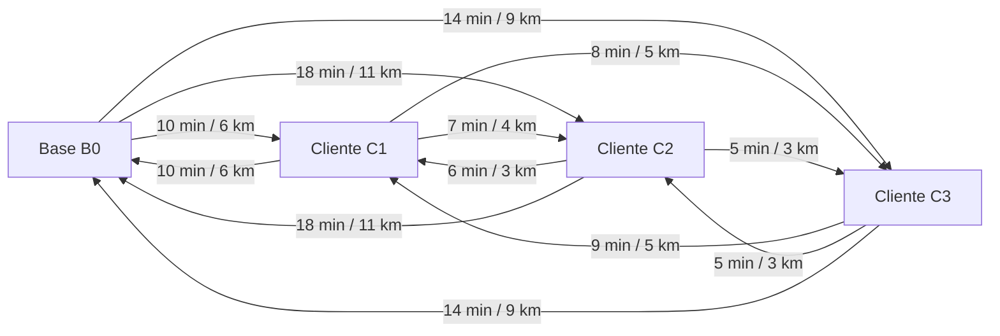

# 2. Elementos da Rede Grafica

## Do mundo real para o grafo

Em Analise de Redes de Transporte, uma operacao logistica pode ser representada por um grafo.

Essa traducao e poderosa porque transforma um problema operacional em um objeto matematico que pode ser analisado e otimizado.

## Nos

No contexto desta aplicacao, os nos representam pontos relevantes da rede:

- base operacional: inicio e fim das rotas;
- agencias ou clientes: locais onde existe demanda de atendimento;
- eventualmente, outros pontos logisticos de apoio.

Cada no pode carregar atributos importantes, como:

- coordenadas geograficas;
- janela de atendimento;
- tempo de servico;
- tipo de demanda.

## Arestas

As arestas representam as ligacoes possiveis entre os nos da rede.

Cada aresta tem pelo menos dois pesos importantes:

- distancia;
- tempo de deslocamento.

Em uma formulacao mais completa, a aresta tambem pode carregar:

- custo monetario;
- restricao de trafego;
- indisponibilidade de percurso.

## Interpretacao da matriz de distancias e tempos

Na pratica, o solver nao trabalha apenas com "ruas desenhadas no mapa". Ele trabalha com uma matriz que informa, para cada par de nos:

- quantos quilometros separam os pontos;
- quanto tempo a viagem consome.

Isso permite comparar diferentes sequencias de atendimento e verificar se a rota ainda respeita o turno da viatura e a janela dos clientes.

## Exemplo de subgrafo simplificado

No diagrama abaixo:

- `B0` e a base;
- `C1`, `C2` e `C3` sao clientes;
- cada aresta mostra um peso simplificado de tempo e distancia.

## Leitura do grafo para fins de otimização

Uma rota e, em essencia, um caminho orientado no grafo:

$$
\text{Base} \rightarrow \text{Cliente 1} \rightarrow \text{Cliente 2} \rightarrow \text{Base}
$$

Mas o objetivo nao e apenas encontrar um caminho qualquer. O objetivo e encontrar um conjunto de caminhos que:

- cubra as demandas relevantes;
- respeite as restricoes;
- minimize o custo total da operacao.

> 🎥 *[Inserir GIF mostrando a rede e a selecao de uma rota sobre o grafo aqui]*

[⬅️ Anterior](./01-introducao-e-contexto.md) | [Próxima ➡️](./03-modelagem-e-funcao-objetivo.md)
