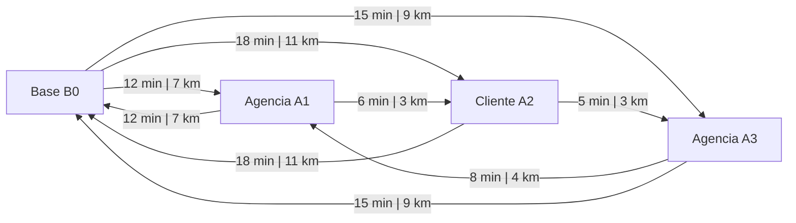

# 2. Elementos da Rede Grafica

## Do mapa da cidade para o grafo matematico

Depois de entender o contexto operacional, o proximo passo e traduzir o problema para a linguagem de redes.

No mundo real, enxergamos:

- uma base;
- agencias e clientes;
- ruas, tempos de viagem e distancias.

Na modelagem, isso vira um grafo.

> Esta e a grande ponte entre o problema logistico e a analise quantitativa.

## O que sao os nos?

Os nos representam os pontos relevantes da rede.

No caso da transportadora de valores, os principais nos sao:

- **base operacional**: inicio e fim das rotas;
- **clientes ou agencias**: locais onde existe demanda;
- **pontos especiais**: quando existirem, locais com funcao logistica adicional.

Cada no pode carregar atributos como:

- coordenadas;
- janela de atendimento;
- tempo de servico;
- tipo de demanda.

## O que sao as arestas?

As arestas representam as ligacoes entre os nos.

Cada aresta responde, no minimo, a duas perguntas:

1. qual a distancia entre os pontos?
2. quanto tempo a viagem consome?

Em alguns casos, a aresta tambem pode refletir:

- custo monetario;
- indisponibilidade;
- atrasos esperados;
- restricoes de percurso.

## Por que a matriz de tempos e distancias e tao importante?

O solver precisa comparar sequencias possiveis de atendimento.

Para isso, ele usa uma matriz que informa, para cada par de nos:

- distancia;
- tempo de deslocamento.

Sem essa matriz, nao conseguimos avaliar se uma rota:

- cabe dentro do turno da viatura;
- atende os clientes dentro da janela;
- continua economicamente razoavel.

## Exemplo de subgrafo simplificado

No exemplo abaixo:

- `B0` e a base;
- `A1`, `A2` e `A3` representam clientes ou agencias;
- os pesos nas arestas mostram tempo e distancia.

## Lendo a rede como um problema de transporte

Uma rota pode ser vista como um caminho orientado:

$$
\text{Base} \rightarrow \text{Agencia 1} \rightarrow \text{Cliente 2} \rightarrow \text{Base}
$$

Mas o objetivo nao e apenas construir um caminho.

O que buscamos e um conjunto de caminhos que:

- cubra os nos relevantes;
- respeite as restricoes logisticas;
- minimize o custo operacional.

## Mapa real versus grafo abstrato

Didaticamente, e interessante mostrar lado a lado:

- o mapa real da operacao;
- o grafo abstrato que alimenta o modelo.

> 🎥 *[Inserir GIF mostrando a transicao do mapa real para o grafo aqui]*

## Pergunta de transicao

Se a rede ja foi desenhada, ainda falta responder:

> O que faz uma rota ser considerada boa, ruim, viavel ou inviavel?

Essa pergunta leva diretamente a modelagem e a funcao objetivo.

[⬅️ Anterior](./01-introducao-e-contexto.md) | [Próxima ➡️](./03-modelagem-e-funcao-objetivo.md)
