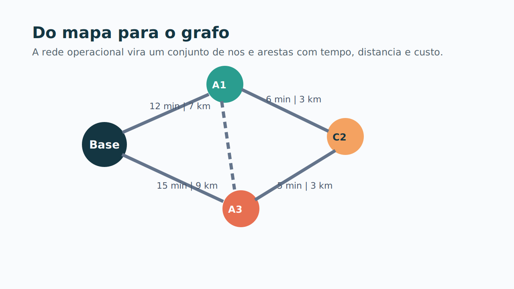

# 2. Elementos da Rede Grafica

## Da operacao para o grafo

Depois de entender o problema, o passo seguinte e traduzi-lo para uma rede. No projeto, isso significa representar:

- **nos**: bases, agencias e clientes;
- **arestas**: deslocamentos com tempo e distancia;
- **atributos**: janelas, servico, demanda e compatibilidade.

## O que o solver enxerga

Cada no carrega informacao relevante para a decisao:

- onde fica;
- quando pode ser atendido;
- quanto tempo consome;
- que tipo de operacao exige.

Cada aresta responde duas perguntas basicas:

1. quanto custa chegar ao proximo ponto;
2. quanto tempo isso consome.

## Leitura de rede

Do ponto de vista de Analise de Redes de Transporte, a rota final e um subconjunto orientado da rede original:

$$
\text{Base} \rightarrow \text{Cliente 1} \rightarrow \text{Cliente 2} \rightarrow \text{Base}
$$

Mas o objetivo nao e construir um caminho qualquer. O objetivo e construir um conjunto de caminhos que:

- respeite restricoes logisticas;
- use a frota de forma eficiente;
- minimize custo e penalidade.

## Ponte para a modelagem

Com a rede definida, a proxima pergunta deixa de ser geografica e passa a ser quantitativa:

> quando uma rota e boa, ruim, viavel ou inviavel?

[⬅️ Anterior](./01-introducao-e-contexto.md) | [Próxima ➡️](./03-modelagem-e-funcao-objetivo.md)
