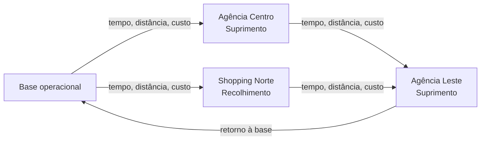

# 2. Elementos da Rede Gráfica

## Do mapa para o grafo

Depois de entender o problema, o passo seguinte é traduzi-lo para uma rede. No projeto, isso significa representar:

- **nós**: bases, agências e clientes;
- **arestas**: deslocamentos com tempo, distância e custo;
- **atributos**: janelas de atendimento, tempo de serviço, demanda e compatibilidade.

## O que o solver enxerga

Cada nó carrega informação relevante para a decisão:

- onde fica;
- quando pode ser atendido;
- quanto tempo consome;
- que tipo de operação exige.

Cada aresta responde duas perguntas básicas:

1. quanto custa chegar ao próximo ponto;
2. quanto tempo isso consome.

## Leitura de rede

Em uma leitura simplificada, o problema pode ser visto assim:

Do ponto de vista de Análise de Redes de Transporte, a solução final é um subconjunto orientado da rede original, escolhido para respeitar restrições e minimizar custo.

## Ponte para a modelagem

Com a rede definida, a próxima pergunta deixa de ser geográfica e passa a ser quantitativa:

> quando uma rota é boa, ruim, viável ou inviável?

[⬅️ Anterior](./01-introducao-e-contexto.md) | [Próxima ➡️](./03-modelagem-e-funcao-objetivo.md)
