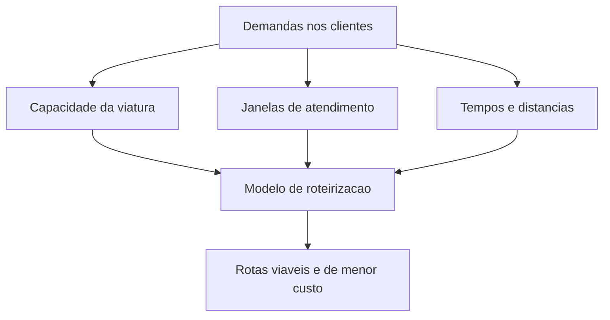

# 3. Modelagem e Funcao Objetivo

## Elementos principais da modelagem

Para formular o problema de roteirizacao, precisamos descrever quem se move, o que precisa ser atendido e quais limites nao podem ser violados.

## Veiculos

Cada viatura pode ser vista como um recurso com caracteristicas proprias:

- capacidade financeira;
- capacidade fisica ou volumetrica;
- custo fixo de uso;
- custo variavel de deslocamento;
- janela de operacao.

Isso significa que duas viaturas podem gerar solucoes diferentes mesmo atendendo os mesmos pontos.

## Demandas

Cada ponto de atendimento pode gerar uma ordem com:

- valor financeiro;
- volume estimado;
- tempo de servico;
- janela de atendimento;
- tipo de operacao: suprimento ou recolhimento.

Do ponto de vista logistico:

- no suprimento, a viatura sai carregada e vai entregando;
- no recolhimento, a viatura vai acumulando valor ao longo da rota.

## Janelas de tempo

As janelas de tempo sao restricoes fundamentais.

Se um cliente aceita atendimento apenas entre 9h e 11h, nao basta que ele esteja "na rota". O horario planejado precisa cair dentro desse intervalo.

Assim, uma boa rota nao depende apenas da menor distancia, mas do encaixe temporal entre:

- tempo de deslocamento;
- tempo de servico;
- horario permitido para cada cliente;
- turno total da viatura.

## Ideia central da funcao objetivo

Em linguagem simples, queremos minimizar o custo total da operacao.

Esse custo pode ser pensado como a soma de:

- custo de deslocamento;
- custo do tempo de frota em operacao;
- custo de ativar mais veiculos;
- custo de nao atender ordens importantes.

Uma versao didatica da funcao objetivo e:

$$
\min Z =
\sum_{k \in K} F_k y_k
+
\sum_{k \in K}\sum_{(i,j)\in A} C_{ij}^k x_{ij}^k
+
\sum_{k \in K}\sum_{(i,j)\in A} T_{ij} x_{ij}^k
+
\sum_{i \in N} P_i u_i
$$

## Significado de cada termo

### 1. Custo fixo dos veiculos

$$
\sum_{k \in K} F_k y_k
$$

- $F_k$ representa o custo fixo de usar a viatura $k$;
- $y_k$ vale 1 se a viatura for usada e 0 caso contrario.

Interpretacao:

- quanto mais veiculos forem acionados, maior tende a ser o custo operacional.

### 2. Custo de deslocamento

$$
\sum_{k \in K}\sum_{(i,j)\in A} C_{ij}^k x_{ij}^k
$$

- $C_{ij}^k$ representa o custo de a viatura $k$ percorrer o arco $(i,j)$;
- $x_{ij}^k$ vale 1 se esse arco for usado na rota da viatura $k$.

Interpretacao:

- rotas mais longas ou mais caras pesam mais na solucao.

### 3. Custo associado ao tempo

$$
\sum_{k \in K}\sum_{(i,j)\in A} T_{ij} x_{ij}^k
$$

- $T_{ij}$ representa o tempo de deslocamento entre os nos $i$ e $j$.

Interpretacao:

- mesmo que duas rotas tenham distancia semelhante, a rota mais lenta pode ser pior por consumir mais tempo de operacao.

### 4. Penalidade por nao atendimento

$$
\sum_{i \in N} P_i u_i
$$

- $P_i$ representa a penalidade de nao atender a ordem $i$;
- $u_i$ vale 1 se a ordem ficar sem atendimento.

Interpretacao:

- o modelo pode aceitar deixar uma ordem fora da solucao, mas isso cobra um preco alto.

## Leitura intuitiva da equacao

Em linguagem natural, a funcao objetivo diz:

> escolher rotas que atendam o maior numero possivel de ordens relevantes, usando poucos veiculos e percorrendo caminhos de menor custo e tempo.

## Restricoes logisticas mais importantes

Mesmo sem escrever o modelo completo em detalhes, as restricoes fundamentais sao:

- cada ordem pode ser atendida no maximo uma vez;
- a viatura deve respeitar sua capacidade financeira;
- a viatura deve respeitar sua capacidade volumetrica;
- a rota deve respeitar as janelas de atendimento;
- a rota deve comecar e terminar na base;
- apenas viaturas elegiveis podem atender determinados clientes.

[⬅️ Anterior](./02-elementos-da-rede-grafica.md) | [Próxima ➡️](./04-tecnologia-solucao.md)
