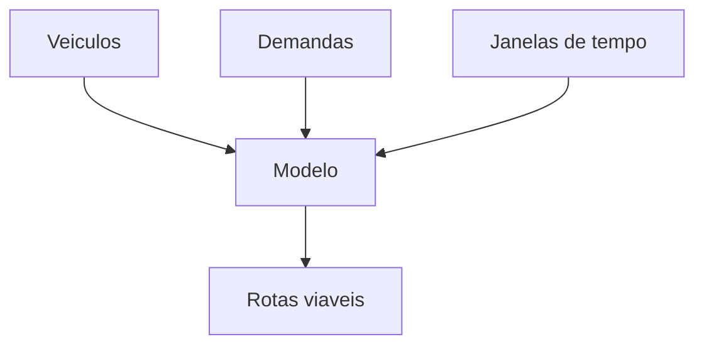

# 3. Modelagem e Funcao Objetivo

## Quando uma rota e boa?

Essa e a pergunta central da modelagem.

Uma rota boa nao e necessariamente a rota mais curta. Ela precisa ser:

- viavel no tempo;
- viavel na capacidade;
- coerente com a operacao;
- economicamente eficiente.

## Os tres blocos da modelagem

Para tornar isso didatico, podemos pensar em tres blocos principais:

1. **veiculos**
2. **demandas**
3. **tempo**

## 1. Veiculos

Cada viatura entra no problema com caracteristicas proprias:

- capacidade financeira;
- capacidade fisica ou volumetrica;
- custo fixo de uso;
- custo variavel de deslocamento;
- janela de operacao.

Isso significa que duas viaturas diferentes podem gerar solucoes muito diferentes para o mesmo conjunto de clientes.

## 2. Demandas

Cada cliente ou agencia pode gerar uma ordem com:

- valor financeiro;
- volume estimado;
- tempo de servico;
- janela de atendimento;
- tipo de operacao.

No problema estudado aqui:

- no **suprimento**, a carga e levada da base para o cliente;
- no **recolhimento**, a carga e acumulada ao longo da rota.

Isso muda a leitura logistica da capacidade e, principalmente, do limite segurado.

## 3. Janelas de tempo

Uma rota pode ser curta e ainda assim ser ruim.

Por exemplo:

- a agencia aceita atendimento so entre 9h e 10h;
- a viatura chega 10h20;
- a rota falhou operacionalmente, mesmo que a distancia total seja pequena.

Por isso, o encaixe temporal e central na modelagem:

- tempo de deslocamento;
- tempo de servico;
- horario permitido em cada no;
- turno total da viatura.

## Intuicao da funcao objetivo

A funcao objetivo tenta equilibrar cobertura e eficiencia.

Em forma simplificada, queremos minimizar:

$$
\text{custo total} =
\text{custo de viaturas}
+
\text{custo de deslocamento}
+
\text{custo de tempo}
+
\text{penalidade por nao atendimento}
$$

Uma escrita didatica e:

$$
\min Z =
\sum_{k \in K} F_k y_k
+
\sum_{k \in K}\sum_{(i,j)\in A} C_{ij}^k x_{ij}^k
+
\sum_{k \in K}\sum_{(i,j)\in A} T_{ij} x_{ij}^k
+
\sum_{i \in N} P_i u_i
$$

## Lendo a equacao passo a passo

### Custo de ativar veiculos

$$
\sum_{k \in K} F_k y_k
$$

Esse termo indica que usar mais viaturas tende a encarecer a operacao.

### Custo de percorrer a rede

$$
\sum_{k \in K}\sum_{(i,j)\in A} C_{ij}^k x_{ij}^k
$$

Esse termo representa o custo de deslocamento nos arcos da rede.

### Custo do tempo em operacao

$$
\sum_{k \in K}\sum_{(i,j)\in A} T_{ij} x_{ij}^k
$$

Esse termo reforca que tempo tambem e recurso logístico.

### Penalidade por nao atendimento

$$
\sum_{i \in N} P_i u_i
$$

Esse termo evita que o modelo "economize" deixando ordens importantes fora da solucao.

## Restricoes fundamentais

Mesmo sem escrever a formulacao completa, algumas restricoes sao indispensaveis:

- cada ordem pode ser atendida no maximo uma vez;
- a viatura deve respeitar sua capacidade financeira;
- a viatura deve respeitar sua capacidade fisica;
- a rota deve respeitar as janelas de atendimento;
- a viatura deve operar dentro do turno;
- a rota deve sair e retornar a base;
- nem toda viatura pode atender todo cliente.

## Leitura final desta pagina

Se precisarmos resumir a modelagem em uma frase:

> O problema e escolher quais arcos da rede serao percorridos por quais viaturas, de forma a atender a demanda com o menor custo possivel e sem violar as restricoes logisticas.

> 🎥 *[Inserir GIF curto com uma rota sendo avaliada por capacidade e horario aqui]*

[⬅️ Anterior](./02-elementos-da-rede-grafica.md) | [Próxima ➡️](./04-tecnologia-solucao.md)
