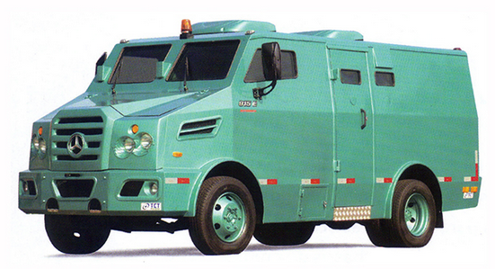

# 3. Modelagem e Função Objetivo

## O que define uma boa rota

Uma rota boa não é apenas curta. Ela precisa ser:

- viável no tempo;
- viável na capacidade;
- coerente com o tipo de operação;
- eficiente em custo.

## Blocos da modelagem

O problema pode ser lido em três blocos:

1. **veículos**: custo, turno e capacidades;
2. **demandas**: volume, valor, janela e serviço;
3. **tempo**: deslocamento, atendimento e retorno à base.

## Função objetivo

No produto e no benchmark, a intuição econômica é a mesma: minimizar o custo total da operação sem violar as restrições logísticas.

$$
\min Z =
\underbrace{\sum_{k \in K} F_k y_k}_{\text{custo fixo de viatura}}
+
\underbrace{\sum_{k \in K}\sum_{(i,j)\in A} C_{ij}^k x_{ij}^k}_{\text{custo de deslocamento}}
+
\underbrace{\sum_{k \in K}\sum_{(i,j)\in A} T_{ij} x_{ij}^k}_{\text{custo de duração}}
+
\underbrace{\sum_{i \in N} P_i u_i}_{\text{penalidade por não atendimento}}
$$

No benchmark, esse valor é recalculado fora do solver como `objective_common`, para garantir comparação justa entre PyVRP e PuLP.

## Restrições que importam

- uma ordem não pode ser atendida mais de uma vez;
- a viatura respeita capacidade volumétrica e financeira;
- a rota respeita janela de tempo e turno;
- toda rota sai e retorna à base;
- `suprimento` e `recolhimento` continuam isolados.

Essa última regra é importante: a comparação experimental não mistura as duas classes na mesma rota.

[⬅️ Anterior](./02-elementos-da-rede-grafica.md) | [Próxima ➡️](./04-tecnologia-solucao.md)
