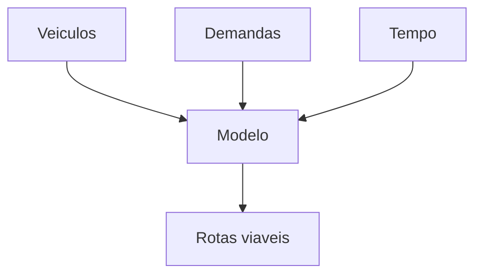
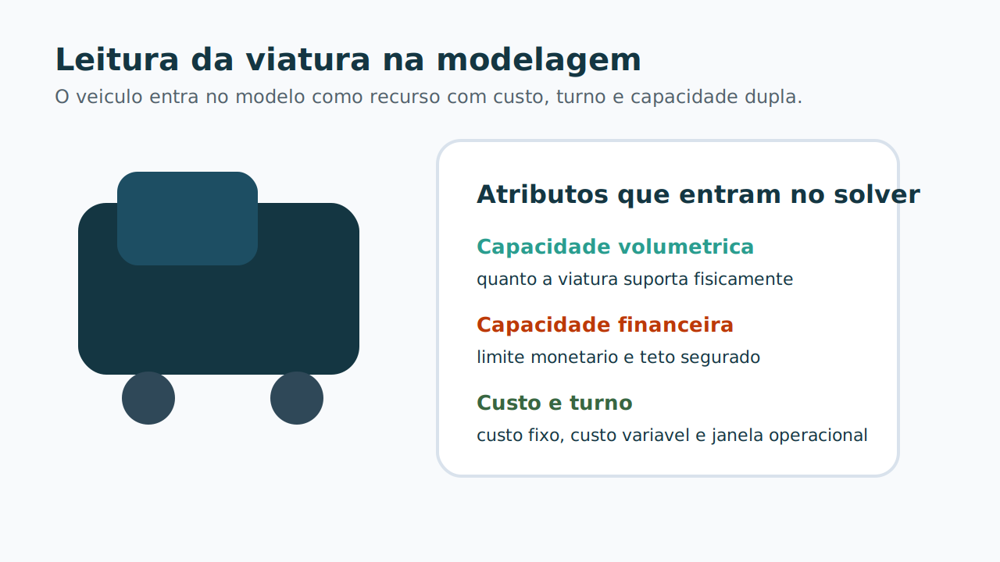
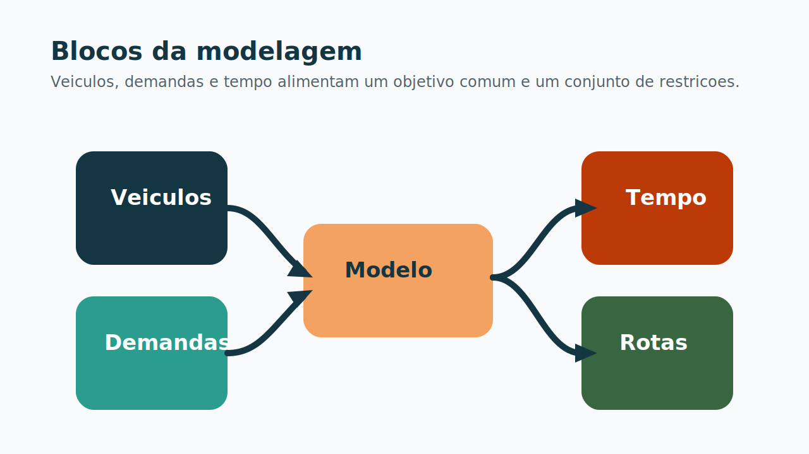

# 3. Modelagem e Funcao Objetivo

## O que define uma boa rota

Uma rota boa nao e apenas curta. Ela precisa ser:

- viavel no tempo;
- viavel na capacidade;
- coerente com o tipo de operacao;
- eficiente em custo.

## Blocos da modelagem

O problema pode ser lido em tres blocos:

1. **veiculos**: custo, turno e capacidades;
2. **demandas**: volume, valor, janela e servico;
3. **tempo**: deslocamento, atendimento e retorno a base.

## Funcao objetivo

No produto e no benchmark, a intuicao economica e a mesma:

$$
\text{custo total} =
\text{custo fixo de viatura}
+
\text{custo de deslocamento}
+
\text{custo de duracao}
+
\text{penalidade por nao atendimento}
$$

No benchmark, esse valor e recalculado fora do solver como `objective_common`, para garantir comparacao justa entre PyVRP e PuLP.

## Restricoes que importam

- uma ordem nao pode ser atendida mais de uma vez;
- a viatura respeita capacidade volumetrica e financeira;
- a rota respeita janela de tempo e turno;
- toda rota sai e retorna a base;
- `suprimento` e `recolhimento` continuam isolados.

Essa ultima regra e importante: a comparacao experimental nao mistura as duas classes na mesma rota.

[⬅️ Anterior](./02-elementos-da-rede-grafica.md) | [Próxima ➡️](./04-tecnologia-solucao.md)
