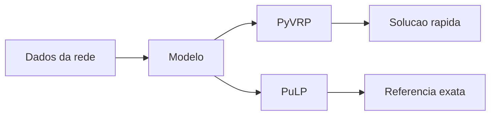
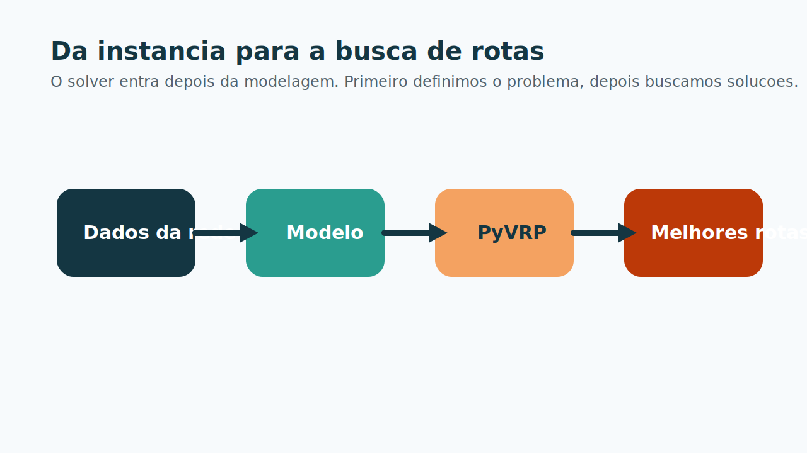
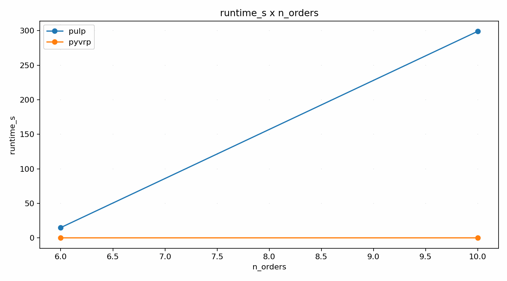

# 4. Tecnologia da Solucao

## Como as rotas sao encontradas

Depois da modelagem, o projeto resolve o problema em duas camadas:

- **PyVRP**: solver heuristico usado como referencia operacional;
- **PuLP**: baseline exato usado apenas no nucleo comparavel do benchmark.

Essa separacao evita comparar o sistema inteiro com um modelo matematico simplificado.

## Papel do PyVRP

O PyVRP e a escolha principal para a operacao porque lida bem com:

- janelas de tempo;
- frota heterogenea;
- clientes opcionais;
- capacidade em mais de uma dimensao.

Na pratica, ele entrega boas solucoes muito rapido.

## Papel do PuLP

O PuLP entra como referencia controlada:

- uma classe operacional por vez;
- mesmas ordens e mesmas viaturas;
- mesmo objetivo comum;
- foco em pequena e media escala.

Ou seja, ele nao substitui o backend. Ele ajuda a validar qualidade.

## Protocolo rodado no notebook

O benchmark da apresentacao usa:

- `operacao_sob_pressao`;
- `20%`, `40%`, `60%` e `80%` das ordens;
- `5` repeticoes por escala;
- rodada exaustiva separada com `100%`.

Isso sustenta uma leitura simples:

- o PuLP ajuda a medir qualidade;
- o PyVRP sustenta escalabilidade operacional.

[⬅️ Anterior](./03-modelagem-e-funcao-objetivo.md) | [Próxima ➡️](./05-resultados-e-analise.md)
