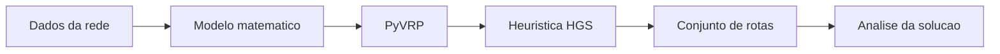

# 4. Tecnologia da Solucao

## Por que Python?

No ambiente academico, Python se tornou uma linguagem muito forte para problemas de Pesquisa Operacional e Analise de Redes de Transporte.

As principais vantagens sao:

- sintaxe simples e de facil leitura;
- ecossistema amplo para analise de dados;
- integracao natural com bibliotecas cientificas;
- rapidez para prototipar modelos e testar cenarios.

Para um aluno ou pesquisador, isso e importante porque reduz o tempo gasto com detalhes de implementacao e aumenta o tempo dedicado a:

- formular o problema;
- testar hipoteses;
- interpretar resultados.

## Por que usar uma biblioteca especializada?

Em teoria, seria possivel programar uma heuristica de roteirizacao do zero.

Na pratica, isso costuma ser caro em tempo e arriscado em qualidade, porque problemas de VRP combinam:

- explosao combinatoria;
- grande numero de restricoes;
- alta sensibilidade a parametros operacionais.

Por isso, faz sentido usar uma biblioteca consolidada para concentrar esforco no problema logistico em si.

## Por que PyVRP?

PyVRP e uma biblioteca moderna voltada para problemas de roteamento de veiculos.

Ela e especialmente interessante neste contexto porque:

- permite modelar VRP com janelas de tempo;
- suporta capacidade em mais de uma dimensao;
- representa bem clientes opcionais;
- trabalha com frota heterogenea;
- evita que precisemos reinventar uma metaheuristica complexa do zero.

## HGS: Hybrid Genetic Search

O motor do PyVRP e baseado em HGS, ou Hybrid Genetic Search.

A ideia geral e combinar:

- exploracao de varias solucoes candidatas;
- recombinacao entre boas rotas;
- mecanismos de melhoria local;
- controle de diversidade para evitar estagnacao.

Esse tipo de abordagem e considerado estado da arte para muitos problemas de roteirizacao de veiculos.

## Relacao com o problema da disciplina

Do ponto de vista de Analise de Redes de Transporte, o uso do PyVRP e valioso porque permite que o foco da analise fique em:

- construcao da rede;
- definicao de custos;
- restricoes de capacidade;
- janelas de tempo;
- avaliacao da qualidade das rotas.

Ou seja, a biblioteca cuida da heuristica de busca, enquanto o pesquisador ou aluno concentra a atencao no modelo logistico.

## O que isso ensina em sala de aula?

O uso de uma ferramenta como PyVRP mostra que, em problemas reais de transporte:

- a formulacao matematica continua central;
- a heuristica computacional e um meio para buscar boas solucoes;
- a qualidade da modelagem da rede influencia diretamente o resultado final.

> 🎥 *[Inserir video curto mostrando a execucao de uma instancia no solver aqui]*

[⬅️ Anterior](./03-modelagem-e-funcao-objetivo.md) | [Próxima ➡️](./05-resultados-e-analise.md)
