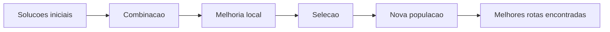
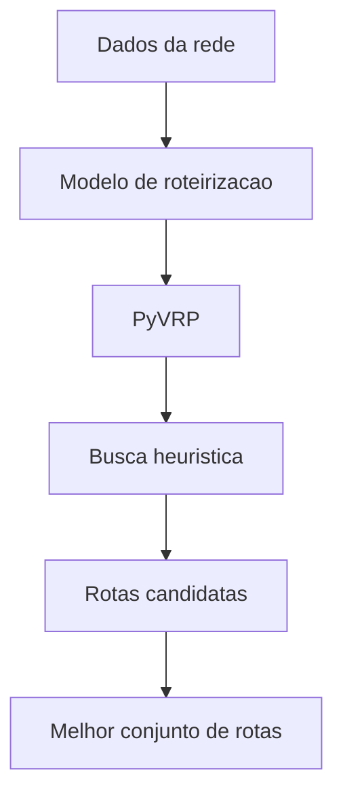

# 4. Tecnologia da Solucao

## Da formulacao para a busca de boas rotas

Depois de formular o problema, surge a pergunta natural:

> Como encontrar boas rotas em um problema com tantas combinacoes possiveis?

Em redes pequenas, ainda e possivel experimentar manualmente algumas alternativas. Mas, em redes reais, o numero de sequencias possiveis explode rapidamente.

## Por que nao resolver "no braco"?

Considere apenas alguns elementos:

- varios clientes;
- mais de um veiculo;
- diferentes ordens de visita;
- janelas de tempo;
- capacidades;
- possibilidade de nao atender alguns pontos.

O numero de combinacoes cresce muito rapidamente. Por isso, problemas de roteirizacao exigem metodos de busca eficientes.

## Por que Python ajuda no ambiente academico?

Python e uma escolha natural para sala de aula e pesquisa porque oferece:

- leitura simples;
- escrita rapida de prototipos;
- integracao forte com bibliotecas cientificas;
- facilidade para testar cenarios e visualizar resultados.

Em ambiente academico, isso e valioso porque permite focar mais em:

- modelagem;
- analise da rede;
- interpretacao da solucao.

## Por que usar PyVRP?

PyVRP e uma biblioteca moderna voltada para problemas de roteamento de veiculos.

Ela e adequada ao caso estudado porque facilita:

- janelas de tempo;
- frota heterogenea;
- clientes opcionais;
- capacidades em mais de uma dimensao;
- busca de solucoes boas sem programar toda a heuristica do zero.

## A ideia do HGS

O PyVRP utiliza uma abordagem baseada em HGS, Hybrid Genetic Search.

Em linguagem simples, a ideia e:

1. gerar varias solucoes candidatas;
2. combinar boas caracteristicas dessas solucoes;
3. melhorar localmente as rotas;
4. manter diversidade para nao ficar preso cedo demais em uma solucao ruim.

## O que isso significa para a disciplina?

Do ponto de vista didatico, a biblioteca nao substitui a modelagem.

Ela entra depois que o problema ja foi:

- traduzido para rede;
- descrito por custos e restricoes;
- organizado em um formato computacional.

Ou seja:

> o solver nao "inventa" o problema. Ele procura boas solucoes para o problema que a modelagem definiu.

## Leitura visual da solucao computacional

## O ganho pedagogico

Usar uma biblioteca especializada permite que o foco da aula permaneça onde interessa:

- formulacao do problema;
- leitura de restricoes logisticas;
- comparacao entre solucoes;
- analise dos resultados sobre a rede.

> 🎥 *[Inserir video curto mostrando a execucao do solver e a melhoria gradual das rotas aqui]*

[⬅️ Anterior](./03-modelagem-e-funcao-objetivo.md) | [Próxima ➡️](./05-resultados-e-analise.md)
