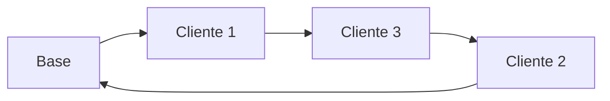

# 5. Resultados e Analise

## Como a solucao aparece

A saida do modelo e um conjunto de rotas associado a veiculos especificos.

Cada rota informa, de forma geral:

- qual viatura foi usada;
- qual base ela utiliza;
- quais clientes foram atendidos;
- em que sequencia o atendimento ocorre;
- qual o horario previsto de cada parada;
- qual o custo estimado da rota.

## Leitura da solucao na perspectiva de redes

Em termos de rede grafica, a solucao final e um subconjunto orientado das arestas originais.

Esse subconjunto precisa formar caminhos logisticamente validos:

- iniciando na base;
- visitando os clientes selecionados;
- retornando ao deposito;
- respeitando capacidades e janelas.

## O que analisar depois da otimizacao

Uma boa analise da solucao nao deve se limitar a olhar "a rota ficou bonita no mapa".

Algumas perguntas importantes sao:

1. O numero de veiculos usados foi razoavel?
2. As rotas respeitaram as janelas de tempo?
3. Houve ordens nao atendidas?
4. O custo total caiu em relacao a um planejamento manual?
5. Alguma rota ficou perto do limite de capacidade ou do limite segurado?

## Indicadores de interesse

Em uma apresentacao para a disciplina, vale destacar indicadores como:

- distancia total percorrida;
- tempo total em operacao;
- numero de viaturas acionadas;
- taxa de atendimento;
- numero de ordens nao atendidas;
- custo total estimado.

## Espacos para evidencias visuais do projeto

> 🎥 *[Inserir GIF da evolucao das rotas no mapa aqui]*

> 🎥 *[Inserir video curto com a execucao completa do projeto aqui]*

## Fechamento

A otimizacao de redes de transporte traz ganhos diretos para a operacao:

- reducao de custos logisticos;
- melhor uso da frota;
- maior aderencia a restricoes reais;
- apoio quantitativo a tomada de decisao.

Para a disciplina de Analise de Redes de Transporte, esse tipo de problema e especialmente rico porque mostra como conceitos de:

- grafos;
- custos generalizados;
- restricoes;
- formulacao matematica;
- heuristicas de busca

se conectam em uma aplicacao real de alto impacto operacional.

## Mensagem final

Mais do que encontrar caminhos, a roteirizacao busca organizar uma rede de servicos sob restricoes.

Esse e exatamente o ponto em que a Analise de Redes de Transporte encontra a Pesquisa Operacional aplicada.

[⬅️ Anterior](./04-tecnologia-solucao.md) | [Próxima ➡️](./05-resultados-e-analise.md)
