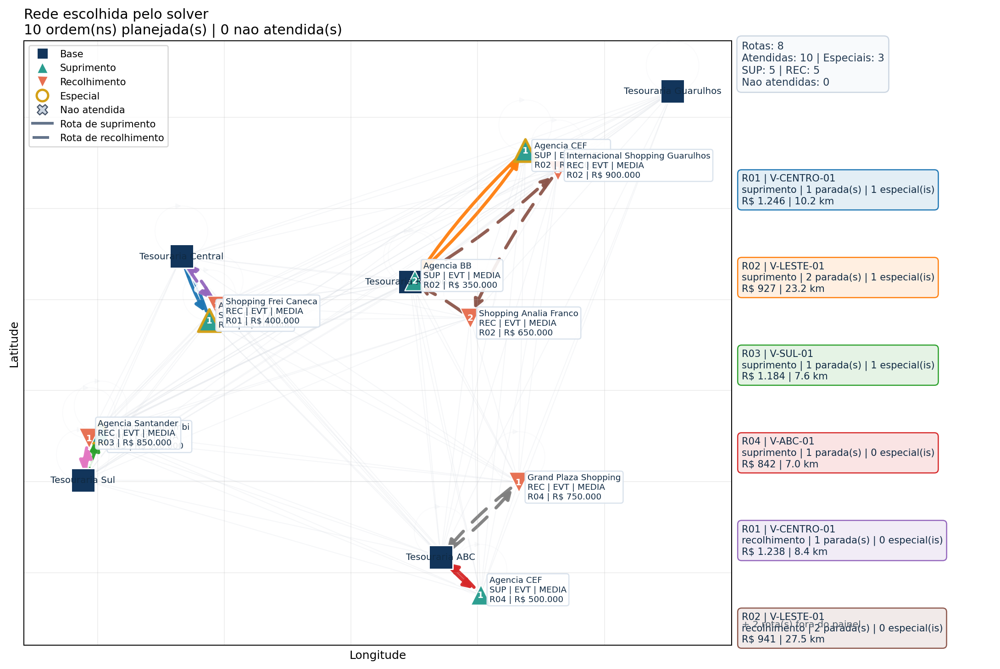
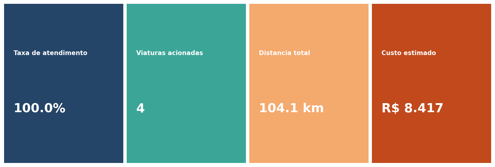
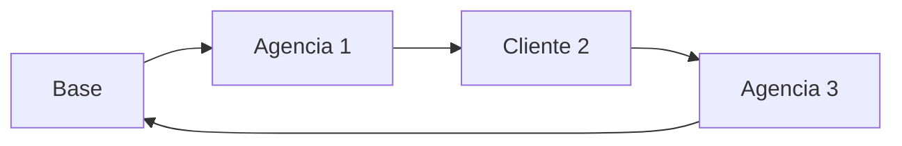
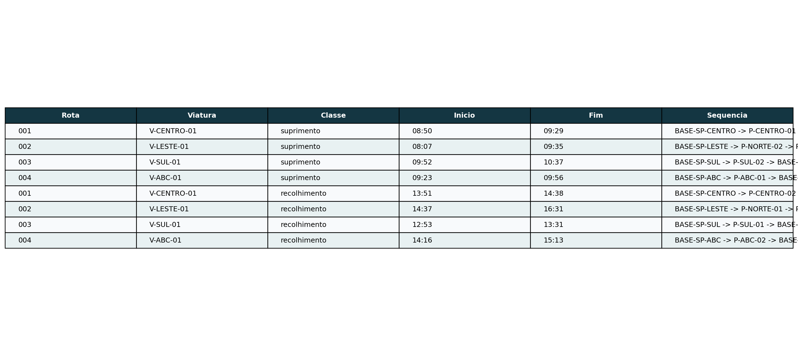
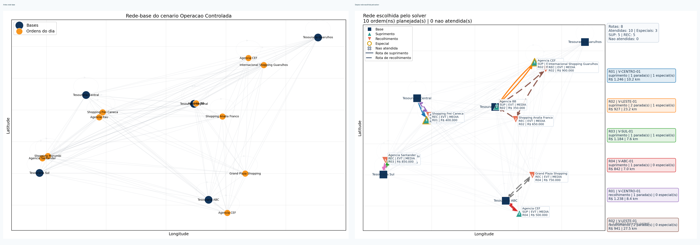

# 5. Resultados e Analise

## A historia termina no mapa

Depois de toda a modelagem, o que o problema entrega ao final nao e apenas um numero.

O resultado aparece como um conjunto de rotas:

- cada rota associada a uma viatura;
- cada viatura ligada a uma base;
- cada atendimento em uma sequencia e em um horario.

Em outras palavras, a saida do modelo devolve um plano operacional.

## Primeiro resultado: a solucao operacional continua legivel

No cenario **operacao_controlada**, o projeto entrega exatamente o tipo de leitura que faz sentido em sala:

- mapa da rede escolhida;
- tabela de sequencia por viatura;
- painel de KPI;
- comparacao entre rede-base e rede planejada.

## Como a solucao pode ser lida?

Cada rota responde perguntas concretas:

1. qual viatura foi usada?
2. quais pontos ela vai atender?
3. em que ordem?
4. em que horario?
5. com qual custo?

## Leitura em linguagem de rede

Na perspectiva de redes, a solucao final e um subconjunto orientado das arestas da rede original.

Esse subconjunto precisa formar caminhos validos:

- saindo da base;
- visitando os nos escolhidos;
- retornando ao deposito;
- respeitando as restricoes do modelo.

## O que deve ser analisado depois da otimizacao?

Uma analise de qualidade nao deve parar na pergunta "a rota ficou curta?".

Tambem e preciso observar:

- a quantidade de viaturas usadas;
- a aderencia as janelas de tempo;
- a quantidade de ordens nao atendidas;
- o custo total da operacao;
- a proximidade de limites de capacidade e de risco segurado.

## Recorte comparavel do experimento

Antes de comparar solvers, e preciso congelar o problema comparavel.

Nesta frente experimental, o recorte e sempre:

- uma classe operacional por vez;
- mesma `InstanciaRoteirizacaoBase`;
- mesmas ordens, viaturas, janelas e capacidades;
- mesmo objetivo comum recalculado fora do solver.

Ficam fora do comparativo:

- auditoria;
- reporting;
- pos-processamento rico;
- qualquer regra hoje documentada fora do solver;
- qualquer acoplamento global entre `suprimento` e `recolhimento`.

## Instancias, escalas e metricas

O benchmark foi organizado em camadas:

1. **didatica**: valida leitura do problema e qualidade do baseline em pequena escala;
2. **benchmark**: mede custo, cobertura e uso de frota em escala intermediaria;
3. **estresse**: existe para expor degradacao de escalabilidade e fronteira do baseline exato.

As metricas primarias sao:

- `runtime_s`;
- `objective_common`;
- `service_rate`;
- `feasible`.

As metricas secundarias complementam a leitura:

- `vehicles_used`;
- `distance_total_m`;
- `duration_total_s`;
- `best_bound`;
- `gap_pct`.

No notebook experimental efetivamente rodado para a apresentacao, o foco recaiu sobre:

- `operacao_sob_pressao`;
- `20%`, `40%`, `60%` e `80%` das ordens;
- `5` repeticoes por escala;
- uma rodada exaustiva separada com `100%` das ordens.

## Indicadores que merecem destaque em sala

- distancia total percorrida;
- tempo total em operacao;
- numero de viaturas acionadas;
- taxa de atendimento;
- ordens nao atendidas;
- custo total estimado;
- rotas proximas do limite segurado.

## Comparacao quantitativa

O benchmark nao existe para provar que "um solver ganha do outro" em todo contexto.

Ele existe para sustentar uma leitura mais rigorosa:

- em instancias pequenas, o baseline exato ajuda a validar cobertura e custo comum;
- conforme a escala cresce, o custo computacional do baseline sobe rapidamente;
- o PyVRP preserva a viabilidade operacional em escala muito maior.

## O que os numeros mostraram no cenario sob pressao

Alguns recortes concretos da execucao atual ajudam a sustentar a leitura metodologica:

- em `40%` das ordens, os dois solvers ficaram com `100%` de atendimento; o PyVRP fechou em cerca de `0,1088 s`, enquanto o PuLP levou cerca de `5,7748 s`;
- em `80%` das ordens, o PyVRP ficou em cerca de `0,2793 s`, enquanto o PuLP subiu para cerca de `155,5691 s`;
- nesse mesmo recorte de `80%`, o PyVRP ficou com taxa media de atendimento de `96,25%`, enquanto o PuLP ficou em `100%`;
- na rodada exaustiva de `100%`, ambos ficaram viaveis, mas com perfis muito diferentes: PyVRP em cerca de `0,3645 s` e PuLP em cerca de `1047,5703 s`.

Esses numeros nao devem ser lidos como verdade universal sobre qualquer instancia. Eles mostram o trade-off observado neste cenario e neste protocolo experimental.

## Dispersao, erro relativo e viabilidade

As medias so contam parte da historia.

Com as repeticoes, passou a ser possivel mostrar:

- como a dispersao cresce entre escalas;
- como o erro relativo da funcao objetivo varia quando o PuLP fornece referencia viavel;
- como a viabilidade do baseline precisa ser observada junto com seu custo computacional.

## Sugestao de bloco visual para a apresentacao final

Nesta pagina, o ideal e mostrar a solucao em varias camadas:

1. mapa da rota;
2. tabela com sequencia e horario;
3. painel com indicadores;
4. comparacao antes e depois;
5. painel quantitativo do benchmark.

## Rodada exaustiva de 100% das ordens

O painel final mais forte do benchmark passou a ser a rodada exaustiva:

- `solver x classe operacional`;
- `suprimento` e `recolhimento` mantidos como execucoes isoladas;
- leitura conjunta de rota, cobertura, frota e custo.

Na execucao atual:

- **PyVRP**: `13` viaturas, `100%` de atendimento, `FO = 40057,51`;
- **PuLP**: `10` viaturas, `100%` de atendimento, `FO = 37812,97`.

Esse recorte ajuda a mostrar que:

- o PyVRP continua extremamente rapido;
- o PuLP ainda produz uma referencia de custo melhor;
- a diferenca entre eles passa a ser menos "funciona ou nao funciona" e mais "qual custo computacional estou disposto a pagar por controle de otimalidade".

## Leitura critica e ameacas a validade

Toda afirmacao comparativa deve vir acompanhada de limites claros:

- o benchmark compara apenas o nucleo comum do problema;
- a igualdade textual da rota nao e criterio cientifico principal;
- o baseline exato nao foi desenhado para escalar como motor operacional;
- resultados do produto completo continuam dependendo de regras fora do solver.

## O ganho logistico da otimizacao

Do ponto de vista operacional, otimizar a rede pode trazer:

- reducao de custo logistico;
- melhor uso da frota;
- melhor aderencia a horarios;
- maior transparencia na tomada de decisao;
- apoio quantitativo para discutir cenarios.

## Fechamento da narrativa

O caminho percorrido nesta apresentacao foi:

1. uma operacao real de transporte de valores;
2. uma rede com nos e arestas;
3. um modelo com custos e restricoes;
4. uma heuristica de busca;
5. uma solucao interpretavel no mapa.

Com o bloco metodologico, a narrativa fica mais forte:

6. um baseline exato para validar o nucleo comparavel;
7. uma leitura critica do trade-off entre otimalidade controlada e escalabilidade.

Essa sequencia resume muito bem a contribuicao da Analise de Redes de Transporte:

> transformar um problema real de mobilidade e servico em uma estrutura analisavel, modelavel e otimizavel.

[⬅️ Anterior](./04-tecnologia-solucao.md) | [Início ↺](./01-introducao-e-contexto.md)
