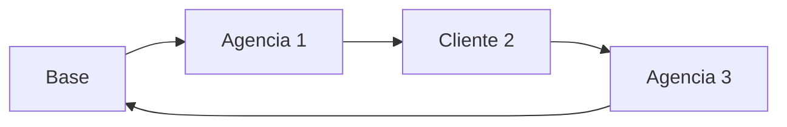

# 5. Resultados e Analise

## A historia termina no mapa

Depois de toda a modelagem, o que o problema entrega ao final nao e apenas um numero.

O resultado aparece como um conjunto de rotas:

- cada rota associada a uma viatura;
- cada viatura ligada a uma base;
- cada atendimento em uma sequencia e em um horario.

Em outras palavras, a saida do modelo devolve um plano operacional.

## Como a solucao pode ser lida?

Cada rota responde perguntas concretas:

1. qual viatura foi usada?
2. quais pontos ela vai atender?
3. em que ordem?
4. em que horario?
5. com qual custo?

## Leitura em linguagem de rede

Na perspectiva de redes, a solucao final e um subconjunto orientado das arestas da rede original.

Esse subconjunto precisa formar caminhos validos:

- saindo da base;
- visitando os nos escolhidos;
- retornando ao deposito;
- respeitando as restricoes do modelo.

## O que deve ser analisado depois da otimizacao?

Uma analise de qualidade nao deve parar na pergunta "a rota ficou curta?".

Tambem e preciso observar:

- a quantidade de viaturas usadas;
- a aderencia as janelas de tempo;
- a quantidade de ordens nao atendidas;
- o custo total da operacao;
- a proximidade de limites de capacidade e de risco segurado.

## Indicadores que merecem destaque em sala

- distancia total percorrida;
- tempo total em operacao;
- numero de viaturas acionadas;
- taxa de atendimento;
- ordens nao atendidas;
- custo total estimado;
- rotas proximas do limite segurado.

## Sugestao de bloco visual para a apresentacao

Nesta pagina, o ideal e mostrar a solucao em varias camadas:

1. mapa da rota;
2. tabela com sequencia e horario;
3. painel com indicadores;
4. comparacao antes e depois.

> 🎥 *[Inserir GIF da evolucao das rotas no mapa aqui]*

> 🎥 *[Inserir video curto com a execucao completa do projeto e a solucao final aqui]*

## O ganho logistico da otimizacao

Do ponto de vista operacional, otimizar a rede pode trazer:

- reducao de custo logistico;
- melhor uso da frota;
- melhor aderencia a horarios;
- maior transparencia na tomada de decisao;
- apoio quantitativo para discutir cenarios.

## Fechamento da narrativa

O caminho percorrido nesta apresentacao foi:

1. uma operacao real de transporte de valores;
2. uma rede com nos e arestas;
3. um modelo com custos e restricoes;
4. uma heuristica de busca;
5. uma solucao interpretavel no mapa.

Essa sequencia resume muito bem a contribuicao da Analise de Redes de Transporte:

> transformar um problema real de mobilidade e servico em uma estrutura analisavel, modelavel e otimizavel.

[⬅️ Anterior](./04-tecnologia-solucao.md) | [Próxima ➡️](./05-resultados-e-analise.md)
