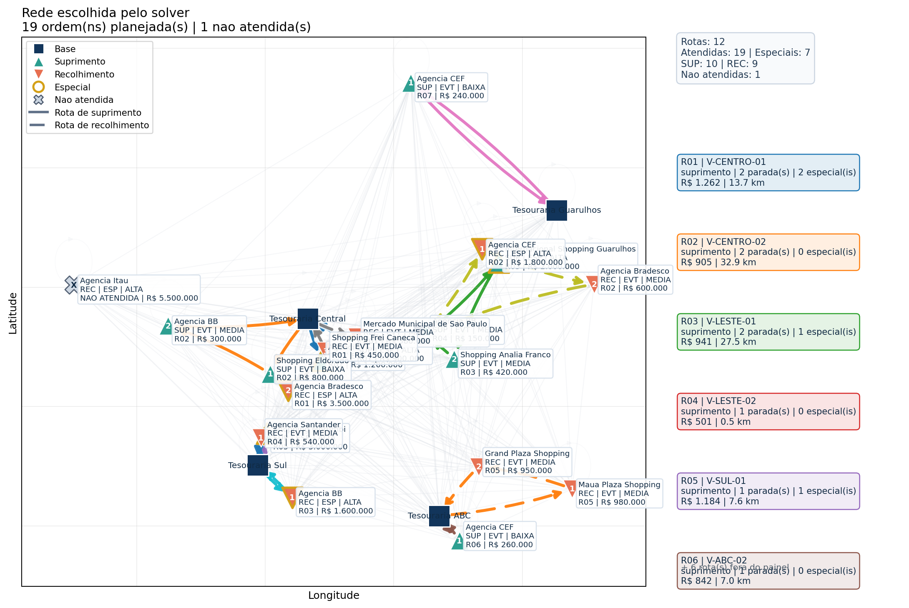
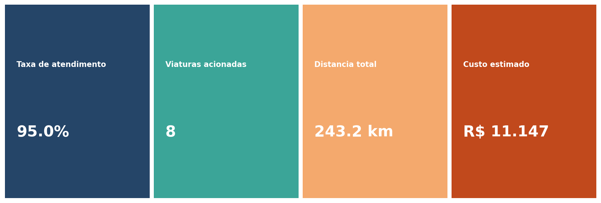
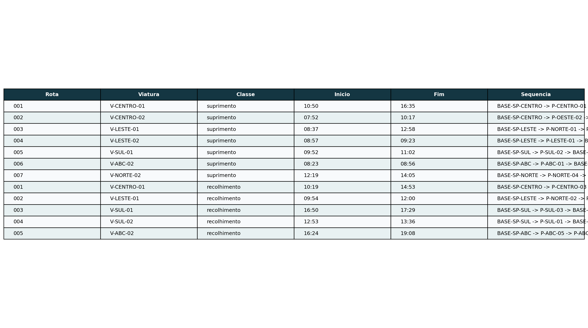
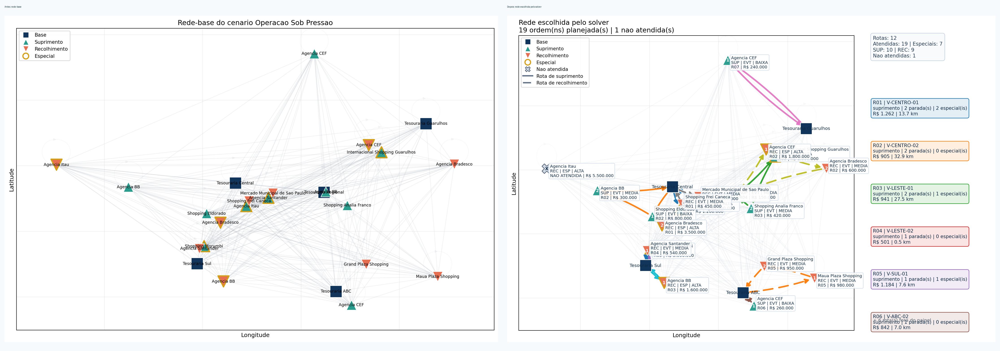
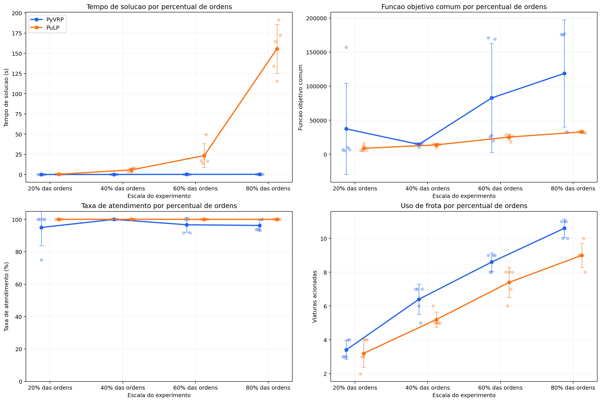
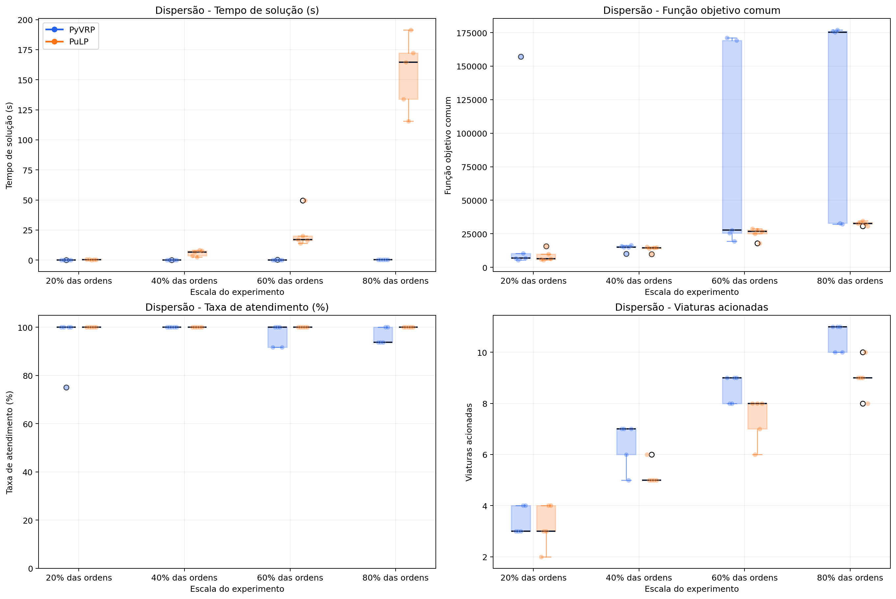
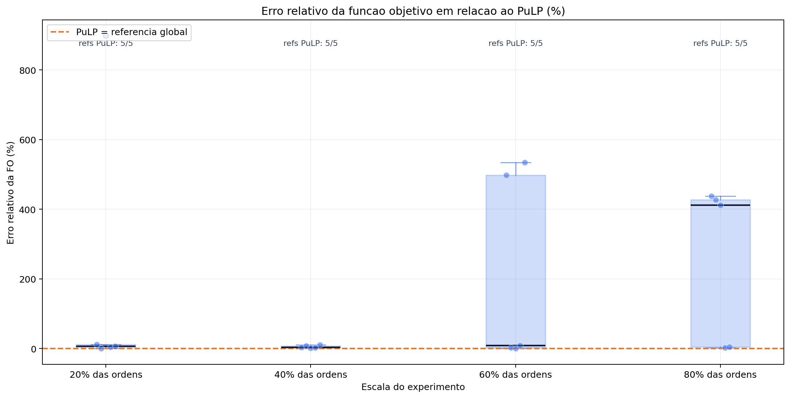
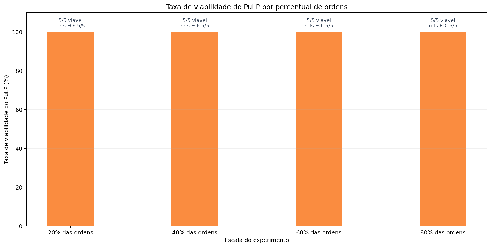
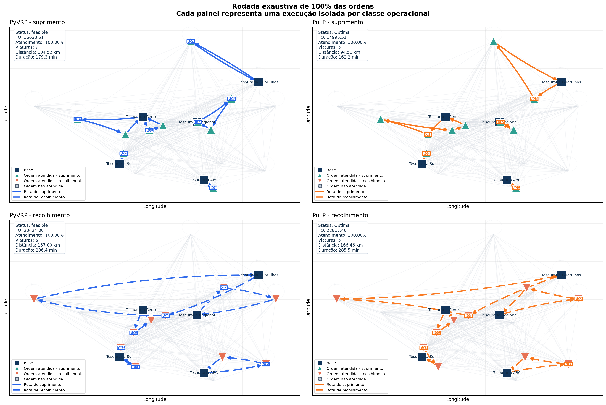

# 5. Resultados e Analise

## Resultado operacional

Com o cenario **operacao_sob_pressao**, a saida do projeto fica mais rica para apresentacao: ha mais ordens, mais dispersao e mais tensao entre cobertura, frota e custo.

O bloco operacional pode ser lido em quatro camadas:

1. mapa da rede escolhida;
2. tabela de sequencias por viatura;
3. painel de indicadores;
4. comparacao entre rede-base e rede planejada.

## O que o benchmark mede

Para comparar PyVRP e PuLP, o experimento congela um nucleo comum:

- uma classe operacional por vez;
- mesmas ordens, viaturas, janelas e capacidades;
- mesma `objective_common`.

As metricas principais sao:

- tempo de solucao;
- funcao objetivo comum;
- taxa de atendimento;
- viaturas acionadas.

## O que apareceu nas escalas amostrais

No benchmark com `20%`, `40%`, `60%` e `80%` das ordens, com `5` repeticoes por escala, a leitura ficou clara:

- o **PyVRP** permanece muito rapido em todas as escalas;
- o **PuLP** entrega referencia de custo melhor, mas seu tempo cresce fortemente;
- a dispersao aumenta quando a escala sobe;
- o erro relativo da FO do PyVRP cresce nas instancias mais pressionadas.

Alguns numeros do cenario atual:

- em `40%` das ordens, ambos atingiram `100%` de atendimento; PyVRP em `0,1088 s` e PuLP em `5,7748 s`;
- em `80%`, o PyVRP ficou em `0,2793 s`, enquanto o PuLP subiu para `155,5691 s`;
- em `100%`, ambos ficaram viaveis, mas com custo computacional muito diferente: PyVRP em `0,3645 s` e PuLP em `1047,5703 s`.

## Rodada exaustiva de 100%

O fechamento mais forte da apresentacao e a rodada com `100%` das ordens. Ela mostra que:

- `suprimento` e `recolhimento` continuam isolados;
- o PyVRP continua rapido;
- o PuLP ainda entrega uma referencia melhor de custo;
- o trade-off real e entre escalabilidade e controle de otimalidade.

Na execucao atual:

- **PyVRP**: `13` viaturas, `100%` de atendimento, `FO = 40057,51`;
- **PuLP**: `10` viaturas, `100%` de atendimento, `FO = 37812,97`.

## Fechamento

Para uma fala de 7 a 10 minutos, a mensagem final pode ser resumida assim:

1. o problema foi traduzido de operacao para rede;
2. a rede virou um modelo com custo e restricoes;
3. o PyVRP entregou viabilidade operacional com alta velocidade;
4. o PuLP ajudou a validar qualidade em escala controlada;
5. o benchmark mostrou um trade-off claro entre escalabilidade e otimalidade.

[⬅️ Anterior](./04-tecnologia-solucao.md) | [Início ↺](./01-introducao-e-contexto.md)
