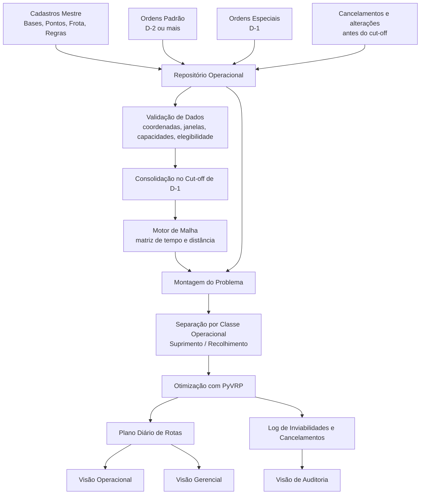

---

# Sistema de Roteirização para Transporte de Numerário

## Relatório de Cenário, Requisitos e Diretrizes do MVP

## 1. Resumo executivo

Este projeto tem como objetivo estruturar um sistema de roteirização para transporte de numerário capaz de gerar, diariamente, um plano operacional viável e economicamente eficiente para atendimento de ordens de **suprimento**, **recolhimento** e **serviços especiais**.

O problema será tratado, no MVP, com apoio do **PyVRP** como motor de otimização. A modelagem considera restrições operacionais típicas do setor, com destaque para:

* **janelas de atendimento**;
* **limites de jornada**;
* **dupla capacidade da viatura**: financeira e volumétrica;
* **prioridade contratual por SLA**;
* **isolamento de estado físico do numerário**;
* **teto de valor vinculado à apólice de seguro**;
* **necessidade de reduzir previsibilidade operacional**.

A decisão central de negócio já assumida para o MVP é que **suprimento e recolhimento não serão misturados na mesma viagem operacional**, salvo futura exceção formalmente modelada. Em termos práticos, a viatura sai da base em um estado operacional definido e retorna à base antes de mudar esse estado.

Além disso, o sistema deve refletir a realidade da operação de numerário: uma mesma viatura pode atender **múltiplos clientes em sequência dentro de um setor geográfico**, desde que o circuito permaneça viável em custo, tempo, risco e limite segurado.

---

## 2. Objetivo do sistema

O sistema deve responder, para cada dia operacional, à seguinte pergunta:

> **Quais ordens cada viatura deve executar, em que sequência e em qual horário, para minimizar o custo total da operação sem violar prazos, capacidades, limites de risco e regras operacionais?**

---

## 3. Escopo do MVP

O MVP será voltado ao **planejamento diário** das rotas, e não ao despacho dinâmico em tempo real.

### Inclui no MVP

* planejamento de rotas saindo e retornando à base;
* roteirização de ordens de **suprimento**;
* roteirização de ordens de **recolhimento**;
* tratamento priorizado de **serviços especiais**;
* uso de matriz de tempo e distância como insumo da otimização;
* geração de plano diário, custos estimados e logs de inviabilidade;
* controle de **limite de valor segurado por rota/viatura**;
* tratamento de **cancelamentos** com impacto operacional e financeiro.

### Fica fora do MVP

* reotimização com viatura já em campo;
* redistribuição dinâmica durante a execução;
* múltiplas viagens por viatura no mesmo turno;
* balanceamento entre múltiplas bases;
* modelagem estocástica de trânsito em tempo real;
* integração plena com torre de controle operacional.

---

## 4. Decisões de modelagem já estabelecidas

### 4.1 Motor de otimização adotado

O otimizador do projeto será o **PyVRP**, utilizado como núcleo de resolução para o problema de roteirização com restrições de capacidade e tempo.

### 4.2 Isolamento de estado físico

Foi adotada a regra de **isolamento de estado físico do numerário**:

* uma viagem operacional de **suprimento** não executa **recolhimento** no mesmo circuito;
* uma viagem operacional de **recolhimento** não executa **suprimento** no mesmo circuito;
* a troca de estado operacional exige **retorno à base**.

Essa decisão simplifica o MVP, aumenta aderência operacional e evita modelar, neste primeiro estágio, um fluxo de pickup-and-delivery com mistura de saldos de naturezas distintas.

### 4.3 Horizonte de planejamento das ordens

As demandas serão tratadas segundo sua antecedência de solicitação:

| Classe da ordem | Antecedência típica | Natureza                                        | Papel no planejamento                                         |
| --------------- | ------------------: | ----------------------------------------------- | ------------------------------------------------------------- |
| Padrão          |     D-2 ou superior | Suprimento ou recolhimento recorrente           | Forma a base da malha do dia                                  |
| Especial        |                 D-1 | Suprimento, recolhimento ou serviço excepcional | Tem prioridade elevada e maior penalidade por não atendimento |

### 4.4 Cut-off operacional

O plano diário será consolidado em um **cut-off time** definido no dia **D-1**, momento em que as ordens elegíveis para D0 são congeladas para roteirização.

### 4.5 Dinâmica multi-cliente por setor

Foi assumido que uma mesma viatura pode atender **diversos pontos dentro de um setor geográfico** em uma única rota. A viabilidade do circuito não será limitada apenas pela quantidade de paradas, mas principalmente por:

* tempo total disponível;
* janela de atendimento;
* custo de deslocamento;
* capacidade volumétrica;
* **teto de valor segurado da carga**.

### 4.6 Limite de risco por apólice

O principal limitador econômico-operacional de uma rota de recolhimento é o **valor acumulado transportado**, condicionado à **apólice de seguro** do veículo/operação. Ao atingir esse teto, a rota deve:

* retornar à base; ou
* encerrar em uma **tesouraria avançada**, quando esse recurso existir no desenho operacional futuro.

No MVP, por simplicidade, considera-se o retorno à base como comportamento padrão.

### 4.7 Variabilidade e redução de previsibilidade

Como diretriz de segurança, a roteirização não deve buscar apenas a menor distância. O plano também deve, sempre que possível, **reduzir previsibilidade operacional**, evitando repetição rígida de horários e trajetos.
No MVP, isso entra como diretriz de projeto e critério futuro de evolução, ainda sem modelagem probabilística completa.

---

## 5. Contexto operacional do problema

A transportadora opera a partir de **bases operacionais** e atende uma carteira de pontos como:

* agências bancárias;
* ATMs;
* cofres inteligentes;
* varejistas;
* clientes corporativos.

Cada ponto pode demandar diferentes serviços, entre eles:

* suprimento de numerário;
* recolhimento de valores;
* troca de malotes;
* atendimento extraordinário;
* serviço especial solicitado em janela reduzida.

A execução é realizada por **viaturas blindadas com guarnição embarcada**, sujeitas a restrições operacionais, contratuais e de segurança.

Na prática, a operação é tipicamente organizada por **setores geográficos**, dentro dos quais uma mesma viatura percorre múltiplos clientes para tornar o serviço economicamente viável. Assim, o problema não é apenas “visitar pontos”, mas compor circuitos que conciliem produtividade, risco, SLA e custo total.

---

## 6. Estrutura de dados necessária

## 6.1 Bases operacionais e malha logística

| Entidade         | Atributos essenciais                                                           | Finalidade                                            |
| ---------------- | ------------------------------------------------------------------------------ | ----------------------------------------------------- |
| Base operacional | ID, nome, coordenadas, horário de operação, capacidade de expedição            | Origem e retorno das viaturas                         |
| Malha logística  | matriz de distância, matriz de tempo, custo por trecho, marcação de restrições | Insumo do solver para calcular sequenciamento e custo |

## 6.2 Pontos atendidos e ordens

| Entidade             | Atributos essenciais                                                                 | Finalidade                           |
| -------------------- | ------------------------------------------------------------------------------------ | ------------------------------------ |
| Ponto atendido       | ID do ponto, tipo, endereço/coordenada, janela de atendimento, tempo de serviço      | Define o nó físico e suas restrições |
| Ordem de atendimento | ID da ordem, data, tipo de serviço, valor, volume, criticidade, SLA, classe da ordem | Define a demanda a ser roteirizada   |

## 6.3 Frota e capacidade

| Entidade   | Atributos essenciais                                                 | Finalidade                                        |
| ---------- | -------------------------------------------------------------------- | ------------------------------------------------- |
| Viatura    | ID, tipo, base de origem, turno, custo fixo, custo variável          | Recurso de execução da rota                       |
| Capacidade | limite financeiro, limite volumétrico, compatibilidades e restrições | Restringe o conjunto de ordens possíveis por rota |

## 6.4 Campos mínimos recomendados para cada ordem

| Campo                        | Descrição                                             |
| ---------------------------- | ----------------------------------------------------- |
| `id_ordem`                   | Identificador único da ordem                          |
| `data_operacao`              | Data prevista do atendimento                          |
| `tipo_servico`               | Suprimento, recolhimento ou especial                  |
| `classe_planejamento`        | Padrão ou Especial                                    |
| `id_ponto`                   | Referência ao ponto atendido                          |
| `valor_estimado`             | Valor monetário movimentado                           |
| `volume_estimado`            | Volume físico previsto                                |
| `inicio_janela`              | Início permitido do atendimento                       |
| `fim_janela`                 | Fim permitido do atendimento                          |
| `tempo_servico`              | Duração estimada da parada                            |
| `criticidade`                | Obrigatória, prioritária, adiável                     |
| `penalidade_nao_atendimento` | Peso econômico/contratual                             |
| `penalidade_atraso`          | Peso por violação de SLA                              |
| `status_cancelamento`        | Indica se houve cancelamento antes da execução        |
| `janela_cancelamento`        | Momento em que o cancelamento foi comunicado          |
| `taxa_improdutiva`           | Valor contratual devido em caso de parada improdutiva |

---

## 7. Regras de negócio e restrições do modelo

O plano é considerado inviável sempre que violar qualquer restrição rígida abaixo.

### 7.1 Restrições rígidas

1. **Janela de atendimento**
   O serviço deve ocorrer dentro do intervalo permitido pelo ponto.

2. **Jornada máxima da guarnição**
   O tempo total da rota não pode ultrapassar o turno operacional.

3. **Capacidade dupla**
   A carga da viatura não pode exceder:

   * o limite de valor transportado;
   * o limite volumétrico.

4. **Limite segurado da rota**
   No caso de recolhimento, o valor acumulado embarcado não pode ultrapassar o teto coberto pela apólice do veículo/operação.

5. **Isolamento de estado físico**
   Suprimento e recolhimento não compartilham a mesma viagem operacional no MVP.

6. **Compatibilidade operacional**
   Nem toda viatura pode atender todo ponto ou todo serviço.

7. **Atendimento obrigatório**
   Ordens críticas ou com SLA rígido não podem ser descartadas sem penalização severa.

8. **Circuito fechado**
   Toda rota parte e retorna à mesma base no MVP.

### 7.2 Restrições tratadas como penalidade

Algumas violações podem ser tratadas como custo alto, e não como impossibilidade absoluta, conforme política de negócio:

* não atendimento de ordem padrão;
* atraso moderado em ordem não crítica;
* uso de viatura adicional;
* cancelamento tardio com impacto em capacidade planejada;
* parada improdutiva remunerada contratualmente.

### 7.3 Regra de cancelamento

O cancelamento de um serviço, seja de suprimento ou recolhimento, não implica ausência de custo operacional. Dependendo do momento da comunicação, pode haver:

* **bloqueio de capacidade já reservada na malha**;
* **manutenção da cobrança integral ou parcial do serviço**;
* **geração de parada improdutiva**;
* **distorção do custo unitário da rota**.

No MVP, cancelamentos devem ser registrados e classificados para permitir:

* exclusão da ordem antes do cut-off, quando aplicável;
* manutenção da penalidade contratual;
* rastreabilidade do impacto financeiro do cancelamento.

---

## 8. Estratégia de modelagem no PyVRP

O problema será tratado, no MVP, como uma variação de **roteirização capacitada com janelas de tempo**, com múltiplas regras de negócio acopladas via capacidades, elegibilidade e penalidades.

Como há isolamento de estado físico, o planejamento diário será organizado em **classes operacionais separadas**:

| Classe de rota       | Conteúdo permitido                                                              |
| -------------------- | ------------------------------------------------------------------------------- |
| Rota de suprimento   | Apenas ordens de suprimento e serviços especiais compatíveis com suprimento     |
| Rota de recolhimento | Apenas ordens de recolhimento e serviços especiais compatíveis com recolhimento |

No caso das rotas de recolhimento, o modelo deve controlar explicitamente a **acumulação de valor ao longo da sequência de visitas**, pois o teto segurado pode encerrar a viabilidade da rota antes do limite de tempo ou da quantidade de paradas.

---

## 9. Função objetivo do MVP

A lógica do MVP deve priorizar primeiro o cumprimento do serviço e, em seguida, a eficiência econômica.

### Hierarquia de decisão

1. minimizar não atendimento de **ordens especiais**;
2. minimizar não atendimento de **ordens padrão**;
3. minimizar violações de SLA;
4. minimizar número de viaturas acionadas;
5. minimizar custo total de deslocamento e tempo em rota;
6. mensurar e reduzir efeitos de **cancelamentos improdutivos**, quando afetarem o custo da malha.

### Estrutura gerencial da função objetivo

[
\text{Minimizar } Z =
P_{esp} \cdot N_{esp_nao_atendidas}
+
P_{pad} \cdot N_{pad_nao_atendidas}
+
P_{sla} \cdot N_{violacoes_sla}
+
P_{imp} \cdot N_{paradas_improdutivas}
+
C_f \cdot N_{viaturas}
+
C_v \cdot C_{deslocamento}
]

Onde:

* (P_{esp}): penalidade de ordem especial não atendida;
* (P_{pad}): penalidade de ordem padrão não atendida;
* (P_{sla}): penalidade por atraso/violação contratual;
* (P_{imp}): custo associado a parada improdutiva ou cancelamento tardio;
* (C_f): custo fixo por viatura acionada;
* (C_v): custo variável de operação.

**Diretriz importante:**
deve valer a relação:

[
P_{esp} \gg P_{pad} \gg C_f
]

para garantir que o modelo não “economize frota” à custa do descumprimento de ordens prioritárias.

---

## 10. Fluxo lógico do projeto

---

## 11. Saídas esperadas

## 11.1 Saídas operacionais

* lista de rotas por viatura;
* sequência de atendimentos;
* horário estimado de saída, chegada e término;
* carga prevista por rota;
* classificação da rota: suprimento ou recolhimento;
* indicação de rotas que atingiram **limite segurado**.

## 11.2 Saídas gerenciais

* total de ordens atendidas;
* total de ordens não atendidas;
* percentual de atendimento por classe de ordem;
* utilização da frota;
* custo total estimado;
* tempo total de deslocamento;
* tempo total de atendimento;
* impacto operacional dos serviços especiais D-1;
* valor de **taxas de parada improdutiva**;
* impacto financeiro de cancelamentos.

## 11.3 Saídas de auditoria

* ordens excluídas;
* motivo da exclusão;
* restrição dominante violada;
* parâmetros usados na geração do plano;
* registro de cancelamentos e seu momento de ocorrência;
* estimativa de custo evitado versus custo incorrido.

---

## 12. Premissas do cenário-base

Para permitir implementação rápida e validação do conceito, o MVP assume:

1. toda rota começa e termina na mesma base;
2. cada ordem é atendida em uma única visita;
3. os tempos de deslocamento são determinísticos;
4. a carga prevista é conhecida no momento do cut-off;
5. não há reotimização em tempo real;
6. a guarnição já é compatível com o serviço atribuído;
7. suprimento e recolhimento não se misturam na mesma viagem;
8. o teto da apólice é tratado como restrição operacional rígida;
9. cancelamentos após determinado marco operacional podem gerar custo contratual mesmo sem execução completa do atendimento.

---

## 13. Riscos e pontos de atenção

| Tema                     | Risco                                                                                           |
| ------------------------ | ----------------------------------------------------------------------------------------------- |
| Qualidade da coordenada  | Endereço mal geocodificado compromete toda a matriz de malha                                    |
| Parâmetros de penalidade | Penalidades mal calibradas geram soluções economicamente corretas, porém operacionalmente ruins |
| Capacidade financeira    | Subdimensionamento do limite de risco inviabiliza rotas úteis                                   |
| Apólice de seguro        | O teto segurado pode encurtar rotas de recolhimento mesmo em setores próximos                   |
| SLA heterogêneo          | Regras contratuais muito diferentes exigem modelagem mais refinada                              |
| Serviços especiais D-1   | Podem pressionar a malha e aumentar muito o acionamento de viaturas                             |
| Cancelamentos tardios    | Podem gerar custo sem ganho operacional e distorcer a produtividade planejada                   |
| Segurança operacional    | Rotas excessivamente repetitivas podem elevar risco por previsibilidade                         |
| Trânsito                 | Sem histórico por faixa horária, a matriz pode subestimar atrasos reais                         |

---

## 14. Evolução prevista após o MVP

A evolução natural do modelo pode seguir a ordem abaixo:

1. múltiplas viagens por viatura no mesmo turno;
2. múltiplas bases com balanceamento;
3. inclusão de **tesouraria avançada** como ponto de descarga intermediária;
4. trânsito por faixa horária;
5. replanejamento intradiário;
6. integração com torre de controle;
7. tratamento formal de variação planejada de rotas para reduzir previsibilidade;
8. cenários comparativos de custo versus SLA.

---

## 15. Glossário

| Termo                       | Definição                                                                                       |
| --------------------------- | ----------------------------------------------------------------------------------------------- |
| Base operacional            | Ponto de origem e retorno das viaturas                                                          |
| Ponto atendido              | Local que recebe serviço de suprimento, recolhimento ou atendimento especial                    |
| Ordem de atendimento        | Demanda operacional a ser executada em determinada data                                         |
| Viatura blindada            | Veículo utilizado no transporte de numerário                                                    |
| Guarnição                   | Equipe embarcada responsável pela execução operacional                                          |
| Janela de atendimento       | Intervalo permitido para realizar o serviço                                                     |
| Tempo de serviço            | Duração da parada no ponto, sem considerar deslocamento                                         |
| Capacidade de valor         | Limite financeiro transportável pela viatura                                                    |
| Capacidade volumétrica      | Limite físico de carga da viatura                                                               |
| SLA                         | Regra contratual de prazo e nível de serviço                                                    |
| Cut-off time                | Horário de congelamento das ordens elegíveis para o plano do dia seguinte                       |
| Ordem padrão                | Ordem conhecida com antecedência de D-2 ou superior                                             |
| Ordem especial              | Ordem com solicitação em D-1 e tratamento prioritário                                           |
| Isolamento de estado físico | Regra que impede mistura de suprimento e recolhimento na mesma viagem                           |
| Teto segurado               | Valor máximo coberto pela apólice para a carga transportada                                     |
| Parada improdutiva          | Custo gerado por atendimento cancelado ou frustrado sem aproveitamento logístico correspondente |
| Inviabilidade               | Situação em que não há solução que respeite as restrições impostas                              |
| Plano diário                | Conjunto de rotas aprovadas para execução no dia                                                |

---

## 16. Referências norteadoras

### Referência aplicada ao contexto de numerário

* **A two-stage algorithm for bi-objective logistics model of cash-in-transit vehicle routing problems with economic and environmental optimization based on real-time traffic data**.

### Referência de modelagem

* literatura de **Vehicle Routing Problem with Time Windows (VRPTW)**;
* literatura de **Capacitated Vehicle Routing Problem (CVRP)**;
* extensões de roteirização com **restrições múltiplas, penalidades de não atendimento e controle de risco por carga**.

### Referência tecnológica

* **PyVRP** como motor de otimização do MVP;
* motor de malha logística baseado em matriz de **tempo** e **distância**;
* possível uso de **OSRM** ou provedor equivalente para construção da malha.

---

## 17. Conclusão

O projeto passa a ter um recorte claro para execução:
um **MVP de planejamento diário**, com **PyVRP**, baseado em **rotas fechadas**, **dupla capacidade**, **controle por apólice**, **priorização por SLA**, **tratamento de ordens especiais**, **registro de cancelamentos** e **isolamento entre suprimento e recolhimento**.

Com isso, o modelo já reflete elementos centrais da operação real: atendimento multi-cliente por setor, limitação por risco segurado, impacto econômico de cancelamentos e preocupação com previsibilidade operacional.

---

# Planejamento de desenvolvimento da aplicação

## Abordagem orientada a contratos, TDD e baixo acoplamento

## 1. Diretriz arquitetural

O desenvolvimento seguirá uma arquitetura orientada a módulos com **contratos explícitos de entrada e saída**, priorizando:

* **TDD** como estratégia principal de construção;
* **separação entre domínio, infraestrutura e otimização**;
* **inversão de dependência**, para que o domínio não dependa diretamente de PyVRP, banco, API de malha ou formato de arquivo;
* **idempotência da execução**, permitindo reprocessamento seguro.

A consequência prática disso é simples:

* a lógica de negócio deve produzir uma **instância interna genérica de roteirização**;
* o PyVRP entra apenas como **adaptador externo**;
* o fluxo completo deve poder ser reexecutado com o mesmo cenário sem corromper estado nem duplicar resultados.

---

# 2. Visão geral do fluxo

---

# 3. Princípios de projeto que orientam o desenvolvimento

## 3.1 Domínio primeiro

O centro da aplicação não é o solver. O centro da aplicação é o **processo de planejamento operacional**.

## 3.2 Dependências apontam para dentro

Módulos de domínio não conhecem:

* PyVRP;
* formato CSV;
* banco específico;
* API externa de malha.

Eles conhecem apenas **interfaces e contratos internos**.

## 3.3 Cada etapa tem resultado verificável

Toda etapa precisa produzir uma saída concreta que possa ser validada por teste.

## 3.4 Reexecução segura

O pipeline deve poder ser executado novamente para o mesmo cenário usando um identificador estável, como:

* `id_execucao`; ou
* `hash_cenario`.

---

# 4. Etapa 1 — Definição dos contratos de dados

## Objetivo

Definir os contratos formais que estabilizam a comunicação entre os módulos.

## Descrição

Esta etapa cria os modelos internos do sistema, distinguindo claramente:

* entrada bruta;
* entrada validada;
* entrada enriquecida;
* instância de roteirização;
* saída operacional;
* saída gerencial;
* saída de auditoria.

## Entradas

* regras de negócio do projeto;
* tipos de entidades operacionais;
* requisitos do planejamento diário.

## Saídas

Modelos internos como:

* `Base`
* `Ponto`
* `Ordem`
* `Viatura`
* `MatrizLogistica`
* `InstanciaRoteirizacaoBase`
* `RotaPlanejada`
* `EventoAuditoria`
* `ResultadoPlanejamento`

## Critérios de aceite

* contratos completos e sem ambiguidade;
* campos obrigatórios definidos;
* separação entre objetos de domínio e objetos de infraestrutura;
* contratos preparados para testes de schema.

## Testes principais

* criação válida dos modelos;
* rejeição de tipos incorretos;
* rejeição de campos obrigatórios ausentes;
* consistência de serialização.

---

# 5. Etapa 2 — Módulo de ingestão

## Objetivo

Receber os dados de origem e convertê-los para estruturas brutas internas.

## Descrição

Esse módulo lê as fontes externas e transforma tudo em objetos internos ainda não validados.
Ele não aplica regra de negócio complexa. Sua responsabilidade é apenas **traduzir a entrada externa**.

## Entradas

* arquivos CSV/planilhas/API;
* dados de bases;
* dados de pontos;
* dados de viaturas;
* dados de ordens;
* parâmetros do dia operacional.

## Saídas

* `bases_brutas`
* `pontos_brutos`
* `viaturas_brutas`
* `ordens_brutas`
* `metadados_ingestao`

## Critérios de aceite

* leitura consistente dos formatos suportados;
* mapeamento correto de colunas/campos;
* rastreabilidade da origem dos dados.

## Testes principais

* leitura de fonte válida;
* falha para colunas obrigatórias ausentes;
* tratamento de registro duplicado;
* preservação de identificadores de origem.

---

# 6. Etapa 3 — Validação e normalização

## Objetivo

Converter dados brutos em dados operacionais confiáveis.

## Descrição

Aplica regras de consistência estrutural e padronização:

* coordenadas válidas;
* janelas coerentes;
* tipos reconhecidos;
* capacidades válidas;
* valores e volumes não negativos.

## Entradas

* `bases_brutas`
* `pontos_brutos`
* `viaturas_brutas`
* `ordens_brutas`

## Saídas

* `bases_validas`
* `pontos_validos`
* `viaturas_validas`
* `ordens_validas`
* `erros_validacao`

## Critérios de aceite

* nenhum dado inconsistente segue adiante sem registro;
* normalização previsível;
* erros explicáveis e auditáveis.

## Testes principais

* coordenada inválida é rejeitada;
* ordem com janela invertida é rejeitada;
* viatura sem limite segurado é rejeitada;
* erro produzido contém entidade, campo e motivo.

---

# 7. Etapa 4 — Classificação operacional e enriquecimento

## Objetivo

Preparar as ordens para o planejamento do dia.

## Descrição

Esse módulo decide como cada ordem será tratada no cenário:

* padrão ou especial;
* suprimento ou recolhimento;
* elegível ou não para o cut-off;
* cancelada ou ativa;
* criticidade efetiva;
* penalidade aplicável.

## Entradas

* `ordens_validas`
* `pontos_validos`
* `regras_operacionais`
* data/hora de referência

## Saídas

* `ordens_classificadas`
* `ordens_planejaveis`
* `ordens_fora_cutoff`
* `ordens_canceladas`
* `metadados_classificacao`

## Critérios de aceite

* classificação determinística;
* separação clara entre ordem ativa, cancelada e fora do planejamento;
* regras de antecedência corretamente aplicadas.

## Testes principais

* ordem D-1 é classificada como especial;
* ordem D-2+ é classificada como padrão;
* cancelamento antes do cut-off exclui ordem da malha;
* cancelamento tardio gera impacto operacional registrável.

---

# 8. Etapa 5 — Geração da malha logística

## Objetivo

Produzir a matriz de tempo e distância do cenário diário.

## Descrição

Esse módulo usa uma interface abstrata de provedor de malha.
O domínio não conhece OSRM nem outro motor; conhece apenas um contrato como `ProvedorMalha`.

## Entradas

* `bases_validas`
* `ordens_planejaveis`
* `pontos_validos`
* `provedor_malha`

## Saídas

* `matriz_tempo`
* `matriz_distancia`
* `mapa_nos`
* `falhas_malha`

## Critérios de aceite

* matrizes dimensionadas corretamente;
* relação consistente entre nó e índice;
* tratamento de trechos indisponíveis.

## Testes principais

* matriz N×N correta;
* base presente como nó obrigatório;
* rota impossível recebe penalidade configurada;
* índice do nó é estável entre execuções idênticas.

---

# 9. Etapa 6 — Separação por classe operacional

## Objetivo

Garantir o isolamento de estado físico antes da otimização.

## Descrição

As ordens planejáveis são divididas em subconjuntos independentes:

* cenário de suprimento;
* cenário de recolhimento.

Isso preserva a regra de não mistura operacional no MVP.

## Entradas

* `ordens_classificadas`
* `ordens_planejaveis`
* `viaturas_validas`
* `bases_validas`

## Saídas

* `cenario_suprimento`
* `cenario_recolhimento`

## Critérios de aceite

* nenhuma ordem é enviada ao cenário errado;
* cenário fica pronto para montagem da instância de domínio.

## Testes principais

* ordem de recolhimento não entra em suprimento;
* serviço especial compatível vai para o cenário correto;
* tipo ambíguo gera erro controlado.

---

# 10. Etapa 7 — Montagem da instância de domínio

## Objetivo

Construir uma representação **genérica e independente de framework** do problema de roteirização.

## Descrição

Esta é a principal correção arquitetural do plano.
Em vez de produzir um `problema_pyvrp`, esta etapa produz uma **instância interna de domínio**, por exemplo:

* `InstanciaRoteirizacaoBase`

Essa instância contém tudo que o domínio precisa expressar:

* nós;
* depósitos;
* veículos;
* capacidades;
* demandas;
* janelas;
* custos;
* penalidades;
* restrições de elegibilidade.

Ela ainda não conhece PyVRP.

## Entradas

* `cenario_suprimento` ou `cenario_recolhimento`
* `matriz_tempo`
* `matriz_distancia`
* `viaturas_validas`
* `parametros_planejamento`

## Saídas

* `InstanciaRoteirizacaoBase`
* `restricoes_aplicadas`
* `mapa_ids_dominio`

## Critérios de aceite

* instância expressa completamente o cenário;
* nenhuma dependência de solver externo;
* capacidades financeira e volumétrica representadas;
* penalidades e janelas corretamente materializadas.

## Testes principais

* instância contém todos os nós esperados;
* veículo recebe capacidades corretas;
* penalidade de ordem especial é superior à padrão;
* recolhimento respeita o acúmulo de valor;
* nenhuma referência a classes do PyVRP existe aqui.

---

# 11. Etapa 8 — Adaptador do solver

## Objetivo

Traduzir a instância de domínio para o formato exigido pelo solver selecionado.

## Descrição

Aqui entra o princípio de inversão de dependência.
O módulo implementa uma interface como:

* `SolverAdapter`

E a implementação concreta do MVP será:

* `PyVRPAdapter`

Se amanhã o solver mudar, esta etapa muda; o domínio permanece.

## Entradas

* `InstanciaRoteirizacaoBase`
* `config_solver`

## Saídas

* `instancia_solver`
* `mapa_ids_solver`
* `metadados_adaptacao`

## Critérios de aceite

* tradução correta e completa da instância interna;
* nenhuma regra de negócio essencial “vaza” para fora do domínio;
* adaptação testável com mocks e cenários pequenos.

## Testes principais

* nó do domínio vira nó do solver com atributos corretos;
* veículo do domínio vira veículo do solver com capacidades corretas;
* falhas de adaptação geram erro controlado;
* troca de adaptador não exige mudança nas etapas anteriores.

---

# 12. Etapa 9 — Execução da otimização

## Objetivo

Executar o solver e obter a solução bruta do problema.

## Descrição

Este módulo apenas executa a otimização via adaptador/configuração definida.
Ele não interpreta regra de negócio; apenas administra a execução do solver.

## Entradas

* `instancia_solver`
* `config_execucao_solver`

## Saídas

* `resultado_solver_bruto`
* `status_solver`
* `metadados_execucao_solver`

## Critérios de aceite

* sucesso, inviabilidade e falha técnica devem ser diferenciados;
* tempo, memória e status precisam ficar rastreáveis.

## Testes principais

* solver mockado retorna solução válida;
* falha técnica retorna status controlado;
* solução vazia não quebra o fluxo;
* timeout ou erro de execução é capturado.

---

# 13. Etapa 10 — Pós-processamento das rotas

## Objetivo

Traduzir a solução do solver para a linguagem do negócio.

## Descrição

Reconstrói:

* rotas por viatura;
* sequência de paradas;
* horários previstos;
* carga acumulada;
* custo estimado;
* ordens não atendidas.

## Entradas

* `resultado_solver_bruto`
* `mapa_ids_solver`
* `mapa_ids_dominio`
* `InstanciaRoteirizacaoBase`
* `matriz_tempo`
* `matriz_distancia`

## Saídas

* `rotas_planejadas`
* `ordens_nao_atendidas`
* `resumo_operacional`

## Critérios de aceite

* saída compreensível para operação;
* fechamento coerente de horários, cargas e custos;
* rastreabilidade da ordem do domínio até a rota final.

## Testes principais

* rota reconstruída corretamente;
* carga acumulada respeita limite segurado;
* ordem não atendida aparece fora das rotas;
* custo final bate com a soma esperada.

---

# 14. Etapa 11 — Auditoria e explicabilidade

## Objetivo

Garantir que o processo seja explicável e auditável.

## Descrição

Consolida eventos de:

* validação;
* exclusão por cut-off;
* cancelamento;
* não atendimento;
* restrição dominante;
* parâmetros de planejamento;
* falhas técnicas.

## Entradas

* `erros_validacao`
* `ordens_fora_cutoff`
* `ordens_canceladas`
* `ordens_nao_atendidas`
* `restricoes_aplicadas`
* `metadados_execucao_solver`

## Saídas

* `eventos_auditoria`
* `log_planejamento`
* `motivos_inviabilidade`

## Critérios de aceite

* toda exclusão deve possuir motivo explícito;
* toda execução deve deixar rastro reproduzível.

## Testes principais

* ordem inválida gera evento de auditoria;
* ordem fora do cut-off gera evento específico;
* falha técnica do solver é registrada;
* parâmetros e timestamps ficam gravados.

---

# 15. Etapa 12 — KPIs e relatórios

## Objetivo

Produzir os resultados de negócio consumidos por operação e gestão.

## Descrição

Consolida as rotas e os eventos em indicadores operacionais e gerenciais.

## Entradas

* `rotas_planejadas`
* `ordens_classificadas`
* `ordens_nao_atendidas`
* `eventos_auditoria`

## Saídas

* `kpis_operacionais`
* `kpis_gerenciais`
* `relatorio_planejamento`

## KPIs esperados

* total de ordens planejadas;
* total de ordens atendidas;
* taxa de atendimento;
* ordens especiais atendidas;
* viaturas acionadas;
* custo total estimado;
* tempo total em deslocamento;
* tempo total em serviço;
* impacto de cancelamentos;
* paradas improdutivas;
* ordens excluídas por restrição.

## Testes principais

* KPI de atendimento calculado corretamente;
* custo total consolidado corretamente;
* total de viaturas igual ao conjunto de rotas ativas;
* cancelamentos entram no indicador apropriado.

---

# 16. Etapa 13 — Orquestração idempotente do planejamento diário

## Objetivo

Encadear todos os módulos em uma execução única, segura e reprocessável.

## Descrição

O orquestrador é o caso de uso principal da aplicação.
Ele deve receber um identificador estável de cenário, como:

* `id_execucao`; ou
* `hash_cenario`.

Esse identificador garante que, se houver falha em qualquer etapa posterior, especialmente na otimização, a reexecução não:

* duplique registros;
* regenere estados inconsistentes;
* perca rastreabilidade do cenário original.

O orquestrador deve operar com a lógica:

* mesma entrada relevante → mesmo identificador de cenário;
* mesma execução reprocessada → mesmo contexto lógico.

## Entradas

* `id_execucao` ou `hash_cenario`
* data de operação
* fontes de dados
* regras operacionais
* parâmetros do solver
* políticas de persistência

## Saídas

* `ResultadoPlanejamento`

### Estrutura esperada da saída final

* identificador da execução;
* resumo executivo;
* rotas de suprimento;
* rotas de recolhimento;
* ordens excluídas;
* ordens não atendidas;
* KPIs;
* auditoria;
* status final da execução.

## Critérios de aceite

* execução ponta a ponta;
* reexecução segura do mesmo cenário;
* resultados consistentes para mesma entrada, salvo quando configurado comportamento não determinístico;
* falhas técnicas isoladas sem duplicação de efeitos.

## Testes principais

* mesma execução repetida não duplica artefatos;
* falha na etapa do solver permite retry seguro;
* mudança de cenário altera `hash_cenario`;
* execução com mesmo cenário recupera contexto anterior corretamente.

---

# 17. Ordem recomendada de implementação em TDD

## Sprint 1 — Contratos e validação

Implementar:

1. contratos de dados;
2. ingestão;
3. validação e normalização.

### Resultado esperado

A aplicação já consegue dizer:

* o que entrou;
* o que é válido;
* o que foi rejeitado;
* por que foi rejeitado.

---

## Sprint 2 — Classificação e recorte do cenário

Implementar:
4. classificação operacional;
5. separação por classe operacional.

### Resultado esperado

A aplicação já consegue dizer:

* o que entra no planejamento do dia;
* o que é especial;
* o que está fora do cut-off;
* o que pertence a suprimento e recolhimento.

---

## Sprint 3 — Malha e instância de domínio

Implementar:
6. geração da malha;
7. montagem da `InstanciaRoteirizacaoBase`.

### Resultado esperado

A aplicação já consegue produzir:

* matrizes válidas;
* representação genérica do problema pronta para qualquer solver.

---

## Sprint 4 — Adaptador e execução do solver

Implementar:
8. adaptador do solver;
9. execução da otimização.

### Resultado esperado

A aplicação já consegue:

* traduzir o problema interno para PyVRP;
* executar a otimização sem contaminar o domínio com dependência externa.

---

## Sprint 5 — Reconstrução, auditoria e KPIs

Implementar:
10. pós-processamento;
11. auditoria;
12. KPIs e relatórios.

### Resultado esperado

A aplicação já consegue:

* entregar rotas;
* explicar exclusões;
* consolidar indicadores.

---

## Sprint 6 — Orquestrador idempotente

Implementar:
13. orquestração idempotente.

### Resultado esperado

A aplicação já roda o caso principal completo com reprocessamento seguro.

---

# 18. Estratégia de testes por camada

## 18.1 Testes unitários

Para funções puras e regras:

* classificação;
* penalidades;
* validação;
* cálculo de KPIs;
* reconstrução de rotas.

## 18.2 Testes de contrato

Para entradas e saídas de cada módulo:

* schemas;
* obrigatoriedade de campos;
* formatos de erro;
* invariantes do domínio.

## 18.3 Testes de integração

Para fluxo entre módulos:

* ingestão → validação;
* classificação → malha;
* instância de domínio → adaptador;
* solver → pós-processamento.

## 18.4 Testes de aceitação

Para cenários de negócio:

* dia normal;
* excesso de valor em rota de recolhimento;
* ordem especial D-1;
* cancelamento tardio;
* rota inviável por janela;
* falha técnica do solver com retry.

---

# 19. Contrato mínimo de entrada e saída por módulo

| Módulo                | Entrada principal                         | Saída principal                     |
| --------------------- | ----------------------------------------- | ----------------------------------- |
| Contratos             | regras do domínio                         | modelos formais                     |
| Ingestão              | arquivos/API                              | dados brutos                        |
| Validação             | dados brutos                              | dados válidos + erros               |
| Classificação         | ordens válidas                            | ordens planejáveis/classificadas    |
| Malha                 | nós do dia                                | matriz tempo/distância              |
| Separação operacional | ordens classificadas                      | cenários de suprimento/recolhimento |
| Instância de domínio  | cenários + matrizes + frota               | `InstanciaRoteirizacaoBase`         |
| Adaptador do solver   | instância de domínio                      | instância específica do solver      |
| Execução do solver    | instância específica                      | solução bruta                       |
| Pós-processamento     | solução bruta                             | rotas planejadas                    |
| Auditoria             | erros + exclusões + parâmetros            | log e eventos                       |
| KPIs                  | rotas + eventos                           | indicadores e relatório             |
| Orquestrador          | configuração + `id_execucao/hash_cenario` | resultado final                     |

---

# 20. Resultado final esperado da aplicação

Ao final do desenvolvimento, a aplicação deverá receber os dados do dia e devolver, de forma rastreável e reprocessável:

1. rotas de suprimento;
2. rotas de recolhimento;
3. ordens não atendidas e respectivos motivos;
4. custos estimados por rota e custo total;
5. KPIs operacionais e gerenciais;
6. log completo de auditoria;
7. identificação única da execução e do cenário processado.

---

# 21. Conclusão prática

A melhor primeira entrega continua não sendo “rodar o PyVRP”.

A melhor primeira entrega é um núcleo que já consiga executar com qualidade este fluxo:

**ingestão → validação → classificação → instância de domínio → auditoria**

Quando essa base estiver firme, o solver entra como componente substituível, e não como dependência estrutural do sistema.