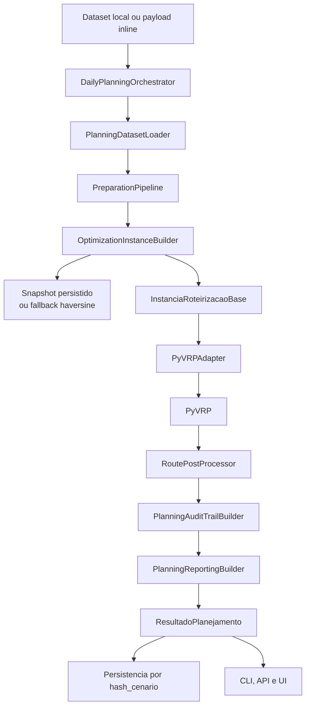

---

# Sistema de Roteirização para Transporte de Numerário

## Relatório de Cenário, Requisitos e Diretrizes do MVP

## 1. Resumo executivo

Este projeto já possui um backend executável de roteirização para transporte de numerário capaz de gerar, diariamente, um plano operacional viável e economicamente eficiente para atendimento de ordens de **suprimento** e **recolhimento**, com tratamento prioritário para **ordens especiais**.

O problema será tratado, no MVP, com apoio do **PyVRP** como motor de otimização. A modelagem considera restrições operacionais típicas do setor, com destaque para:

* **janelas de atendimento**;
* **limites de jornada**;
* **dupla capacidade da viatura**: financeira e volumétrica;
* **prioridade contratual por SLA**;
* **isolamento de estado físico do numerário**;
* **teto de valor vinculado à apólice de seguro**;
* **necessidade de reduzir previsibilidade operacional**.

Além do fluxo operacional principal, o repositório passou a incluir uma camada experimental explícita para comparação **PyVRP x PuLP**, um catálogo de cenários sintéticos, um notebook de demonstração do solver e um notebook separado para benchmark visual e análise metodológica.

A decisão central de negócio já assumida para o MVP é que **suprimento e recolhimento não serão misturados na mesma viagem operacional**, salvo futura exceção formalmente modelada. Em termos práticos, a viatura sai da base em um estado operacional definido e retorna à base antes de mudar esse estado.

Além disso, o sistema deve refletir a realidade da operação de numerário: uma mesma viatura pode atender **múltiplos clientes em sequência dentro de um setor geográfico**, desde que o circuito permaneça viável em custo, tempo, risco e limite segurado.

---

## 2. Objetivo do sistema

O sistema deve responder, para cada dia operacional, à seguinte pergunta:

> **Quais ordens cada viatura deve executar, em que sequência e em qual horário, para minimizar o custo total da operação sem violar prazos, capacidades, limites de risco e regras operacionais?**

---

## 3. Escopo do MVP

O MVP será voltado ao **planejamento diário** das rotas, e não ao despacho dinâmico em tempo real.

### Inclui no MVP

* planejamento de rotas saindo e retornando à base;
* roteirização de ordens de **suprimento**;
* roteirização de ordens de **recolhimento**;
* tratamento priorizado de **ordens especiais** e atendimentos extraordinários compatíveis;
* uso de matriz de tempo e distância como insumo da otimização;
* geração de plano diário, custos estimados e logs de inviabilidade;
* controle de **limite de valor segurado por rota/viatura**;
* tratamento de **cancelamentos** com impacto operacional e financeiro.

### Fica fora do MVP

* reotimização com viatura já em campo;
* redistribuição dinâmica durante a execução;
* múltiplas viagens por viatura no mesmo turno;
* balanceamento entre múltiplas bases;
* modelagem estocástica de trânsito em tempo real;
* integração plena com torre de controle operacional.

---

## 4. Decisões de modelagem já estabelecidas

### 4.1 Motor de otimização adotado

O otimizador do projeto será o **PyVRP**, utilizado como núcleo de resolução para o problema de roteirização com restrições de capacidade e tempo.

### 4.2 Isolamento de estado físico

Foi adotada a regra de **isolamento de estado físico do numerário**:

* uma viagem operacional de **suprimento** não executa **recolhimento** no mesmo circuito;
* uma viagem operacional de **recolhimento** não executa **suprimento** no mesmo circuito;
* a troca de estado operacional exige **retorno à base**.

Essa decisão simplifica o MVP, aumenta aderência operacional e evita modelar, neste primeiro estágio, um fluxo de pickup-and-delivery com mistura de saldos de naturezas distintas.

### 4.3 Horizonte de planejamento das ordens

As demandas são tratadas segundo a combinação entre `classe_planejamento`, `timestamp_criacao` e `data_operacao`.

No estado atual da aplicação:

* ordens explicitamente classificadas como `padrao` permanecem `padrao`;
* ordens não `padrao` com antecedência menor ou igual a zero em relação à `data_operacao` são normalizadas para `especial`;
* ordens não `padrao` com antecedência positiva são normalizadas para `eventual`;
* a normalização é feita a partir de `timestamp_criacao`, preservando a distinção entre carteira base e demanda extraordinária do dia.

| Classe da ordem | Regra efetiva no backend               | Natureza                                                     | Papel no planejamento                                                |
| --------------- | -------------------------------------- | ------------------------------------------------------------ | -------------------------------------------------------------------- |
| Padrão          | valor informado como `padrao`          | Carteira base ou recorrente                                  | Forma a base da malha do dia                                         |
| Eventual        | não `padrao` com antecedência positiva | Solicitação não padrão recebida antes do dia operacional     | Requer encaixe adicional e prioridade intermediária conforme o SLA   |
| Especial        | não `padrao` com antecedência `<= 0`   | Solicitação no próprio dia operacional ou atendimento urgente | Tem prioridade elevada e maior sensibilidade operacional e contratual |

### 4.4 Cut-off operacional

O backend recebe um `cutoff` explícito no `contexto` da execução. Em operação típica, esse marco tende a ser definido em `D-1`, mas o código não fixa essa data: ele apenas aplica a comparação temporal entre `cutoff` e `instante_cancelamento` para decidir exclusão antes do planejamento ou cancelamento tardio com impacto.

### 4.5 Dinâmica multi-cliente por setor

Foi assumido que uma mesma viatura pode atender **diversos pontos dentro de um setor geográfico** em uma única rota. A viabilidade do circuito não será limitada apenas pela quantidade de paradas, mas principalmente por:

* tempo total disponível;
* janela de atendimento;
* custo de deslocamento;
* capacidade volumétrica;
* **teto de valor segurado da carga**.

### 4.6 Limite de risco por apólice

O principal limitador econômico-operacional de uma rota de recolhimento é o **valor acumulado transportado**, condicionado à **apólice de seguro** do veículo/operação. Ao atingir esse teto, a rota deve:

* retornar à base; ou
* encerrar em uma **tesouraria avançada**, quando esse recurso existir no desenho operacional futuro.

No MVP, por simplicidade, considera-se o retorno à base como comportamento padrão.

### 4.7 Variabilidade e redução de previsibilidade

Como diretriz de segurança, a roteirização não deve buscar apenas a menor distância. O plano também deve, sempre que possível, **reduzir previsibilidade operacional**, evitando repetição rígida de horários e trajetos.
No MVP, isso entra como diretriz de projeto e critério futuro de evolução, ainda sem modelagem probabilística completa.

### 4.8 Recorte comparável do benchmark

A camada experimental do projeto não compara o sistema inteiro “como produto”. O benchmark compara um **núcleo comum solver-agnostic** do problema, sempre por **classe operacional isolada**.

No protocolo atual, isso significa:

* `suprimento` e `recolhimento` são resolvidos em instâncias separadas;
* a comparação usa as mesmas ordens, viaturas, janelas, capacidades e custos-base para os dois solvers;
* pós-processamento, auditoria, reporting e quaisquer efeitos fora do solver ficam fora da medida comparativa;
* mesmo na rodada exaustiva de `100%`, a leitura continua sendo por classe isolada, e não por frota acoplada entre `suprimento` e `recolhimento`.

---

## 5. Contexto operacional do problema

A transportadora opera a partir de **bases operacionais** e atende uma carteira de pontos como:

* agências bancárias;
* ATMs;
* cofres inteligentes;
* varejistas;
* clientes corporativos.

Cada ponto pode demandar diferentes serviços, entre eles:

* suprimento de numerário;
* recolhimento de valores;
* troca de malotes;
* atendimento extraordinário;
* ordem especial solicitada em janela reduzida.

A execução é realizada por **viaturas blindadas com guarnição embarcada**, sujeitas a restrições operacionais, contratuais e de segurança.

Na prática, a operação é tipicamente organizada por **setores geográficos**, dentro dos quais uma mesma viatura percorre múltiplos clientes para tornar o serviço economicamente viável. Assim, o problema não é apenas “visitar pontos”, mas compor circuitos que conciliem produtividade, risco, SLA e custo total.

---

## 6. Estrutura de dados necessária

## 6.1 Bases operacionais e malha logística

| Entidade         | Atributos essenciais                                                           | Finalidade                                            |
| ---------------- | ------------------------------------------------------------------------------ | ----------------------------------------------------- |
| Base operacional | ID, nome, coordenadas, horário de operação, capacidade de expedição            | Origem e retorno das viaturas                         |
| Malha logística  | matriz de distância, matriz de tempo, custo por trecho, marcação de restrições | Insumo do solver para calcular sequenciamento e custo |

## 6.2 Pontos atendidos e ordens

| Entidade             | Atributos essenciais                                                                 | Finalidade                           |
| -------------------- | ------------------------------------------------------------------------------------ | ------------------------------------ |
| Ponto atendido       | ID do ponto, tipo, endereço/coordenada, janela de atendimento, tempo de serviço      | Define o nó físico e suas restrições |
| Ordem de atendimento | ID da ordem, data, tipo de serviço, valor, volume, criticidade, SLA, classe da ordem | Define a demanda a ser roteirizada   |

## 6.3 Frota e capacidade

| Entidade   | Atributos essenciais                                                 | Finalidade                                        |
| ---------- | -------------------------------------------------------------------- | ------------------------------------------------- |
| Viatura    | ID, tipo, base de origem, turno, custo fixo, custo variável          | Recurso de execução da rota                       |
| Capacidade | limite financeiro, limite volumétrico, compatibilidades e restrições | Restringe o conjunto de ordens possíveis por rota |

## 6.4 Campos mínimos recomendados para cada ordem

| Campo                        | Descrição                                             |
| ---------------------------- | ----------------------------------------------------- |
| `id_ordem`                   | Identificador único da ordem                          |
| `data_operacao`              | Data prevista do atendimento                          |
| `timestamp_criacao`          | Instante usado para normalizar `especial` e `eventual` |
| `tipo_servico`               | `suprimento`, `recolhimento` ou `extraordinario`      |
| `classe_planejamento`        | Padrão, Especial ou Eventual                          |
| `classe_operacional`         | Obrigatória quando `tipo_servico = extraordinario`    |
| `id_ponto`                   | Referência ao ponto atendido                          |
| `valor_estimado`             | Valor monetário movimentado                           |
| `volume_estimado`            | Volume físico previsto                                |
| `inicio_janela`              | Início permitido do atendimento                       |
| `fim_janela`                 | Fim permitido do atendimento                          |
| `tempo_servico`              | Duração estimada da parada                            |
| `criticidade`                | Valor canônico (`baixa`, `media`, `alta`, `critica`) ou alias aceito na ingestão |
| `penalidade_nao_atendimento` | Peso econômico/contratual                             |
| `penalidade_atraso`          | Peso por violação de SLA                              |
| `status_cancelamento`        | Indica se houve cancelamento antes da execução        |
| `instante_cancelamento`      | Instante explícito do cancelamento, quando houver     |
| `janela_cancelamento`        | Janela opcional usada para derivar o instante do cancelamento |
| `taxa_improdutiva`           | Valor contratual devido em caso de parada improdutiva |

---

## 7. Regras de negócio e restrições do modelo

O plano é considerado inviável sempre que violar qualquer restrição rígida abaixo.

### 7.1 Restrições rígidas

1. **Janela de atendimento**
   O serviço deve ocorrer dentro do intervalo permitido pelo ponto.

2. **Jornada máxima da guarnição**
   O tempo total da rota não pode ultrapassar o turno operacional.

3. **Capacidade dupla**
   A carga da viatura não pode exceder:

   * o limite de valor transportado;
   * o limite volumétrico.

4. **Limite segurado da rota**
   No caso de recolhimento, o valor acumulado embarcado não pode ultrapassar o teto coberto pela apólice do veículo/operação.

5. **Isolamento de estado físico**
   Suprimento e recolhimento não compartilham a mesma viagem operacional no MVP.

6. **Compatibilidade operacional**
   Nem toda viatura pode atender todo ponto ou todo serviço.

7. **Atendimento obrigatório**
   Ordens críticas ou com SLA rígido não podem ser descartadas sem penalização severa.

8. **Circuito fechado**
   Toda rota parte e retorna à mesma base no MVP.

### 7.2 Restrições tratadas como penalidade

Algumas violações podem ser tratadas como custo alto, e não como impossibilidade absoluta, conforme política de negócio:

* não atendimento de ordem padrão;
* atraso moderado em ordem não crítica;
* uso de viatura adicional;
* cancelamento tardio com impacto em capacidade planejada;
* parada improdutiva remunerada contratualmente.

### 7.3 Regra de cancelamento

O cancelamento de um serviço, seja de suprimento ou recolhimento, não implica ausência de custo operacional. Dependendo do momento da comunicação, pode haver:

* **bloqueio de capacidade já reservada na malha**;
* **manutenção da cobrança integral ou parcial do serviço**;
* **geração de parada improdutiva**;
* **distorção do custo unitário da rota**.

No MVP, cancelamentos devem ser registrados e classificados para permitir:

* exclusão da ordem antes do cut-off, quando aplicável;
* manutenção da penalidade contratual;
* rastreabilidade do impacto financeiro do cancelamento.

---

## 8. Estratégia de modelagem no PyVRP

O problema será tratado, no MVP, como uma variação de **roteirização capacitada com janelas de tempo**, com múltiplas regras de negócio acopladas via capacidades, elegibilidade e penalidades.

Como há isolamento de estado físico, o planejamento diário será organizado em **classes operacionais separadas**:

| Classe de rota       | Conteúdo permitido                                                              |
| -------------------- | ------------------------------------------------------------------------------- |
| Rota de suprimento   | Apenas ordens de suprimento e serviços extraordinários compatíveis com suprimento     |
| Rota de recolhimento | Apenas ordens de recolhimento e serviços extraordinários compatíveis com recolhimento |

No caso das rotas de recolhimento, o modelo deve controlar explicitamente a **acumulação de valor ao longo da sequência de visitas**, pois o teto segurado pode encerrar a viabilidade da rota antes do limite de tempo ou da quantidade de paradas.

---

## 9. Função objetivo do MVP

A lógica do MVP deve priorizar primeiro o cumprimento do serviço e, em seguida, a eficiência econômica.

### Hierarquia de decisão

1. minimizar não atendimento de **ordens especiais**;
2. minimizar não atendimento de **ordens padrão e eventuais**;
3. minimizar violações de SLA;
4. minimizar número de viaturas acionadas;
5. minimizar custo total de deslocamento e tempo em rota;
6. mensurar e reduzir efeitos de **cancelamentos improdutivos**, quando afetarem o custo da malha.

### Estrutura gerencial da função objetivo

[
\text{Minimizar } Z =
P_{esp} \cdot N_{esp_nao_atendidas}
+
P_{evt} \cdot N_{evt_nao_atendidas}
+
P_{pad} \cdot N_{pad_nao_atendidas}
+
P_{sla} \cdot N_{violacoes_sla}
+
P_{imp} \cdot N_{paradas_improdutivas}
+
C_f \cdot N_{viaturas}
+
C_v \cdot C_{deslocamento}
]

Onde:

* (P_{esp}): penalidade de ordem especial não atendida;
* (P_{evt}): penalidade de ordem eventual não atendida;
* (P_{pad}): penalidade de ordem padrão não atendida;
* (P_{sla}): penalidade por atraso/violação contratual;
* (P_{imp}): custo associado a parada improdutiva ou cancelamento tardio;
* (C_f): custo fixo por viatura acionada;
* (C_v): custo variável de operação.

**Diretriz importante:**
na prática, a aplicação materializa prioridade por ordem via criticidade, SLA e penalidades contratuais. Uma parametrização coerente com essa regra é:

[
P_{esp} \geq P_{evt} \geq P_{pad} \gg C_f
]

para garantir que o modelo não “economize frota” à custa do descumprimento de ordens prioritárias.

### Função objetivo comum do benchmark

Para a comparação metodológica entre **PyVRP** e **PuLP**, o projeto recalcula uma função objetivo comum fora do solver:

\[
\text{objective\_common} =
\text{custo fixo de viatura}
+
\text{custo de deslocamento}
+
\text{custo de duração}
+
\text{penalidade por não atendimento}
\]

Esse valor é usado para medir qualidade relativa em uma base comparável, independentemente da formulação interna de cada solver.

---

## 10. Fluxo lógico do backend atual

---

## 11. Saídas esperadas

## 11.1 Saídas operacionais

* lista de rotas por viatura;
* sequência de atendimentos;
* horário estimado de saída, chegada e término;
* carga prevista por rota;
* classificação da rota: suprimento ou recolhimento;
* indicação de rotas que atingiram **limite segurado**.

## 11.2 Saídas gerenciais

* total de ordens atendidas;
* total de ordens não atendidas;
* percentual de atendimento por classe de ordem;
* utilização da frota;
* custo total estimado;
* tempo total de deslocamento;
* tempo total de atendimento;
* impacto operacional de ordens especiais e eventuais;
* valor de **taxas de parada improdutiva**;
* impacto financeiro de cancelamentos.

## 11.3 Saídas de auditoria

* ordens excluídas;
* motivo da exclusão;
* restrição dominante violada;
* parâmetros usados na geração do plano;
* registro de cancelamentos e seu momento de ocorrência;
* `hash_cenario` e trilha de reexecução.

## 11.4 Artefatos de execução

* `ResultadoPlanejamento` consolidado;
* `hash_cenario` estável por cenário;
* manifesto e estado de execução persistidos em disco;
* indicação de reaproveitamento de cache e de recuperação de contexto anterior;
* materialização de snapshot, quando solicitada.

---

## 12. Premissas do cenário-base

Para permitir implementação rápida e validação do conceito, o MVP assume:

1. toda rota começa e termina na mesma base;
2. cada ordem é atendida em uma única visita;
3. os tempos de deslocamento são determinísticos;
4. a carga prevista é conhecida no momento do cut-off;
5. não há reotimização em tempo real;
6. a guarnição já é compatível com o serviço atribuído;
7. suprimento e recolhimento não se misturam na mesma viagem;
8. o teto da apólice é tratado como restrição operacional rígida;
9. cancelamentos após determinado marco operacional podem gerar custo contratual mesmo sem execução completa do atendimento.

---

## 13. Riscos e pontos de atenção

| Tema                     | Risco                                                                                           |
| ------------------------ | ----------------------------------------------------------------------------------------------- |
| Qualidade da coordenada  | Endereço mal geocodificado compromete toda a matriz de malha                                    |
| Parâmetros de penalidade | Penalidades mal calibradas geram soluções economicamente corretas, porém operacionalmente ruins |
| Capacidade financeira    | Subdimensionamento do limite de risco inviabiliza rotas úteis                                   |
| Apólice de seguro        | O teto segurado pode encurtar rotas de recolhimento mesmo em setores próximos                   |
| SLA heterogêneo          | Regras contratuais muito diferentes exigem modelagem mais refinada                              |
| Ordens especiais e extraordinárias | Podem pressionar a malha e aumentar muito o acionamento de viaturas                    |
| Cancelamentos tardios    | Podem gerar custo sem ganho operacional e distorcer a produtividade planejada                   |
| Segurança operacional    | Rotas excessivamente repetitivas podem elevar risco por previsibilidade                         |
| Trânsito                 | Sem histórico por faixa horária, a matriz pode subestimar atrasos reais                         |

---

## 14. Evolução prevista após o MVP

A evolução natural do modelo pode seguir a ordem abaixo:

1. múltiplas viagens por viatura no mesmo turno;
2. múltiplas bases com balanceamento;
3. inclusão de **tesouraria avançada** como ponto de descarga intermediária;
4. trânsito por faixa horária;
5. replanejamento intradiário;
6. integração com torre de controle;
7. tratamento formal de variação planejada de rotas para reduzir previsibilidade;
8. cenários comparativos de custo versus SLA.

---

## 15. Glossário

| Termo                       | Definição                                                                                       |
| --------------------------- | ----------------------------------------------------------------------------------------------- |
| Base operacional            | Ponto de origem e retorno das viaturas                                                          |
| Ponto atendido              | Local que recebe serviço de suprimento, recolhimento ou atendimento extraordinário              |
| Ordem de atendimento        | Demanda operacional a ser executada em determinada data                                         |
| Viatura blindada            | Veículo utilizado no transporte de numerário                                                    |
| Guarnição                   | Equipe embarcada responsável pela execução operacional                                          |
| Janela de atendimento       | Intervalo permitido para realizar o serviço                                                     |
| Tempo de serviço            | Duração da parada no ponto, sem considerar deslocamento                                         |
| Capacidade de valor         | Limite financeiro transportável pela viatura                                                    |
| Capacidade volumétrica      | Limite físico de carga da viatura                                                               |
| SLA                         | Regra contratual de prazo e nível de serviço                                                    |
| Cut-off time                | Marco temporal configurado no `contexto` que separa exclusão pré-planejamento de cancelamento tardio |
| Ordem padrão                | Ordem explicitamente classificada como `padrao`, representando a carteira base                  |
| Ordem eventual              | Ordem não `padrao` normalizada para `eventual` por antecedência positiva                         |
| Ordem especial              | Ordem não `padrao` normalizada para `especial` quando criada no próprio dia ou sem antecedência |
| Isolamento de estado físico | Regra que impede mistura de suprimento e recolhimento na mesma viagem                           |
| Teto segurado               | Valor máximo coberto pela apólice para a carga transportada                                     |
| Parada improdutiva          | Custo gerado por atendimento cancelado ou frustrado sem aproveitamento logístico correspondente |
| Inviabilidade               | Situação em que não há solução que respeite as restrições impostas                              |
| Plano diário                | Conjunto de rotas aprovadas para execução no dia                                                |

---

## 16. Referências norteadoras

### Referência aplicada ao contexto de numerário

* **A two-stage algorithm for bi-objective logistics model of cash-in-transit vehicle routing problems with economic and environmental optimization based on real-time traffic data**.

### Referência de modelagem

* literatura de **Vehicle Routing Problem with Time Windows (VRPTW)**;
* literatura de **Capacitated Vehicle Routing Problem (CVRP)**;
* extensões de roteirização com **restrições múltiplas, penalidades de não atendimento e controle de risco por carga**.

### Referência tecnológica

* **PyVRP** como motor de otimização do MVP;
* snapshots logísticos persistidos como fonte preferencial da malha;
* fallback geométrico local (`haversine_v1`) quando o snapshot está ausente ou incompleto;
* formulação matemática detalhada em `docs/formulacao-matematica.md`.

---

## 17. Conclusão

O projeto já possui um backend executável para o recorte principal:
um **planejamento diário**, com **PyVRP**, baseado em **rotas fechadas**, **dupla capacidade**, **controle por apólice**, **priorização por SLA**, **tratamento de ordens padrão, eventuais e especiais**, **registro de cancelamentos**, **materialização de snapshots** e **isolamento entre suprimento e recolhimento**.

Com isso, o modelo já reflete elementos centrais da operação real: atendimento multi-cliente por setor, limitação por risco segurado, impacto econômico de cancelamentos e preocupação com previsibilidade operacional.

---

# Arquitetura atual da aplicação

## 18. Estado atual da implementação

O projeto não está mais apenas em fase de desenho. Hoje já existe um backend executável com os seguintes blocos:

* `src/roteirizacao/domain`: contratos, enums, serialização, validação e classificação;
* `src/roteirizacao/application`: carregamento de dataset, snapshots, matriz logística, construção de instância, execução, pós-processamento, auditoria, reporting e orquestração;
* `src/roteirizacao/optimization`: adaptador para PyVRP;
* `src/roteirizacao/benchmark`: baseline PuLP, catálogo de cenários, runner experimental e agregação de métricas;
* `src/roteirizacao/api`: camada FastAPI sobre o orquestrador;
* `notebook/modelo_solver_workbench.ipynb`: workbench narrativo para demonstração do solver;
* `notebook/benchmark_solver_comparison.ipynb`: caderno experimental para comparação PyVRP x PuLP.

## 19. Fluxo atual do planejamento diário

1. `DailyPlanningOrchestrator` resolve caminhos, parâmetros e calcula `hash_cenario`.
2. `PlanningDatasetLoader` lê `contexto.json`, `bases.json`, `pontos.json`, `viaturas.json` e `ordens.json`.
3. `PreparationPipeline` valida os contratos e classifica as ordens.
4. `OptimizationInstanceBuilder` monta uma `InstanciaRoteirizacaoBase` por `ClasseOperacional`.
5. Para a malha, o backend tenta primeiro `PersistedSnapshotLogisticsMatrixProvider`; se o snapshot estiver ausente, inválido ou incompleto, usa `FallbackLogisticsMatrixProvider` com `LogisticsMatrixBuilder`.
6. `PlanningExecutor` usa `PyVRPAdapter`, executa o solver e consolida `RoutePostProcessor`, `PlanningAuditTrailBuilder` e `PlanningReportingBuilder`.
7. O orquestrador persiste artefatos por cenário e expõe o resultado para CLI e API.

## 20. Interfaces públicas do sistema

### 20.1 Dataset local canônico

O formato principal de entrada em disco é JSON, com os arquivos:

* `contexto.json`
* `bases.json`
* `pontos.json`
* `viaturas.json`
* `ordens.json`

Arquivos auxiliares opcionais por dataset:

* `logistics_sources/<data_operacao>.json`
* `logistics_snapshots/<data_operacao>.json`

### 20.2 CLI

Os comandos públicos atuais são:

* `materialize-snapshot`
* `run-planning`

### 20.3 API HTTP

A API expõe:

* `GET /health`
* `POST /api/v1/snapshots/materialize`
* `POST /api/v1/planning/run-dataset`
* `POST /api/v1/planning/run`

O endpoint `run` materializa internamente um dataset em `data/api_runs/` e reutiliza o mesmo orquestrador da CLI.

### 20.4 Clientes HTTP externos

Consumidores externos não executam o solver diretamente. Eles usam a API HTTP e trabalham sobre o mesmo contrato de resposta publicado pelo backend.

### 20.5 Notebooks públicos

O repositório expõe dois artefatos interativos com objetivos distintos:

* `modelo_solver_workbench.ipynb`: demonstração top-down do solver, com leitura de rede-base, gargalo dominante, solução, KPIs e takeaway;
* `benchmark_solver_comparison.ipynb`: experimento analítico com benchmarking por amostragem, dispersão, erro relativo da função objetivo e rodada exaustiva de `100%`.

Os cadernos trabalham com os nomes públicos de cenário:

* `operacao_controlada`: cenário de demonstração, materializado internamente em `data/fake_solution`;
* `operacao_sob_pressao`: cenário de estresse e benchmark, materializado internamente em `data/fake_smoke`.

### 20.6 Benchmark experimental

O benchmark atual opera em dois regimes:

* benchmark amostral sobre `operacao_sob_pressao`, com `20%`, `40%`, `60%` e `80%` das ordens e `5` repetições por escala;
* rodada exaustiva separada com `100%` das ordens.

As saídas experimentais principais são:

* `results.csv`;
* `summary.json`;
* plots em português;
* painel visual da rodada exaustiva organizado por `solver x classe operacional`.

## 21. Persistência, cache e idempotência

Para cada `hash_cenario`, o backend mantém em disco:

* `cenario.json`
* `estado.json`
* `resultado-planejamento.json`
* `resultado-planejamento.pkl`

Além disso:

* `manifest.json` consolida as execuções conhecidas;
* `output_path` mantém um alias legível do resultado final;
* `reused_cached_result` indica reaproveitamento de resultado concluído;
* `recovered_previous_context` indica recuperação de contexto persistido;
* `snapshot_materialization` registra a materialização realizada durante a execução, quando aplicável.

Na camada experimental, a persistência é separada da operação principal e fica em diretórios de benchmark com artefatos tabulares e visuais reutilizáveis.

## 22. Estratégia atual de testes

O repositório já cobre o backend com testes por contrato e integração leve:

* `tests/contract/test_preparation_pipeline.py`
* `tests/contract/test_instance_builder.py`
* `tests/contract/test_logistics_provider.py`
* `tests/contract/test_snapshot_materializer.py`
* `tests/contract/test_pyvrp_adapter.py`
* `tests/contract/test_planning_executor.py`
* `tests/contract/test_post_processing.py`
* `tests/contract/test_audit_builder.py`
* `tests/contract/test_reporting_builder.py`
* `tests/contract/test_orchestration.py`
* `tests/contract/test_api.py`
* `tests/contract/test_cli.py`
* `tests/contract/test_benchmark_catalog.py`
* `tests/contract/test_benchmark_runner.py`
* `tests/contract/test_benchmark_workbench_support.py`
* `tests/contract/test_api.py` para o contrato HTTP consumido por clientes externos

## 23. Resultado atual esperado da aplicação

Hoje a aplicação já consegue receber os dados do dia e devolver, de forma rastreável e reprocessável:

1. rotas de suprimento;
2. rotas de recolhimento;
3. ordens não atendidas e respectivos motivos;
4. custos estimados por rota e custo total;
5. KPIs operacionais e gerenciais;
6. log completo de auditoria;
7. identificação estável da execução e do cenário processado;
8. estado persistido para reexecução segura.

## 24. Conclusão prática

O ponto central deste projeto já não é apenas “preparar a base para um solver”.

O núcleo executável existe, e a prioridade documental passa a ser:

* manter o contexto de negócio alinhado ao backend real;
* preservar o desacoplamento entre domínio e solver;
* registrar com clareza o contrato entre CLI, API, UI, notebooks e persistência operacional;
* sustentar a narrativa metodológica do benchmark, distinguindo claramente operação do produto e comparação científica controlada.
