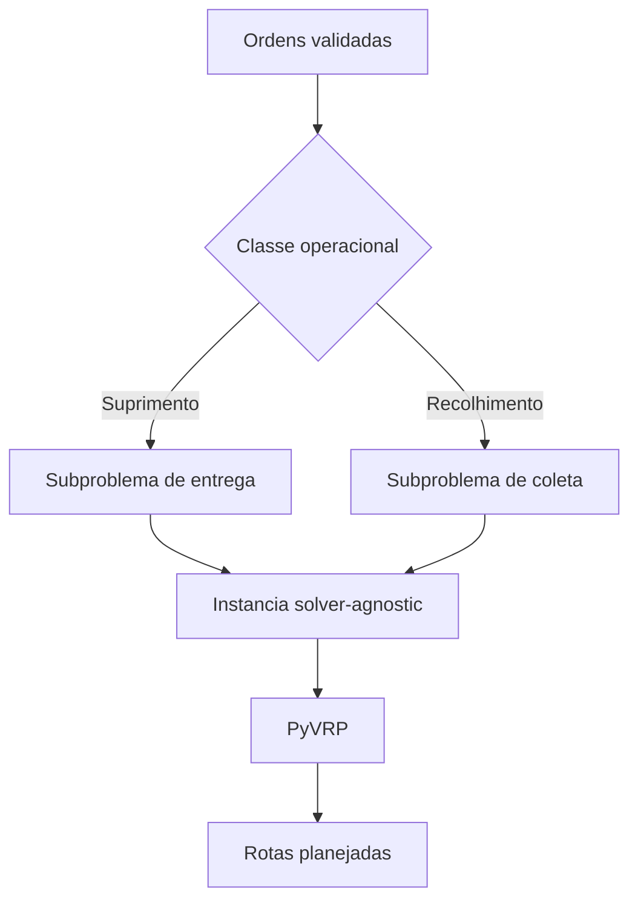
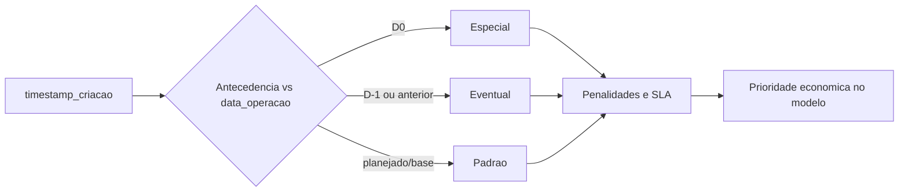
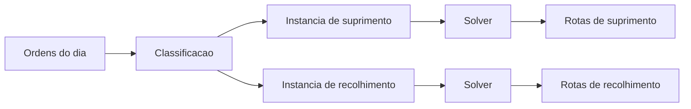
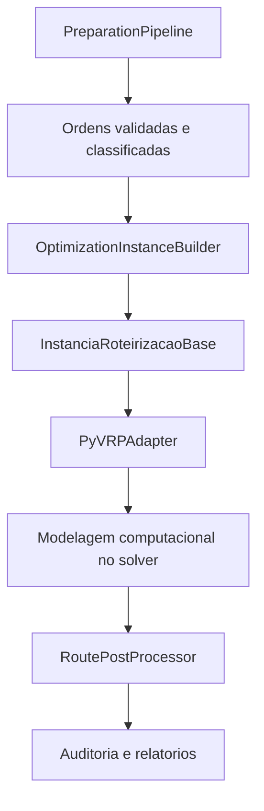

# Formulacao Matematica do Problema de Otimizacao

## 1. Objetivo deste documento

Este documento descreve, em linguagem tecnica e matematica, o problema de otimizacao tratado pelo sistema de roteirizacao de transporte de numerario implementado neste repositorio.

O foco aqui nao e a interface nem o contrato HTTP. O foco e o problema cientifico subjacente:

- qual problema de pesquisa esta sendo resolvido;
- quais sao os conjuntos, parametros e variaveis de decisao;
- qual e a funcao objetivo;
- quais restricoes operacionais definem a viabilidade;
- como as regras de negocio atuais entram na formulacao.

## 2. Classificacao do problema

O problema tratado pode ser entendido como uma variante de **Rich Vehicle Routing Problem with Time Windows** com as seguintes caracteristicas:

- frota potencialmente heterogenea;
- inicio e fim da rota na base de origem da viatura;
- janelas de tempo em clientes e viaturas;
- capacidade em duas dimensoes: volumetrica e financeira;
- atendimento opcional com penalidade por nao atendimento;
- separacao operacional entre **suprimento** e **recolhimento**;
- compatibilidade entre ordem, ponto, setor geografico e viatura;
- restricao adicional de risco financeiro para rotas de recolhimento, via teto segurado.

Em termos de literatura, o problema fica proximo de um:

- prize-collecting VRPTW ou soft-selection VRPTW;
- multi-capacitated VRP;
- multi-depot por vinculacao de viatura a base;
- rich VRP com restricoes de elegibilidade.

## 3. Interpretacao operacional

No dominio de transporte de numerario, cada ordem representa uma visita operacional com janela de atendimento, tempo de servico, demanda e custo de nao atendimento.

As rotas sao geradas por classe operacional:

- **suprimento**: a viatura sai da base carregada e vai descarregando ao longo da rota;
- **recolhimento**: a viatura sai da base e vai acumulando numerario ao longo da rota.

O sistema atual **nao mistura suprimento e recolhimento na mesma viagem**. Em vez disso, resolve subproblemas separados por classe operacional.



## 4. Taxonomia das ordens no negocio

Ha duas taxonomias importantes no sistema, e elas nao devem ser confundidas:

### 4.1 Classe operacional

Controla **como a demanda entra no solver**:

- `suprimento`
- `recolhimento`

Essa classificacao afeta pickup/delivery, dinamica de carga e teto segurado.

### 4.2 Classe de planejamento

Controla **a semantica operacional da solicitacao**, mas nao cria um solver separado:

- `padrao`
- `especial`: ordem criada no proprio dia operacional;
- `eventual`: ordem criada em `D-1` ou antes.

No estado atual da implementacao, a urgencia economica dessas ordens deve ser refletida principalmente por:

- `criticidade`;
- `penalidade_nao_atendimento`;
- `penalidade_atraso`;
- regras de SLA e prioridade definidas no payload.

Em outras palavras: **classe de planejamento e uma classificacao de negocio**, enquanto a prioridade matematica efetiva entra no modelo via penalidades e janelas.



## 5. Grafo e conjuntos

Para cada classe operacional `c`, define-se um problema em um grafo dirigido:

- `G^c = (V^c, A^c)`

onde:

- `K^c`: conjunto de viaturas elegiveis para a classe `c`;
- `B`: conjunto de bases;
- `N^c`: conjunto de ordens planejaveis da classe `c`;
- `V^c = B U N^c`;
- `A^c`: conjunto de arcos logisticos disponiveis na matriz de tempo/distancia.

Cada viatura `k in K^c` tem uma base de origem `b(k) in B`, e sua rota:

- comeca em `b(k)`;
- termina em `b(k)`;
- pode atender no maximo uma viagem no MVP atual.

## 6. Parametros

### 6.1 Parametros de custo e tempo

- `d_ij`: distancia do arco `(i, j)`;
- `tau_ij`: tempo de deslocamento no arco `(i, j)`;
- `c_ij^k`: custo variavel de deslocamento da viatura `k` no arco `(i, j)`;
- `f_k`: custo fixo de ativacao da viatura `k`;
- `s_i`: tempo de servico no no `i`.

### 6.2 Parametros de demanda

Cada ordem `i in N^c` possui demanda em duas dimensoes:

- `q_i^V`: demanda volumetrica;
- `q_i^F`: demanda financeira.

### 6.3 Parametros de capacidade

Cada viatura `k` possui:

- `Q_k^V`: capacidade volumetrica;
- `Q_k^F`: capacidade financeira nominal;
- `I_k`: teto segurado.

Para rotas de recolhimento, a capacidade financeira efetiva e:

- `Q_k^{F,rec} = min(Q_k^F, I_k)`

Para rotas de suprimento, a capacidade financeira efetiva permanece:

- `Q_k^{F,sup} = Q_k^F`

### 6.4 Parametros temporais

Cada ordem `i` possui janela:

- `[a_i, b_i]`

Cada viatura `k` possui janela de operacao:

- `[alpha_k, beta_k]`

### 6.5 Parametros de penalidade

- `pi_i`: penalidade por nao atendimento da ordem `i`;
- `rho_i`: parametro de penalizacao de atraso da ordem `i`.

Observacao importante:

- a implementacao atual monetiza explicitamente o **nao atendimento**;
- o atraso aparece operacionalmente como violacao de janela e `time_warp` no pos-processamento;
- a monetizacao explicita de atraso ja existe no dominio de negocio e pode ser aprofundada no solver em evolucao futura.

### 6.6 Parametros de elegibilidade

Defina `e_ik in {0,1}` como um parametro de elegibilidade:

- `e_ik = 1` se a viatura `k` pode atender a ordem `i`;
- `e_ik = 0` caso exista incompatibilidade de servico, ponto ou setor.

## 7. Variaveis de decisao

Para cada classe operacional `c`, considere:

- `x_ijk in {0,1}`: vale `1` se a viatura `k` percorre o arco `(i, j)`;
- `y_ik in {0,1}`: vale `1` se a ordem `i` e atendida pela viatura `k`;
- `z_i in {0,1}`: vale `1` se a ordem `i` nao e atendida;
- `T_i >= 0`: instante de inicio de servico da ordem `i`;
- `L_i^V >= 0`: carga volumetrica apos atendimento em `i`;
- `L_i^F >= 0`: carga financeira apos atendimento em `i`;
- `w_i >= 0`: atraso ou excesso de janela no no `i`, quando modelado como janela suave.

Tambem pode-se usar:

- `u_k in {0,1}`: vale `1` se a viatura `k` e ativada.

## 8. Funcao objetivo

Uma formulacao geral coerente com o problema de negocio e:

```text
min
    sum_{k in K^c} f_k u_k
  + sum_{k in K^c} sum_{(i,j) in A^c} c_ij^k x_ijk
  + sum_{i in N^c} pi_i z_i
  + sum_{i in N^c} rho_i w_i
```

Interpretacao:

- o primeiro termo reduz ativacao desnecessaria de viaturas;
- o segundo termo minimiza custo de deslocamento;
- o terceiro termo penaliza ordens descartadas;
- o quarto termo penaliza atrasos, quando essa suavizacao e ativada.

### 8.1 Observacao sobre a implementacao atual

No estado atual do codigo:

- o custo fixo e o custo variavel da viatura entram no modelo;
- a penalidade de nao atendimento entra explicitamente;
- a restricao temporal e observada pelo solver e auditada no resultado;
- o campo `penalidade_atraso` existe no dominio, mas a parametrizacao monetaria fina do atraso ainda e um ponto natural de evolucao.

## 9. Restricoes

## 9.1 Atendimento unico ou descarte

Cada ordem ou e atendida por exatamente uma viatura elegivel, ou fica nao atendida:

```text
sum_{k in K^c} y_ik + z_i = 1      para todo i in N^c
```

## 9.2 Conservacao de fluxo no no atendido

Se uma ordem e atendida por uma viatura, ha um arco entrando e um arco saindo:

```text
sum_j x_jik = y_ik                 para todo i in N^c, k in K^c
sum_j x_ijk = y_ik                 para todo i in N^c, k in K^c
```

## 9.3 Ativacao de rota por viatura

Cada viatura inicia e encerra sua rota na propria base:

```text
sum_j x_{b(k)jk} = u_k             para todo k in K^c
sum_j x_{jb(k)k} = u_k             para todo k in K^c
```

Como o MVP atual nao contempla multiplas viagens por viatura, `u_k` aciona no maximo uma rota.

## 9.4 Elegibilidade

Uma ordem so pode ser atendida por viatura elegivel:

```text
y_ik <= e_ik                       para todo i in N^c, k in K^c
```

Isso agrega restricoes como:

- compatibilidade de servico;
- compatibilidade de setor;
- compatibilidade de ponto;
- aderencia a classe operacional da instancia.

## 9.5 Dinamica de carga

Defina `sigma(c)` como:

- `sigma(suprimento) = -1`
- `sigma(recolhimento) = +1`

Entao a evolucao de carga pode ser escrita como:

```text
L_j^d >= L_i^d + sigma(c) q_j^d - M_d (1 - x_ijk)
```

para:

- `d in {V, F}`
- `(i, j) in A^c`
- `k in K^c`

com:

```text
0 <= L_i^V <= Q_k^V
0 <= L_i^F <= Q_k^{F,c}
```

onde:

- `Q_k^{F,c} = Q_k^F` em suprimento;
- `Q_k^{F,c} = min(Q_k^F, I_k)` em recolhimento.

Essa restricao representa o ponto central do dominio:

- no suprimento, a viatura consome carga ao longo da rota;
- no recolhimento, a viatura acumula carga e risco financeiro.

## 9.6 Janelas de tempo

Se a viatura percorre `(i, j)`, o atendimento em `j` nao pode comecar antes do fim do atendimento em `i` acrescido do deslocamento:

```text
T_j >= T_i + s_i + tau_ij - M (1 - x_ijk)
```

As janelas do cliente impem:

```text
a_i <= T_i <= b_i + w_i
```

com:

```text
w_i >= 0
```

No caso de janela dura, basta impor `w_i = 0`.

## 9.7 Janela da viatura

Cada rota deve respeitar o turno da viatura:

```text
alpha_k <= T_{primeira_visita_k}
T_{ultima_visita_k} + s_{ultima} + tau_{ultima,b(k)} <= beta_k
```

## 9.8 Separacao entre suprimento e recolhimento

A implementacao atual resolve duas familias de problema, e nao permite mistura de classes na mesma rota:

```text
Rota k pertence integralmente a uma unica classe operacional c
```

Equivalentemente, o sistema constroi e resolve:

- `P^sup`
- `P^rec`

de forma independente.



## 9.9 Restricoes fora do solver

Algumas regras sao tratadas antes ou depois da otimizacao, e nao como restricoes internas do modelo:

- ordens canceladas antes do cutoff;
- ordens excluidas por validacao;
- materializacao de snapshot logistico;
- auditoria de inconsistencias;
- consolidacao gerencial e KPIs.

Isso e importante: **nem toda regra de negocio precisa virar restricao matematica**. Parte do sistema opera na camada de preparacao, orquestracao e auditoria.

## 10. Formula resumida do problema

Para cada classe operacional `c`, o problema resolvido pode ser resumido como:

```text
minimizar
    custo fixo de viaturas
  + custo de deslocamento
  + penalidade por nao atendimento
  + penalidade por violacao temporal, quando aplicavel

sujeito a
    atendimento unico ou descarte
    conservacao de fluxo
    inicio e retorno a base
    jornada da viatura
    janelas de tempo
    capacidade volumetrica
    capacidade financeira
    teto segurado em recolhimento
    elegibilidade veiculo-ordem
    segregacao entre suprimento e recolhimento
```

## 11. Relacao entre modelo matematico e implementacao atual

O mapeamento conceitual principal no repositorio e:



Ligacao com os objetos implementados:

- `PreparationPipeline`: remove entradas invalidas e classifica ordens;
- `OptimizationInstanceBuilder`: constroi nos, veiculos, penalidades e matriz logistica;
- `PyVRPAdapter`: traduz a formulacao solver-agnostic para o modelo do PyVRP;
- `RoutePostProcessor`: reconstrui horarios, cargas, esperas, atrasos e violacoes;
- `PlanningReportingBuilder`: consolida KPIs operacionais e gerenciais.

## 12. Limites da formulacao atual

O modelo implementado resolve bem o problema do MVP, mas assume:

- uma viagem por viatura no turno;
- ausencia de telemetria em tempo real;
- ausencia de reotimizacao em campo;
- ausencia de geometria viaria detalhada no resultado;
- segregacao estrita entre suprimento e recolhimento.

Do ponto de vista cientifico, extensoes naturais seriam:

- multiplas viagens por viatura;
- frota compartilhada entre bases com rebalanceamento;
- penalizacao explicita calibrada para atraso;
- incerteza de tempo de deslocamento;
- reotimizacao dinamica;
- pickup-and-delivery misto com troca de estado operacional.

## 13. Conclusao

O problema tratado pelo sistema nao e um VRP simples. Trata-se de um **rich VRP com janelas, capacidades multiplas, atendimento opcional, elegibilidade e restricoes de risco**.

A funcao objetivo economica e guiada por:

- custo fixo;
- custo de deslocamento;
- custo de nao atendimento;
- disciplina temporal.

As restricoes mais caracteristicas do dominio sao:

- dupla capacidade;
- teto segurado em recolhimento;
- janelas de atendimento;
- turno da viatura;
- segregacao entre classes operacionais;
- compatibilidade operacional entre viatura e ordem.

Essa formulacao explica por que o sistema foi desenhado como pipeline de validacao, construcao solver-agnostic, adaptacao ao solver, pos-processamento e auditoria, e nao apenas como uma chamada direta a um algoritmo de roteirizacao generico.
