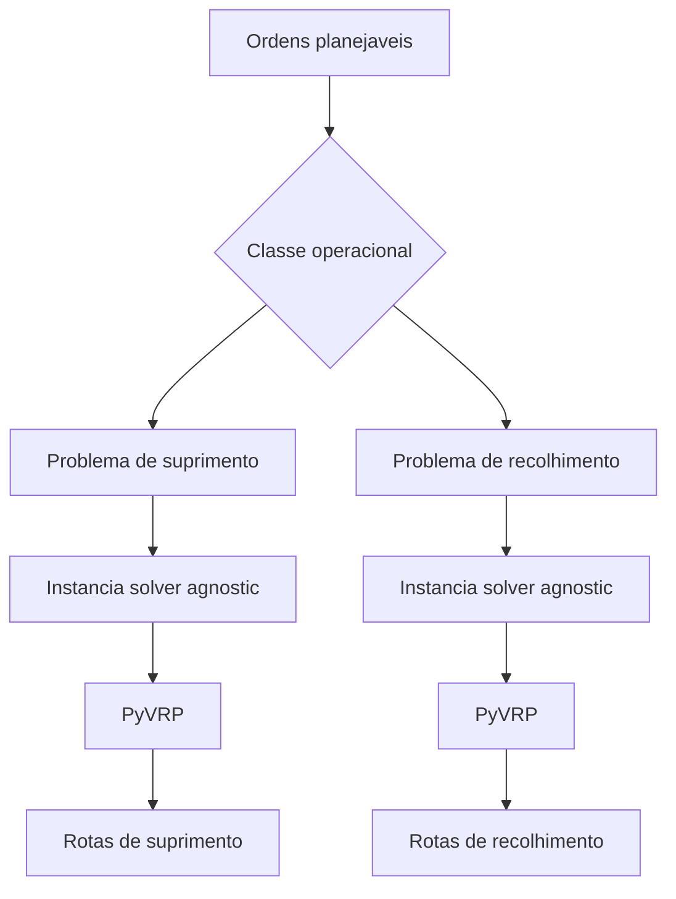
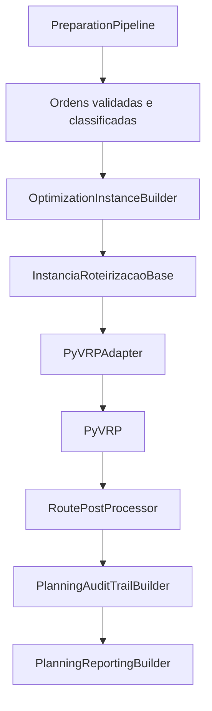

# Formulacao Matematica do Problema de Otimizacao

## 1. Objetivo

Este documento descreve, de forma curta e operacional, o problema que o backend resolve hoje.

A ideia nao e apresentar a formulacao mais geral possivel de VRP, e sim registrar:

- qual problema entra no solver;
- quais restricoes ja estao representadas;
- quais regras continuam fora do solver;
- como a modelagem conversa com o codigo atual.

## 2. Problema resolvido hoje

O backend resolve um problema de roteirizacao com:

- janelas de tempo em ordens e viaturas;
- duas dimensoes de capacidade: volume e financeiro;
- frota heterogenea;
- clientes opcionais, com custo alto para nao atendimento;
- elegibilidade entre viatura e ordem;
- custo fixo por viatura e custo variavel por deslocamento;
- separacao entre `suprimento` e `recolhimento`.

Do ponto de vista pratico, isso e bem representado como um:

$$
\text{Rich Prize-Collecting VRPTW}
$$

resolvido em dois subproblemas independentes.

## 3. Decomposicao por classe operacional

O repositorio nao resolve um unico problema misto com suprimento e recolhimento na mesma rota.

Em vez disso, ele resolve separadamente:

$$
P^{sup}
\qquad \text{e} \qquad
P^{rec}.
$$

Consequencia importante:

- uma mesma viatura fisica pode aparecer no subproblema de suprimento;
- e tambem no subproblema de recolhimento;
- o modelo atual nao impoe um acoplamento global do tipo "a viatura so pode ser usada em uma classe no dia".

## 4. Notacao usada abaixo

Daqui em diante, a formulacao descreve um unico subproblema $P^c$, onde:

$$
c \in \{sup, rec\}.
$$

### 4.1 Conjuntos

$$
\begin{aligned}
D^c &:& \text{depositos da classe } c \\
N^c &:& \text{ordens planejaveis da classe } c \\
K^c &:& \text{viaturas disponiveis na classe } c \\
A^c &:& \text{arcos disponiveis da malha}
\end{aligned}
$$

O conjunto de nos do problema e:

$$
V^c = D^c \cup N^c.
$$

Cada viatura $k \in K^c$ possui uma base de origem fixa, denotada por:

$$
base(k) \in D^c.
$$

### 4.2 Parametros de rede e tempo

Para cada arco $(i,j) \in A^c$:

$$
\begin{aligned}
dist_{ij} &:& \text{distancia do arco} \\
time_{ij} &:& \text{tempo de deslocamento do arco}
\end{aligned}
$$

Para cada ordem $i \in N^c$:

$$
\begin{aligned}
service_i &:& \text{tempo de servico} \\
open_i,\ close_i &:& \text{janela de atendimento}
\end{aligned}
$$

Para cada viatura $k \in K^c$:

$$
\begin{aligned}
vehOpen_k,\ vehClose_k &:& \text{janela de operacao da viatura}
\end{aligned}
$$

### 4.3 Parametros de demanda e capacidade

Cada ordem tem duas demandas:

$$
\begin{aligned}
dem_i^{vol} &:& \text{demanda volumetrica} \\
dem_i^{cash} &:& \text{demanda financeira}
\end{aligned}
$$

Cada viatura possui:

$$
\begin{aligned}
cap_k^{vol} &:& \text{capacidade volumetrica} \\
cap_k^{cash} &:& \text{capacidade financeira nominal} \\
insured_k &:& \text{teto segurado}
\end{aligned}
$$

A capacidade financeira efetiva usada no solver e:

$$
cashCap_k^c =
\begin{cases}
cap_k^{cash}, & \text{se } c = sup \\
\min(cap_k^{cash}, insured_k), & \text{se } c = rec
\end{cases}
$$

Isso reflete exatamente o comportamento implementado no `OptimizationInstanceBuilder`.

### 4.4 Parametros de custo

Para cada viatura:

$$
\begin{aligned}
fixed_k &:& \text{custo fixo de ativacao} \\
distCost_k &:& \text{custo por unidade de distancia}
\end{aligned}
$$

No payload atual do PyVRP tambem existe um custo por duracao:

$$
durCost = 1.
$$

### 4.5 Parametros de optionalidade

Cada ordem possui uma penalidade de nao atendimento:

$$
penalty_i.
$$

No modelo computacional atual, o cliente opcional recebe um premio dominante de atendimento:

$$
bonus \gg 0,
$$

e o custo equivalente de nao atendimento pode ser lido como:

$$
missCost_i = bonus + penalty_i.
$$

### 4.6 Elegibilidade

Para cada ordem $i$ e viatura $k$:

$$
eligible_{ik} =
\begin{cases}
1, & \text{se } k \text{ pode atender } i \\
0, & \text{caso contrario}
\end{cases}
$$

Essa elegibilidade agrega:

- compatibilidade de servico;
- compatibilidade de setor;
- compatibilidade de ponto;
- aderencia da ordem ao subproblema da classe operacional.

## 5. Como a ordem entra no solver

O backend usa a mesma ordem de dimensoes de capacidade em toda a instancia:

$$
(volume,\ financeiro).
$$

Para uma ordem $i$:

- em suprimento, a demanda entra como `delivery`;
- em recolhimento, a demanda entra como `pickup`.

De forma resumida:

$$
\text{se } c = sup:
\quad
delivery_i = (dem_i^{vol}, dem_i^{cash}),
\quad
pickup_i = (0,0)
$$

$$
\text{se } c = rec:
\quad
pickup_i = (dem_i^{vol}, dem_i^{cash}),
\quad
delivery_i = (0,0)
$$

## 6. Variaveis de decisao

Para cada classe $c$, consideramos:

$$
x_{ijk} =
\begin{cases}
1, & \text{se a viatura } k \text{ percorre o arco } (i,j) \\
0, & \text{caso contrario}
\end{cases}
$$

$$
serve_{ik} =
\begin{cases}
1, & \text{se a ordem } i \text{ e atendida pela viatura } k \\
0, & \text{caso contrario}
\end{cases}
$$

$$
miss_i =
\begin{cases}
1, & \text{se a ordem } i \text{ nao e atendida} \\
0, & \text{caso contrario}
\end{cases}
$$

$$
use_k =
\begin{cases}
1, & \text{se a viatura } k \text{ e usada no subproblema} \\
0, & \text{caso contrario}
\end{cases}
$$

$$
start_i \ge 0
\qquad
\text{instante de inicio de servico da ordem } i.
$$

## 7. Funcao objetivo

Para leitura humana, a formulacao mais intuitiva e em minimizacao:

$$
\min
\left[
\sum_{k \in K^c} fixed_k \, use_k
+
\sum_{k \in K^c} \sum_{(i,j) \in A^c} distCost_k \, dist_{ij} \, x_{ijk}
+
durCost \sum_{k \in K^c} \sum_{(i,j) \in A^c} time_{ij} \, x_{ijk}
+
\sum_{i \in N^c} missCost_i \, miss_i
\right]
$$

Leitura pratica:

1. evitar nao atendimento;
2. depois reduzir custo de frota;
3. depois reduzir custo de deslocamento e duracao.

### 7.1 Relacao com a implementacao do PyVRP

O payload atual do PyVRP usa clientes opcionais com:

$$
prize_i = bonus + penalty_i
$$

e `required = False`.

Ou seja, o solver trabalha na pratica com uma forma equivalente de:

$$
\text{maximizar premio de atendimento} - \text{custos}
$$

mas a leitura acima em minimizacao e mais simples para entender o problema.

## 8. Restricoes principais

### 8.1 Atendimento unico ou nao atendimento

Cada ordem ou e atendida por uma unica viatura, ou fica fora da solucao:

$$
\sum_{k \in K^c} serve_{ik} + miss_i = 1,
\qquad \forall i \in N^c
$$

### 8.2 Conservacao de fluxo

Se a ordem $i$ foi servida pela viatura $k$, entao ela tem exatamente um arco de entrada e um de saida naquela rota:

$$
\sum_{j : (j,i) \in A^c} x_{jik} = serve_{ik},
\qquad \forall i \in N^c,\ \forall k \in K^c
$$

$$
\sum_{j : (i,j) \in A^c} x_{ijk} = serve_{ik},
\qquad \forall i \in N^c,\ \forall k \in K^c
$$

### 8.3 Saida e retorno na base da viatura

Cada viatura usada sai da sua propria base e retorna para ela:

$$
\sum_{j : (base(k),j) \in A^c} x_{base(k)jk} = use_k,
\qquad \forall k \in K^c
$$

$$
\sum_{j : (j,base(k)) \in A^c} x_{j\,base(k)\,k} = use_k,
\qquad \forall k \in K^c
$$

No payload atual, cada tipo de veiculo entra com:

$$
num\_available = 1,
$$

o que significa uma rota por copia de viatura dentro de cada subproblema.

### 8.4 Elegibilidade entre viatura e ordem

Uma ordem so pode ser atribuida a uma viatura elegivel:

$$
serve_{ik} \le eligible_{ik},
\qquad \forall i \in N^c,\ \forall k \in K^c
$$

### 8.5 Janelas de tempo

A propagacao temporal ao longo dos arcos segue a forma padrao:

$$
start_j \ge start_i + service_i + time_{ij} - M (1 - x_{ijk}),
\qquad \forall (i,j) \in A^c,\ \forall k \in K^c
$$

Cada ordem deve respeitar sua janela:

$$
open_i \le start_i \le close_i,
\qquad \forall i \in N^c
$$

E cada viatura deve respeitar sua propria janela de operacao:

$$
vehOpen_k \le \text{inicio da rota de } k
\qquad \text{e} \qquad
\text{fim da rota de } k \le vehClose_k
$$

### 8.6 Capacidade em duas dimensoes

Para qualquer rota da viatura $k$:

$$
\sum_{i \in rota(k)} dem_i^{vol} \le cap_k^{vol}
$$

$$
\sum_{i \in rota(k)} dem_i^{cash} \le cashCap_k^c
$$

Essa segunda restricao e a traducao direta do teto segurado no caso de recolhimento.

### 8.7 Separacao entre suprimento e recolhimento

Como $P^{sup}$ e $P^{rec}$ sao resolvidos separadamente:

$$
rota(k) \subseteq N^c
$$

para uma unica classe $c$.

Nao existe mistura de suprimento e recolhimento dentro da mesma rota no modelo atual.

## 9. O que fica fora do solver

Nem toda regra de negocio entra como restricao interna do modelo. Parte da logica e tratada antes ou depois da otimizacao.

Ficam fora do solver:

- ordens invalidas na validacao;
- ordens canceladas antes do `cutoff`;
- consolidacao de auditoria;
- calculo de KPIs e relatorios;
- materializacao de snapshot logistico;
- idempotencia por `hash_cenario`.

Tambem e importante notar:

- `penalidade_atraso` existe no dominio;
- mas hoje ela nao entra explicitamente como custo de atraso no payload do PyVRP;
- o atraso aparece depois como `time_warp`, alerta operacional e auditoria.

## 10. Relacao com o codigo

Correspondencia principal:

- `PreparationPipeline`: decide o que entra ou nao entra no solver;
- `OptimizationInstanceBuilder`: monta nos, veiculos, capacidades, penalidades e elegibilidade;
- `PyVRPAdapter`: traduz a instancia para clientes opcionais, custos, janelas e capacidades do PyVRP;
- `RoutePostProcessor`: reconstrui rotas, horarios, espera, atraso e ordens nao atendidas;
- `PlanningAuditTrailBuilder` e `PlanningReportingBuilder`: explicam e consolidam o resultado.

## 11. Limites atuais da modelagem

Hoje o modelo ainda tem limites claros:

1. a mesma viatura fisica pode aparecer em `P^{sup}` e `P^{rec}`;
2. nao existe custo explicito de atraso por cliente na funcao objetivo;
3. cada copia de viatura faz no maximo uma rota por subproblema;
4. nao ha reotimizacao dinamica;
5. os tempos de deslocamento sao tratados como deterministicos;
6. suprimento e recolhimento nao se misturam na mesma rota.

## 12. Conclusao

O que o backend resolve hoje pode ser resumido assim:

$$
\text{um Rich Prize-Collecting VRPTW com dupla capacidade,}
$$

$$
\text{resolvido separadamente para suprimento e recolhimento.}
$$

Essa leitura bate com o comportamento do codigo:

- optionalidade de ordens;
- custo alto de nao atendimento;
- janelas de tempo;
- capacidade volumetrica e financeira;
- teto segurado em recolhimento;
- elegibilidade entre viatura e ordem;
- pos-processamento, auditoria e relatorio fora do solver.
