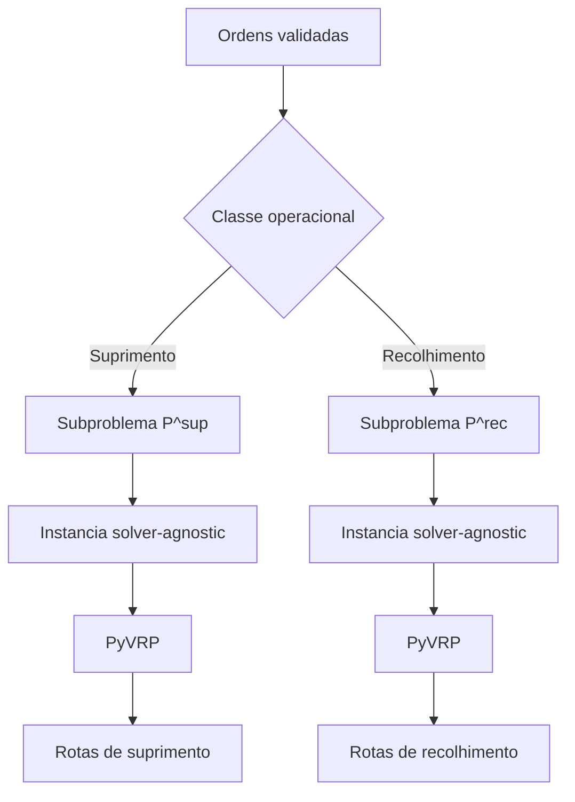
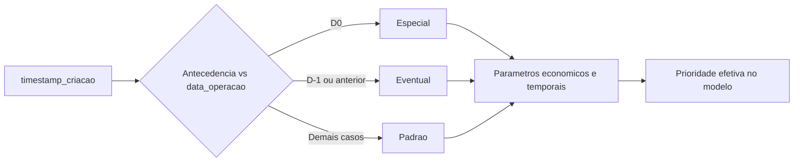

# Formulacao Matematica do Problema de Otimizacao

## 1. Objetivo do documento

Este documento descreve, em linguagem matematica e de Pesquisa Operacional, o problema resolvido pelo nucleo de roteirizacao de transporte de numerario implementado neste repositorio.

O objetivo aqui nao e propor uma formulacao idealizada ou generica de VRP, mas registrar com rigor:

- qual problema o sistema resolve hoje;
- como esse problema pode ser interpretado em termos de grafos, custos e restricoes;
- quais elementos sao efetivamente enviados ao solver;
- quais elementos existem no dominio, mas ainda nao entram explicitamente na funcao objetivo computacional.

Em outras palavras, este texto descreve a **formulacao operacional implementada**, e nao apenas uma formulacao aspiracional.

## 2. Classificacao do problema

Do ponto de vista da literatura, o problema tratado pode ser classificado como uma variante de:

$$
\text{Prize-Collecting Rich VRPTW}
$$

com as seguintes caracteristicas:

- frota heterogenea;
- multiplos depositos por vinculacao de viaturas a bases;
- janelas de tempo em clientes e viaturas;
- capacidade em duas dimensoes, volumetrica e financeira;
- atendimento opcional de clientes, com premio por atendimento e penalidade implicita por descarte;
- elegibilidade veiculo-ordem;
- restricao de risco financeiro nas rotas de recolhimento;
- decomposicao em subproblemas por classe operacional.

Em termos de Engenharia Logistica, Analise de Redes e Pesquisa Operacional, o problema pode ser lido como:

- um problema de cobertura operacional com restricoes de roteamento;
- um problema de selecao de clientes com custo de frota;
- um problema de planejamento em rede com capacidades, turnos e janelas.

## 3. Estrutura operacional do problema

As ordens sao separadas em duas classes operacionais:

- **suprimento**;
- **recolhimento**.

Essa separacao nao e apenas semantica. Ela altera a modelagem das demandas e da capacidade:

- em `suprimento`, a demanda entra como **delivery**;
- em `recolhimento`, a demanda entra como **pickup**;
- em `recolhimento`, a capacidade financeira efetiva e limitada pelo teto segurado.

O repositorio **nao resolve um unico problema misto** com suprimento e recolhimento na mesma rota. Em vez disso, constroi dois subproblemas independentes:

$$
P^{\text{sup}} \quad \text{e} \quad P^{\text{rec}}.
$$

### 3.1 Consequencia importante da decomposicao

Como os subproblemas sao resolvidos separadamente, a mesma viatura fisica pode aparecer:

- uma vez em `P^{\text{sup}}`;
- outra vez em `P^{\text{rec}}`.

Logo, o modelo implementado hoje **nao impõe** uma restricao global do tipo:

$$
u_k^{\text{sup}} + u_k^{\text{rec}} \leq 1.
$$

Esse acoplamento entre classes operacionais seria uma extensao futura importante.

## 4. Taxonomias do dominio

O sistema possui duas taxonomias distintas.

### 4.1 Classe operacional

Ela determina como a ordem entra no solver:

$$
\mathcal{C} = \{\text{sup}, \text{rec}\}.
$$

Essa classe altera:

- o tipo de demanda no solver;
- a interpretacao da capacidade;
- a aplicacao do teto segurado.

### 4.2 Classe de planejamento

Ela e uma classificacao de negocio:

- `padrao`;
- `especial`;
- `eventual`.

No estado atual do codigo, essa classificacao:

- existe no dominio;
- afeta a interpretacao operacional;
- pode influenciar parametrizacao de criticidade, janelas e penalidades;
- **nao cria um subproblema separado no solver**.

Portanto, a classe de planejamento nao aparece como indice estrutural do modelo. Sua influencia matematica e indireta, por meio de parametros como:

$$
\pi_i \quad \text{(penalidade de nao atendimento)}, \qquad
[a_i, b_i] \quad \text{(janela)}, \qquad
\text{criticidade}_i.
$$

## 5. Representacao em grafo

Para cada classe operacional $c \in \mathcal{C}$, define-se um grafo dirigido:

$$
G^c = (V^c, A^c),
$$

onde:

- $B^c$ e o conjunto de depositos disponiveis na instancia;
- $N^c$ e o conjunto de ordens planejaveis da classe $c$;
- $K^c$ e o conjunto de viaturas disponiveis no subproblema da classe $c$;
- $V^c = B^c \cup N^c$;
- $A^c$ e o conjunto de arcos disponiveis na matriz logistica.

Cada viatura $k \in K^c$ possui uma base de origem $b(k) \in B^c$, e cada rota:

- inicia em $b(k)$;
- termina em $b(k)$;
- usa no maximo uma vez a copia da viatura no subproblema $c$.

Em termos de implementacao, a copia da viatura e por classe operacional. Por isso, a disponibilidade e "uma rota por viatura por subproblema", e nao "uma rota por viatura por dia" de forma global.

## 6. Conjuntos, parametros e variaveis

### 6.1 Conjuntos

Para cada classe $c$:

$$
\begin{aligned}
\mathcal{N}^c &: \text{conjunto de ordens planejaveis}, \\
\mathcal{B}^c &: \text{conjunto de depositos}, \\
\mathcal{K}^c &: \text{conjunto de viaturas disponiveis}, \\
\mathcal{A}^c &: \text{conjunto de arcos disponiveis}.
\end{aligned}
$$

### 6.2 Parametros de rede e tempo

Para cada arco $(i,j) \in \mathcal{A}^c$:

$$
\begin{aligned}
d_{ij} &: \text{distancia do arco } (i,j), \\
\tau_{ij} &: \text{tempo de deslocamento no arco } (i,j).
\end{aligned}
$$

Para cada ordem $i \in \mathcal{N}^c$:

$$
\begin{aligned}
s_i &: \text{tempo de servico}, \\
[a_i, b_i] &: \text{janela de tempo}.
\end{aligned}
$$

Para cada viatura $k \in \mathcal{K}^c$:

$$
[\alpha_k, \beta_k] : \text{janela de operacao da viatura}.
$$

### 6.3 Parametros de demanda e capacidade

Cada ordem $i \in \mathcal{N}^c$ possui duas demandas:

$$
q_i^V \quad \text{(volume)} \qquad \text{e} \qquad q_i^F \quad \text{(financeiro)}.
$$

Cada viatura $k$ possui:

$$
\begin{aligned}
Q_k^V &: \text{capacidade volumetrica}, \\
Q_k^F &: \text{capacidade financeira nominal}, \\
I_k &: \text{teto segurado}.
\end{aligned}
$$

No subproblema de recolhimento, a capacidade financeira efetiva e:

$$
\widetilde{Q}_k^{F,\text{rec}} = \min(Q_k^F, I_k).
$$

No subproblema de suprimento:

$$
\widetilde{Q}_k^{F,\text{sup}} = Q_k^F.
$$

### 6.4 Parametros de custo

O modelo implementado no repositorio nao usa diretamente um custo arbitrario $c_{ij}^k$ por arco e por veiculo. Em vez disso, ele usa:

$$
\begin{aligned}
f_k &: \text{custo fixo de ativacao da viatura } k, \\
\gamma_k &: \text{custo unitario por distancia da viatura } k, \\
\eta &: \text{custo unitario por duracao da rota}.
\end{aligned}
$$

Na implementacao atual:

- $\gamma_k$ depende da viatura;
- $\eta$ e uniforme no payload do PyVRP;
- $d_{ij}$ e $\tau_{ij}$ entram como atributos dos arcos.

### 6.5 Parametros de prioridade e optionalidade

Cada ordem $i$ possui:

$$
\pi_i : \text{penalidade de nao atendimento}.
$$

O modelo computacional atual introduz ainda um bonus dominante de atendimento:

$$
M \gg 0,
$$

e define o premio computacional do cliente como:

$$
\Pi_i = M + \pi_i.
$$

Esse e o mecanismo que implementa a politica operacional:

$$
\texttt{maximize\_attendance\_v1}.
$$

### 6.6 Parametros de elegibilidade

Define-se:

$$
e_{ik} =
\begin{cases}
1, & \text{se a viatura } k \text{ pode atender a ordem } i, \\
0, & \text{caso contrario.}
\end{cases}
$$

Essa elegibilidade agrega:

- compatibilidade de servico;
- compatibilidade de setor;
- compatibilidade de ponto;
- aderencia da ordem ao subproblema operacional.

### 6.7 Variaveis de decisao

Para cada classe operacional $c$:

$$
\begin{aligned}
x_{ijk} &=
\begin{cases}
1, & \text{se a viatura } k \text{ percorre o arco } (i,j), \\
0, & \text{caso contrario;}
\end{cases} \\
\\
y_{ik} &=
\begin{cases}
1, & \text{se a ordem } i \text{ e atendida pela viatura } k, \\
0, & \text{caso contrario;}
\end{cases} \\
\\
z_i &=
\begin{cases}
1, & \text{se a ordem } i \text{ nao e atendida}, \\
0, & \text{caso contrario;}
\end{cases} \\
\\
u_k &=
\begin{cases}
1, & \text{se a viatura } k \text{ e ativada}, \\
0, & \text{caso contrario;}
\end{cases} \\
\\
T_i &\ge 0 : \text{instante de inicio de servico no no } i.
\end{aligned}
$$

Observacao importante: o campo `penalidade_atraso` existe no dominio, mas a implementacao atual **nao introduz explicitamente** uma variavel de atraso monetizada do tipo $w_i$ na funcao objetivo do solver.

## 7. Funcao objetivo implementada hoje

### 7.1 Forma conceitual

A leitura mais fiel da formulacao computacional atual e:

$$
\max
\left[
\sum_{i \in \mathcal{N}^c} \Pi_i \sum_{k \in \mathcal{K}^c} y_{ik}
-
\sum_{k \in \mathcal{K}^c} f_k u_k
-
\sum_{k \in \mathcal{K}^c} \gamma_k D_k
-
\eta \sum_{k \in \mathcal{K}^c} H_k
\right],
$$

onde:

- $D_k$ e a distancia total da rota da viatura $k$;
- $H_k$ e a duracao total da rota da viatura $k$;
- $\Pi_i = M + \pi_i$ e o premio de atendimento.

### 7.2 Forma equivalente em minimizacao

Como

$$
z_i = 1 - \sum_{k \in \mathcal{K}^c} y_{ik},
$$

uma forma equivalente, a menos de constante aditiva, e:

$$
\min
\left[
\sum_{k \in \mathcal{K}^c} f_k u_k
+
\sum_{k \in \mathcal{K}^c} \gamma_k D_k
+
\eta \sum_{k \in \mathcal{K}^c} H_k
+
\sum_{i \in \mathcal{N}^c} \Pi_i z_i
\right].
$$

### 7.3 Interpretacao academica

Essa formulacao nao e uma simples minimizacao de custo. Ela implementa um **surrogate lexicografico**:

1. primeiro, maximizar o atendimento;
2. depois, entre solucoes com atendimento semelhante, reduzir custo de frota e deslocamento.

Isso decorre do fato de que $M$ foi definido com magnitude muito superior aos demais termos de custo.

### 7.4 O que nao entra explicitamente na funcao objetivo atual

O modelo atual **nao monetiza explicitamente**:

$$
\rho_i w_i,
$$

isto e, nao existe hoje um termo parametrizado por ordem para atraso no payload do solver. O atraso aparece:

- como violacao operacional observada no pos-processamento;
- como `time_warp` no retorno do solver;
- como alerta e auditoria no resultado consolidado.

Portanto, do ponto de vista cientifico, o problema implementado hoje e mais precisamente um:

$$
\text{Prize-Collecting VRPTW com custo fixo, custo por distancia e custo por duracao},
$$

e nao um VRPTW com penalizacao monetaria fina de atraso por cliente.

## 8. Restricoes

### 8.1 Atendimento unico ou descarte

Cada ordem deve ser ou atendida exatamente uma vez, ou descartada:

$$
\sum_{k \in \mathcal{K}^c} y_{ik} + z_i = 1,
\qquad \forall i \in \mathcal{N}^c.
$$

### 8.2 Conservacao de fluxo

Se uma ordem e atendida pela viatura $k$, entao existe exatamente um arco de entrada e um de saida:

$$
\sum_{j : (j,i) \in \mathcal{A}^c} x_{jik} = y_{ik},
\qquad \forall i \in \mathcal{N}^c,\ \forall k \in \mathcal{K}^c,
$$

$$
\sum_{j : (i,j) \in \mathcal{A}^c} x_{ijk} = y_{ik},
\qquad \forall i \in \mathcal{N}^c,\ \forall k \in \mathcal{K}^c.
$$

### 8.3 Saida e retorno ao deposito

Cada viatura ativada inicia e termina na propria base:

$$
\sum_{j : (b(k),j) \in \mathcal{A}^c} x_{b(k)jk} = u_k,
\qquad \forall k \in \mathcal{K}^c,
$$

$$
\sum_{j : (j,b(k)) \in \mathcal{A}^c} x_{jb(k)k} = u_k,
\qquad \forall k \in \mathcal{K}^c.
$$

Na implementacao atual, cada copia de viatura no subproblema possui:

$$
\texttt{num\_available} = 1,
$$

o que implica uma unica rota por viatura **dentro de cada subproblema**.

### 8.4 Elegibilidade veiculo-ordem

Uma ordem so pode ser atribuida a um veiculo elegivel:

$$
y_{ik} \le e_{ik},
\qquad \forall i \in \mathcal{N}^c,\ \forall k \in \mathcal{K}^c.
$$

### 8.5 Janelas de tempo

A propagacao temporal ao longo dos arcos segue a forma padrao:

$$
T_j \ge T_i + s_i + \tau_{ij} - \mathcal{M}(1 - x_{ijk}),
\qquad \forall (i,j) \in \mathcal{A}^c,\ \forall k \in \mathcal{K}^c.
$$

Para cada cliente, a meta de atendimento temporal e:

$$
a_i \le T_i \le b_i.
$$

Para cada viatura:

$$
\alpha_k \le T_{\text{inicio}(k)}
\qquad \text{e} \qquad
T_{\text{fim}(k)} \le \beta_k.
$$

### 8.6 Observacao importante sobre janelas no solver

O solver recebe explicitamente os limites:

$$
[\alpha_k, \beta_k] \quad \text{e} \quad [a_i, b_i].
$$

Entretanto, o repositorio nao envia uma penalizacao monetaria do tipo $\rho_i w_i$ por cliente. Em termos computacionais:

- a viabilidade temporal e tratada pelo solver;
- a quantidade de `time_warp` e exposta no resultado;
- o valor `penalidade_atraso` do dominio ainda nao e parametrizado no payload do PyVRP.

### 8.7 Capacidade em duas dimensoes

Como o repositorio separa suprimento e recolhimento em subproblemas distintos, a capacidade pode ser lida de modo mais simples e fiel do que num problema pickup-and-delivery misto.

#### a) Suprimento

Em $P^{\text{sup}}$, toda demanda e do tipo entrega. Logo, para cada rota $R_k$:

$$
\sum_{i \in R_k} q_i^V \le Q_k^V,
$$

$$
\sum_{i \in R_k} q_i^F \le \widetilde{Q}_k^{F,\text{sup}} = Q_k^F.
$$

#### b) Recolhimento

Em $P^{\text{rec}}$, toda demanda e do tipo coleta. Logo, para cada rota $R_k$:

$$
\sum_{i \in R_k} q_i^V \le Q_k^V,
$$

$$
\sum_{i \in R_k} q_i^F \le \widetilde{Q}_k^{F,\text{rec}} = \min(Q_k^F, I_k).
$$

Essa segunda restricao e a traducao direta do teto segurado no modelo atual.

### 8.8 Separacao estrita entre classes operacionais

O sistema resolve:

$$
P^{\text{sup}} \quad \text{e} \quad P^{\text{rec}}
$$

de forma independente. Assim, uma rota em um subproblema pertence integralmente a uma unica classe:

$$
R_k^c \subseteq \mathcal{N}^c.
$$

Nao ha mistura de clientes de suprimento e recolhimento numa mesma rota.

## 9. Regras fora do solver

Nem toda regra do sistema e implementada como restricao interna do modelo matematico. Parte da logica e tratada:

- antes da otimizacao, na validacao e classificacao;
- durante a construcao da instancia;
- depois da otimizacao, na auditoria e no reporting.

Em particular, ficam fora do solver:

- ordens canceladas antes do cutoff;
- ordens excluidas por contrato ou validacao;
- materializacao de snapshot logistico;
- consolidacao gerencial;
- interpretacao de SLA e explicabilidade operacional.

Isso e uma decisao de engenharia importante: o sistema foi construído como **pipeline de decisao**, e nao como um unico modelo monolitico.

## 10. Correspondencia com a implementacao do repositorio

O fluxo computacional pode ser resumido assim:

### 10.1 Correspondencias principais

- `PreparationPipeline`:
  valida entradas, remove ordens invalidadas e organiza a massa de dados do dia;

- `OptimizationInstanceBuilder`:
  constroi os subproblemas $P^{\text{sup}}$ e $P^{\text{rec}}$, define nos, veiculos, elegibilidade, penalidades e matriz logistica;

- `PyVRPAdapter`:
  traduz a instancia solver-agnostic para o payload do PyVRP, usando:
  - clientes opcionais (`required = False`);
  - premio por atendimento (`prize = M + \pi_i`);
  - capacidade multidimensional;
  - custo fixo, custo por distancia e custo por duracao;

- `RoutePostProcessor`:
  reconstrui horarios, esperas, atrasos (`time_warp`), carga acumulada e ordens nao atendidas;

- `PlanningReportingBuilder`:
  consolida os indicadores operacionais e gerenciais.

## 11. Limites cientificos da modelagem atual

Embora o modelo seja tecnicamente coerente com o MVP, ele ainda possui limites claros do ponto de vista de Pesquisa Operacional:

1. a mesma viatura fisica pode ser reutilizada em subproblemas distintos no mesmo dia;
2. a penalizacao de atraso por cliente nao entra explicitamente na funcao objetivo;
3. o modelo trabalha com uma viagem por viatura por subproblema;
4. nao ha reotimizacao dinamica;
5. nao ha incerteza estocastica de tempo de viagem;
6. nao ha mistura de suprimento e recolhimento numa mesma rota.

Esses pontos definem uma agenda natural de evolucao para investigacao academica e engenharia futura.

## 12. Extensoes naturais

Do ponto de vista cientifico, as extensoes mais naturais sao:

### 12.1 Acoplamento global da frota

Introduzir restricoes do tipo:

$$
u_k^{\text{sup}} + u_k^{\text{rec}} \le 1,
\qquad \forall k,
$$

para evitar reuso simultaneo da mesma viatura fisica.

### 12.2 Penalizacao explicita de atraso

Introduzir variaveis de atraso:

$$
w_i \ge 0,
$$

e um termo objetivo:

$$
\sum_{i \in \mathcal{N}^c} \rho_i w_i.
$$

### 12.3 Multiplas viagens por viatura

Substituir a restricao de disponibilidade simples por formulacoes com:

- multiplos circuitos por turno;
- retorno e recarga na base;
- possivel re-sequenciamento intradia.

### 12.4 Tempo de viagem incerto

Modelos robustos ou estocasticos poderiam substituir:

$$
\tau_{ij}
$$

por distribuicoes ou intervalos de confiabilidade.

## 13. Conclusao

O problema implementado neste repositorio nao e um VRP elementar. A formulacao atual corresponde, de modo mais fiel, a um:

$$
\text{Prize-Collecting Rich VRPTW multi-capacitado, decomposto por classe operacional}.
$$

Sua principal caracteristica economica hoje e:

$$
\text{maximizar atendimento primeiro e reduzir custo depois},
$$

e nao simplesmente minimizar custo puro.

As caracteristicas mais distintivas do dominio sao:

- dupla capacidade;
- teto segurado em recolhimento;
- janelas de tempo;
- elegibilidade veiculo-ordem;
- optionalidade de clientes;
- separacao entre suprimento e recolhimento.

Essa leitura justifica a arquitetura do sistema:

- preparacao;
- construcao solver-agnostic;
- adaptacao ao solver;
- pos-processamento;
- auditoria;
- reporting.

Portanto, a modelagem matematica e a engenharia de software do repositorio estao alinhadas com uma visao moderna de sistemas de apoio a decisao em logistica: o solver e central, mas nao esgota o problema.
